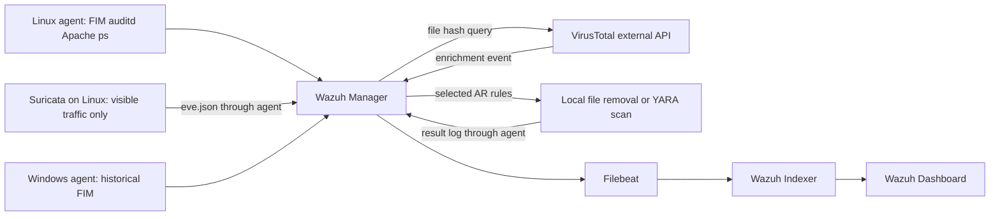
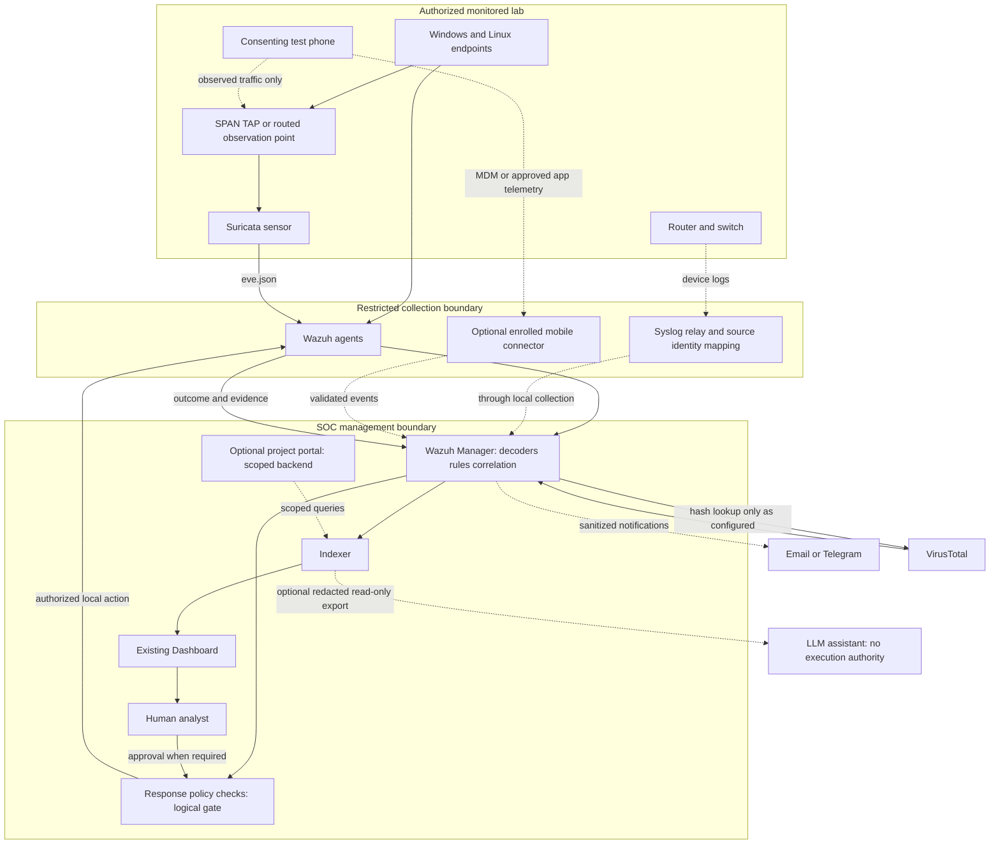
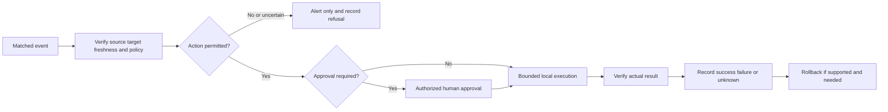

# T-17 — دراسة نية صاحب المشروع والمخطط المقترح

> الغرض: فهم الأصول قبل استكمال البناء؛ المالك: ASTRA؛ التاريخ: 2026-09-09.
> الحالة: دراسة ومقترح للمراجعة، لا اعتماد نطاق موسع ولا تقرير تشغيل. المصادر: S1–S7 الأصلية، الكود الحالي، المراجع الرسمية في §12. طلب المستخدم هو الدراسة ثم المخطط ثم إكمال المشروع.
> لا تستبدل هذه الوثيقة docs/05 تلقائياً. قرارات الهواتف/واجهة جديدة/AI وتغيير FR/NFR تنتظر موافقة صاحب المشروع عبر ADR-013. توقف تنفيذ التوسعات أثناء الدراسة؛ T-11 غير مكتملة.

## 1. خلاصة النية: ما الذي يريده أخوك؟

**يريد منصة أمنية مركزية مبنية على Wazuh، تجمع معلومات الأجهزة والشبكة وتعرض التنبيهات، وتمكّن الأجهزة من تنفيذ دفاعات تلقائية محددة مسبقاً، ثم يوسعها لتشمل أجهزة الشبكة والهواتف؛ ويريد أن تكون إضافته تطويراً عملياً متكاملاً لا مجرد تنصيب الأداة.** هذه صياغة تحليلية لكلامه ووثائقه، وليست اقتباساً حرفياً أو وعداً بمراقبة كل شيء.

هناك ثلاثة مستويات يجب ألا نخلطها:

1. **المشكلة الأكاديمية:** أدوات متفرقة، تكلفة مرتفعة، صعوبة جمع وتحليل الأحداث وتأخر الاستجابة؛ الحل منصة مفتوحة المصدر في معمل يمثل مؤسسة متوسطة (S4، P9–18).
2. **الأساس الذي جرّبه:** وكلاء Windows/Linux، مراقبة ملفات، Suricata، auditd، YARA، VirusTotal، سجلات الويب والعمليات (S2/S5). اللقطات التاريخية لا تثبت نشر الكود المحصّن الحالي.
3. **طموح التطوير بصوته:** توسيع الأجهزة وربط الراوترات والسويتشات والهواتف مع استجابة مشروطة (S6، نحو 91–205 ثانية). لا يجوز إسقاط هذا الطموح بحجة أن الوكلاء السابقين وضعوه Future Work.

عبارة «أداة ثانية أقوى» لا تحسم هل يريد fork أو منتجاً مستقلاً أو طبقة فوق Wazuh. **التوصية الهندسية: التوسعة فوق Wazuh، لا إعادة كتابة محرك كشف**؛ ذلك ينسجم مع S4 P63 الذي يستبعد تطوير أدوات كشف من الصفر. نعرض هذا الاختيار عليه ولا ننسبه إليه كقرار نهائي.

## 2. كيف قرئت الأدلة وحدود الثقة

أرقام PDF أدناه أرقام صفحات الملف، لا أسماء الصور المستخرجة. مرجع DOCX مثل P43 يعني ترتيب جميع عناصر `w:p` داخل `w:body` بما فيها الجداول والفقرات الفارغة، بدءاً من 1؛ النص مجمّع من `w:t` في `word/document.xml` مباشرة، لا من ملخص وكيل.

| الرمز | الأصل تحت docs/sources | القراءة المباشرة في T-17 | الاستنتاج وحدّه |
|---|---|---|---|
| S1 | originals/01_proposal_ai_soc_ar.pdf | النص المستخرج حديثاً لكل الصفحات الثماني | مقترح AI-SOC: LLM/TheHive/تقارير/إشعارات، مع توصية بالتدرج؛ ليست ميزات منفذة. لم تُراجع كل الصفحات بصرياً |
| S2 | originals/02_wazuh_lab_guide_ar.pdf | نص الصفحات 1–55؛ فحص بصري آلي للصفحات 4،19،30،39،49 | دليل مختلط: إعدادات، أمثلة توثيق، لقطات معمل. ليس سجل تجارب مضبوطاً؛ باقي الصور تحتاج تدقيقاً |
| S3 | originals/03_thesis_chapter1_v1.docx | نص الجسم والجداول مباشرة من XML | مسودة أقدم تؤكد مركزية الجمع والتحليل، AI مستقبل، لا كشف من الصفر |
| S4 | originals/04_thesis_ch1_ch3_latest_REPAIRED.docx | نص الجسم والجداول مباشرة من XML، وإعادة فحص فقرات النطاق | أحدث أساس أكاديمي؛ جداول الأدوات/الطبقات لا تثبت أن الأدوات منشورة |
| S5 | originals/05_wazuh_siem_report_4_usecases.docx | نص الجسم والجداول مباشرة من XML | auditd/Shellshock/YARA/process؛ ادعاء 100% غير مسند بمحاولات مستقلة؛ الصور المضمنة لم تُراجع كلها مجدداً |
| S6 | voice_notes/voice_01_2026-09-07_0750_vision.ogg | تحليل محتوى مباشر ثم تفريغ زمني مستقل من تحويل MP3 للأصل | رغبة توسعة واضحة؛ كلمات مترددة/غير واضحة، لا نعتمد التفريغ كاقتباس معتمد من المتحدث |
| S7 | voice_notes/voice_02_2026-09-07_2348_platform.ogg | نفس المنهج | يشرح منصة موجودة وManagement/Agent وربطها؛ لا يطلب صراحة واجهة جديدة |

**ضبط جودة الصوت:** مدة S6 الفعلية بـffprobe هي 212.1865 ثانية، وS7 هي 28.2465 ثانية. أعطى تحليل Gemini 3.1 Pro الأول أزمنة تتجاوز الملف الطويل ووصف القصير بنحو 21 ثانية؛ رُفضت تلك الأزمنة. التفريغ الثاني `elevenlabs_scribe_v2` يصل إلى 212.14 و28.18 ثانية، أي داخل مدة الملف. هذا فحص اتساق زمني فقط، وليس تصديقاً بشرياً لكل كلمة. من أخطائه المحتملة «Waze» بدل Wazuh، وكلام غير واضح عن «Mac address» وعن أنواع الهواتف؛ لا نستنتج منه نشر macOS أو عبارة حرفية «كل الأنظمة» دون تأكيد.

مخرجات التفريغ للمراجعة (قد تتطلب جلسة المستخدم؛ الأصول في المستودع هي المرجع الدائم): [S6](https://www.genspark.ai/api/files/s/a1HM7u1w)، [S7](https://www.genspark.ai/api/files/s/zp58LDqo). لم تستخدم خدمة توليد صوت أو استنساخ صوت.

بصمات أصول محورية، SHA-256:

```text
S4 a4ad04e9021ed127f254847d5aecf7ecc0c5d0df15dd70c32c2e04b30a2d7eba
S5 b24a51c3ff4e7540813c3cabc5355b6911a22748f457465d0322b0599e4d5c4e
S6 a78d37160e438d2fc00086f885b6677c0e995ad99f9e36d02212ec0410115ef1
S7 50149f3c4a602e7f0f03f6075f565ffe2306350b2925a7c3dafe59a9caf13501
```

لم تتغير الأصول. فصلَا الرسالة الحاليان 1 و2 والمراجع وكل الصور ليست مدققة بالكامل في هذه الدراسة؛ T-16/ISSUE-046 باقيان.

## 3. مصفوفة النية والأدلة والمتطلبات المقترحة

«صريح» يعني ورد المعنى في الأصل؛ «مقترح» يعني اختيارنا الهندسي. الحالة ليست إثبات تنفيذ.

| المعرّف | الطلب/النية | الدليل المباشر | معيار قبول قابل للإثبات |
|---|---|---|---|
| I-01 | منصة مركزية مفتوحة المصدر ومنخفضة التكلفة — صريح | S4 P9–18،24–33 | جرد مكونات وتراخيص وتكاليف، إعادة نشر من نسخة مثبتة، جمع حدث من كل مصدر معتمد |
| I-02 | مراقبة Windows/Linux والملفات والتهديدات — صريح | S4 P48–56؛ S6 نحو 24–90ث؛ S2 ص1–26 | هوية واتصال كلا الوكيلين، إنشاء/تعديل/حذف ونتائج UC مرتبطة بمحاولاتها |
| I-03 | مراقبة حركة الشبكة — صريح | S4 P27،53؛ S6 نحو 175–189ث | توثيق مسار مرور حقيقي عبر الحساس، تنبيه مطابق لتوقيع وسجل المصدر؛ اختبار حركة لا يراها الحساس كحد تغطية |
| I-04 | وكلاء تدافع تلقائياً وفق شروط — صريح | S6 نحو 190–205ث؛ S2 ص12–18 | سياسة محددة، تنفيذ على الهدف الصحيح، نتيجة/فشل مسجل، منع الحالات غير المصرح بها واستعادة الإجراء القابل للعكس |
| I-05 | ربط routers/switches — صريح | S6 نحو 146–186ث؛ S4 P116،134 | جهاز شبكة مصرح واحد أولاً: سجل خام، فك حقول، قاعدة، تنبيه حي، رفض مصدر غير مسموح؛ إضافة موديل آخر تحتاج اختباراً مستقلاً |
| I-06 | ربط ومراقبة الهواتف — صريح، عمق المراقبة غير محسوم | S6 نحو 146–186ث | اختيار مستوى M0/M1/M2 في §6؛ هاتف محدد/نظام/صلاحيات؛ دليل عملي وحدود واضحة؛ لا نقول «مغطى» لمجرد IP |
| I-07 | تطوير «أداة أقوى» — هدف عام غامض | S6 نحو 146–175ث مقابل S4 P63 | حسم extension/fork/replacement؛ قياس إضافة محددة فوق Wazuh، لا ادعاء تفوق عام |
| I-08 | عرض/إشعارات/تقارير — صريح أكاديمياً | S4 P30،54،126؛ S7 نحو 0–24ث يشرح الموجود | بحث وتصفية، إشعار منقح يصل مرة مع اختبار فشل، تقرير مرتبط بأدلة؛ واجهة مخصصة قرار مستقل |
| I-09 | AI — تطور في المقترحات لا شرط ثابت | S1 مقابل S3 P53 وS4 P43 | حسم إن كان وقت التطوير فقط أم ميزة تشغيل؛ إن اختير التشغيل فقبول مستقل لدقة التفسير والخصوصية والتكلفة |
| I-10 | إثبات علمي/تعليمي قابل للتطوير — صريح | S4 P31–33،55–56 | بروتوكول ومحاولات ناجحة وفاشلة، قياسات صادقة، وثائق تسليم وتجربة إعادة تنفيذ |

**خلاصة التعارض:** S1 مقترح AI مبكر، S4 ينقله إلى المستقبل، S6 يوسع أصناف الأجهزة. ليست هذه أدلة كافية على أن صاحب المشروع يريد أربعة منتجات منفصلة أو أن طموحه غير واقعي كله. بعض التوسعة مدعوم أصلاً، وبعضها يتطلب صلاحيات ومنصات إضافية.

## 4. ما تثبته المصادر وما لا تثبته

- S2 ص4: تظهر أسماء `win1` و`kali1` وحالة Windows disconnected؛ لا نعتمد هذه اللقطة كاتصال حالي. قراءة OCR لإصدار Kali في المراجعة الجديدة اختلفت عن سجل المعمارية؛ لا نغيّر الإصدار آلياً، ويلزم أصل واضح أو جرد حي.
- S2 ص19 وص49: تعرضان `Ubuntu22.04` وتواريخ في 2024؛ لا نعدّهما نتائج على `win1/kali1` في 2026. هذه قرينة اختلاف بيئة، لا إثبات آلي لمن التقط الصورة. تحليل الصور الذي نسبهما إلى معمل الطالب تجاوز الدليل ولا يُعتمد.
- S2 ص30: خدمة Suricata وقراءة `eve.json` دليل تاريخي؛ كونها running لا يثبت أنها ترى كل الشبكة. S2 ص39 يعرض كشف نمط Shellshock؛ لا يثبت تنفيذ أوامر عن بعد. تاريخ سبتمبر 2026 ليس تاريخاً مستقبلياً بالنسبة لهذه الدراسة؛ رُفض وصف أداة الصور له بذلك.
- S2 ص36 يذكر SQL Injection في العنوان دون مسار تنفيذ؛ T-12 فجوة حقيقية. ص44–45 تكرر IDs؛ الإصلاح بالمستودع لا يثبت إصلاح المعمل.
- S5 P35–36: auditd محدد بـAUID/GID، فلا يسجل «كل الأوامر وكل المستخدمين». تصنيف `nc` أو `sudo` بالأحمر لا يثبت سلوكاً خبيثاً؛ حتى `nc -h` قد ينبه.
- S5 P149 مقابل P166–174: YARA هنا يفحص ويبلغ؛ ليس عزلاً أو منعاً تلقائياً. Listener ليس دليلاً على reverse shell. «نجاح 100%» في P81 لا مقام تجارب له.
- افتراض OVA/IPs/الإصدارات الحالية يحتاج جرداً. Windows AR الحالي يفشل مغلقاً ما لم تضبط allowlists ويبنى ويختبر أصلياً.
- الشبكة/syslog قدرة أصلية في Wazuh [R3]؛ مساهمتنا ليست اختراعها بل onboarding محدد، parsing وسياسات وسلامة وتقييم وتوثيق متكامل.

## 5. المخطط: الأساس التاريخي مقابل الهدف المقترح

### 5.1 الأساس الموثق تاريخياً، لا اكتشاف حي



لا يعني السهم أن كل OS/UC اجتاز قبول الكود الحالي. لا TheHive أو LLM أو هاتف أو router موصول مثبت في هذا المخطط.

### 5.2 الهدف المقترح — الخط المتقطع مكونات تحتاج اعتماداً/تنفيذاً



G ليس خدمة SOAR مكتوبة حالياً: هو وصف لشروط القواعد والحراسة في AR، وأي سجل موافقات جديد يُنفذ فقط عند اختياره. لا نرسم خط syslog كقناة أوامر إلى الراوتر. التحكم بجهاز شبكة يحتاج موصلاً وصلاحيات واستعادة مستقلة.

**اختيار المنصة:** إعادة استخدام Manager/Indexer/Dashboard وWazuh agents؛ فصل حزم الإعداد/الاستجابة/مصادر البيانات الخاصة بالمشروع في المستودع. fork يزيد صيانة الترقيات والثغرات ولا يلزم لإثبات الإضافة. الواجهة الحالية تحقق العرض والبحث؛ بوابة مخصصة ممكنة لكن ليست شرطاً مستخرجاً من S7.

## 6. تغطية الأجهزة، خصوصاً الهواتف

| المستوى | ما يمكن جمعه | ما لا يثبته | القرار/الاعتماد |
|---|---|---|---|
| Endpoint Win/Linux | FIM والسجلات والعمليات ضمن الإعداد والصلاحيات؛ استجابة محلية | لا رصد لكل سلوك أو لكل مسار بلا إعداد | النواة الحالية؛ اختبار لكل OS |
| Network device | login/config/firewall/syslog حسب المصدر | ليس التقاط كل packets ولا تحكماً تلقائياً | I-05، T-31، نموذج جهاز محدد |
| M0 — رؤية الهاتف من الشبكة | أحداث يراها حساس أو gateway، DHCP/DNS إن توفرت | لا قراءة ملفات الهاتف أو رسائله؛ TLS/VPN/NAT/random MAC تحد التفسير والهوية | اقتراح أولي منخفض التداخل؛ لا يسمى mobile endpoint agent |
| M1 — هاتف مُدار | inventory/compliance والأحداث التي يتيحها MDM/EMM بحسب النظام ونوع enrollment | ليس فحصاً عاماً لكل ملفات التطبيقات ولا مكافئاً لوكيل Windows | Android Enterprise أو Apple MDM، موافقة وجهاز اختبار؛ يلزم تقييم الموصل والشروط |
| M2 — تطبيق مخصص/تكامل متقدم | telemetry داخل صلاحيات التطبيق وواجهات النظام المسموحة | لا صلاحيات شاملة ولا دعم متساوٍ تلقائياً لـAndroid/iOS | مشروع فرعي بعد تحديد الميزات والتوقيع والنشر واستهلاك البطارية |

Google توثق أن Android Management API موجهة لمزودي EMM ولها شروط إطلاق إنتاجي [R4]؛ ليست API مجانية بلا شروط لأي استخدام. Apple توثق enrollment/supervision والشهادات وAPNs واتصال الخدمة [R5]؛ تختلف القدرة بحسب نوع الإدارة. هذه مسارات جدوى، لا اختيار منتج MDM نهائي أو إثبات تكامل جاهز.

**التوصية المعروضة للموافقة:** إدخال مصدر شبكة حقيقي ضمن التسليم المقصود، ثم M0 على هاتف اختبار مع وصفه الصحيح؛ إن كان قصد الأخ دفاعاً داخل الهاتف نضيف M1/جدوى M2 ولا نقدم M0 بديلاً صامتاً. لا wipe ولا root/jailbreak ولا مراقبة سرية ضمن الاختبارات.

## 7. سياسة الاستجابة والثقة والموارد



| نوع التنبيه | القرار المقترح |
|---|---|
| FIM عادي أو auditd red أو Netcat | إعلام/تحقيق؛ المستوى أو اسم البرنامج وحده لا يجيز الحذف/القتل |
| YARA trigger | فحص محدود ونتيجة؛ match ليس تفويض حذف عام |
| VirusTotal positive | فقط السياسة المعتمدة والمسار والهدف والبصمة الصحيحة؛ بوابات T-15 قبل AR؛ الحذف غير قابل للعكس بذاته |
| SSH brute-force | حظر مؤقت لعنوان محدد بعد استثناء الإدارة، اختبار فك الحظر ومهلة وانقطاع/إعادة تشغيل؛ لا حظر شامل |
| Router/mobile | alert-only أولاً؛ أي تغيير إعدادات/قفل يحتاج عقد موصل وموافقة واستعادة مستقلة |

- شبكة مختبر معزولة، لا bridge غير مقصود إلى الإنتاج. جهاز المحاكاة منفصل عندما يتطلب إثبات الرؤية؛ SPAN/TAP/مسار الحساس يحدد التغطية، وليس HOME_NET وحده.
- قناة الإدارة مقيدة؛ enrollment مضبوط، صلاحيات منفصلة للمحلل والمشغل والموافق، لا حساب admin مشترك/default password. لا كشف Indexer/API للإنترنت.
- syslog التقليدي TCP/UDP ليس TLS بمجرد اختيار TCP. استعمل شبكة إدارة معزولة أو relay يدعم TLS/VPN عند الحاجة؛ `allowed-ips` مطلوب [R3] لكنه ليس مصادقة تشفيرية. احتفظ بعنوان المصدر/هوية الجهاز؛ عنوان relay ليس هوية كل الأجهزة.
- مصادر السجلات غير موثوقة: لا تحويل الحقول إلى أوامر shell، حدود حجم/مهلة، حماية إعادة الإرسال والتكرار، وأسرار خارج Git. انقطاع المصدر يجب أن يظهر كتدهور تغطية لا كغياب تهديدات.
- إشعارات/VT/LLM وجهات خارجية: تقليل البيانات، منع رفع محتويات الملفات أو سجلات العملاء افتراضياً، مراجعة الموافقة والتكلفة/الحصص. تعطلها لا يعطل الكشف المحلي؛ تسجل نتيجة unknown بدلاً من benign.
- تحفظ النتائج مع وقت المصدر والاستلام والتنفيذ والتأكيد والظهور وإصدار السياسة. logs الوكيل ليست دليلاً عصياً على التزوير إذا اختُرق المضيف؛ نوضح مستوى الثقة ونقارن الأدلة.
- Linux/Windows AR بهما خطر تبديل اسم نهائي متبقٍ (ISSUE-039). صلاحيات 750 لا تثبت تشغيل أقل امتيازاً، ولا نعد بأن AR «لا يضر أبداً». العزل/snapshot شرط معملي وليس ضماناً إنتاجياً. اقتراح quarantine قابل للاستعادة يحتاج تنفيذاً منفصلاً؛ غير موجود الآن.
- موارد S1 (16GB حد أولي و32GB توصية) وNFR-05 أهداف لا capacity test. نجرد RAM/CPU/disk، نوزع ميزانيات الـVMs مع احتياطي للمضيف، ونقيس EPS/الفقد/تأخر الفهرسة والقرص. حجم التخزين التقديري = EPS المقاس × متوسط حجم الحدث × مدة الاحتفاظ × معامل الفهرسة المقاس، لا رقم ثابت مختلق. تحدد سياسة الاحتفاظ والنسخ والاستعادة قبل جمع بيانات حساسة.

## 8. ربط كل FR/NFR الحالي دون إسقاط

هذه مراجعة للمتطلبات في ch3 §3.3، وليست تعديلاً صامتاً لها. كل حكم قبول يحتاج إصدار config وسجلاً فعلياً. «موجود» أدناه يعني ملفاً في المستودع، لا قبولاً حياً.

| المعرف | التنفيذ/الاختبار المرتبط | الفجوة/قبول مقترح |
|---|---|---|
| FR-01 | UC-01؛ wazuh/agents | اتصال وهوية كلا الوكيلين بعد reboot؛ قياس الاتصال ضمن باقي T-11 |
| FR-02 | UC-02؛ syscheck؛ TEST_PLAN | ثلاث عمليات بمسارات فريدة وسجل مصدر؛ لا اعتماد فترة انتظار عامة كزمن كشف |
| FR-03 | UC-03؛ soc_ar.py وsoc_windows_ar.py؛ test_security.py | VT/AR أصلي لكل OS؛ مطابقة الملف، فشل آمن، حراسة delete؛ Windows غير مقبول بعد |
| FR-04 | UC-04؛ wazuh/suricata | sensor visibility وتوقيع محدد؛ ping ليس إثبات scan detection |
| FR-05 | UC-05؛ auditd/CDB | توثيق AUID/GID/execve المحمل وحدود shell built-ins؛ اختبار benign أيضاً |
| FR-06 | UC-06 ثم UC-09/T-12 | نمط سجل HTTP، لا إثبات استغلال أو ثغرة فعالة |
| FR-07 | UC-07؛ YARA AR | فحص محلي بقواعد ثابتة ومحدودة، عدم اتصال خارجي أثناء الفحص؛ fixture لا يثبت جودة كشف malware |
| FR-08 | UC-08؛ ps/100051 | listener لا يعني reverse shell؛ اقتراح تصحيح العبارة مع الحفاظ على كشف العمليات |
| FR-09 | MITRE metadata في قواعد الحالات | «كل تنبيه» غير مناسب لـFIM/تشغيل عادي؛ نقترح applicable mapping أو N/A مسبب لكل قاعدة؛ يحتاج موافقة |
| FR-10 | Wazuh Dashboard | بحث/تصفية بهوية صحيحة وقياس query visibility؛ صلاحيات مستخدم للقراءة |
| FR-11 | T-14/UC-10 | استلام إشعار منقح، duplicate/retry/failure tests؛ غير منفذ |
| FR-12 | T-13/UC-11 | الحظر ثم timeout/unblock مع حماية الإدارة؛ غير منفذ |
| FR-13 | T-31/UC-12 | raw logs من نموذج جهاز معروف وnative parsing وإدخال حي؛ مقترح رفع الأولوية من COULD للموافقة |
| NFR-01 | README وتراخيص التبعيات | راجع تراخيص الكود وYARA feeds والخدمات؛ VT/MDM/AI ليست كلها مفتوحة المصدر؛ لا صفر تكلفة تشغيل |
| NFR-02 | T-11/TEST_PLAN | فصل source-to-manager عن dashboard visibility؛ ≤60ث هدف، ليس نتيجة؛ clock uncertainty وكبت UC-08 موثقان |
| NFR-03 | باقي T-11 AR timeline | ≤30ث هدف؛ وقت اكتمال الفعل مستقل عن تنبيه تأكيد المدير؛ لا تسمية الأخير execution latency |
| NFR-04 | باقي T-11 baseline | ساعة benign مع adjudication وexposure غير مكرر؛ صفر FP إن لوحظ ليس ضماناً عاماً |
| NFR-05 | جرد/رصد المضيف والـVMs | 16GB/ثلاث VMs هدف غير مختبر؛ أي تعديل يحتاج موافقة |
| NFR-06 | scripts/lab وrunbooks | إعادة نشر بإعدادات منقحة ونسخة مثبتة، native tests، reboot وrollback |
| NFR-07 | SECURITY_REVIEW وT-15 | ضمان عدم الضرر المطلق غير مثبت؛ اقتراح صياغة ضوابط ومخاطر/اختبارات محددة دون إسقاط الأمن |
| NFR-08 | T-31 ثم موصل الهاتف عند اختياره | ليس decoder+rules فقط لكل مصدر؛ قد يلزم transport/API connector؛ قبول عدم تغيير النواة مع عقد إدخال موثق |

ملاحظات ch3 الأخرى: مقدمة «كل مكون عامل» أوسع من الأدلة؛ مخططات `rm -f` وYARA القديمة تخالف T-15؛ OVA غير مثبت؛ تغيير Suricata قد يغير الحقول والقواعد؛ قواعد النطاقات الوصفية متداخلة رغم تفرد IDs الفعلية. تصحيح الفصل ومراجعته مهمة متابعة، لا نزعم إنجازه هنا.

## 9. خطة التنفيذ حتى التسليم

| البوابة | العمل | دليل الخروج |
|---|---|---|
| G0 فهم واعتماد | هذه الدراسة + قرارات §11 + جرد المعمل والموعد/القالب | نطاق مكتوب يوافق عليه الأخ؛ قائمة الأجهزة والإصدارات والصلاحيات، بلا أسرار |
| G1 الاتساق والقياس | تصحيح ch3/docs05 بعد الموافقات؛ بقية T-11: source adapters، AR/visibility/UC-01، baseline | عقود واختبارات ومراجعة، لا دمج نواة #20 كإنجاز كامل |
| G2 النواة الآمنة | T-15/native Wazuh/YARA/Windows، deployment/allowlists/ACL/rollback؛ UC-01..08 | PILOT حديث لكل مسار مع فشل آمن وتوثيق القيود |
| G3 إكمال حالات المشروع | T-13 ثم T-12 ثم T-14؛ يمكن إعدادها قبل G2 لكن لا تشغيل استجابة قبل السلامة | إعداد + اختبارات + runbook + قبول حي لكل UC |
| G4 توسيع الأجهزة | T-31 ثم مستوى الهاتف المعتمد؛ مصدر واحد ثم تعميم تدريجي | بيانات جهاز حقيقية، coverage matrix، لا إعلان all-devices |
| G5 إضافات مشروطة | واجهة/MDM/LLM أو Zeek/TheHive فقط إذا اعتمدت؛ لكل منها task وموارد وتهديدات | اختبارات مستقلة وإثبات فائدة فوق النواة، أو تأجيل صريح وافق عليه صاحب المشروع |
| G6 التقييم | عشر محاولات صالحة لكل UC/variant/OS/config المنطبق، PILOT منفصل وساعة baseline موثقة | كل المحاولات والفشل والأدلة؛ لا توليد نتائج أو حذف misses، clock/coverage مثبتان |
| G7 الرسالة والعرض | تدقيق ch1–3 والمراجع؛ T-22/23/32/33/25، dry-run مرتان | DOCX/PDF مطابقان للقالب وفحص بصري، جداول من بيانات حقيقية، تسجيل بديل موسوم |
| G8 التسليم | release مثبت وتراخيص وتعليمات تشغيل/أسرار/نسخ/استعادة وسجل قيود | شخص آخر يعيد النشر ويشرح السيناريوهات؛ قائمة متطلبات مكتمل/معلق/مؤجل بموافقة |

لا نقدّر مدة نهائية قبل Q5/الموارد/الجرد. نعمل بتكرارات صغيرة ذات مخرج مقبول؛ لا نضيف كوداً كبيراً غير مختبر تحت شعار قوة الموديلات. تعطل قرار الهاتف لا يمنع إصلاح القياس والنواة، لكنه يمنع إعلان المشروع الموسع كاملاً.

## 10. ما معنى «المشروع كامل»؟

- نطاق مُعتمد، لا طموح غير محدد ولا متطلبات محذوفة بصمت.
- كل متطلب له كود/إعداد واختبار ودليل تشغيل أو قيد وتأجيل وافق عليه صاحبه.
- مخطط يطابق النشر الفعلي؛ إضافتنا مفصولة عن قدرات Wazuh الأصلية مع نسب المصادر والتراخيص.
- كود مختبر ومراجَع، أسرار خارج Git، تشغيل واستعادة وقيود أمنية معروفة.
- نتائج حقيقية قابلة لإعادة الحساب، والرسالة لا تعرض fixtures أو صور التوثيق كقياساتنا.
- مستودع وإصدار وDOCX والعرض وشرح للفريق، لا مجرد نجاح سكربت أو إغلاق PR.

**الحالة الآن:** 53 اختباراً محلياً أُعيدت بنجاح أثناء هذه الدراسة؛ لا قبول native أو قياسات جديدة. إنشاء المخطط لا يكمل T-11/T-15 أو المشروع.

## 11. القرارات التي نحتاجها من الأخ/المستخدم

| القرار | التوصية، لا الافتراض الملزم |
|---|---|
| D1 «أقوى من Wazuh» | منتج تكامل فوق Wazuh، لا محرك أو fork جديد؛ عرّف ثلاث إضافات قابلة للعرض والقياس |
| D2 أجهزة الشبكة | جهاز router/switch متوفر أو VM مصرح ضمن التسليم؛ يلزم النوع والإصدار والسجلات |
| D3 الهاتف | هل يريد حركة الشبكة فقط، أم agent داخل الهاتف؟ Android أم iPhone أم كلاهما؟ الجهاز مملوك/مُدار؟ نبدأ بنموذج واحد دون حذف هدف البقية |
| D4 الواجهة | Dashboard الحالية مع views مخصصة أولاً؛ بوابة مستقلة فقط إذا كان شكل المنتج جزءاً مطلوباً من التسليم |
| D5 AI وقت التشغيل | استخدام AI للتطوير الآن؛ تشغيل LLM كمحلل تنبيهات اختيار مستقل، read-only وتفسير مسند، بلا سلطة استجابة |
| D6 متطلبات ch3 | اعتماد التصحيحات المقترحة FR-08/09 وNFR-01/02/03/07/08 دون اختزال وظيفة مطلوبة |
| D7 الجدولة والتنفيذ | الموعد وقالب الجامعة، مواصفات المضيف، جرد VM وحسابات وصلاحيات آمنة أو تشغيل بشري للـrunbooks |

طلب الدراسة العامة لا يعد موافقة تفصيلية على كل صف. الأجزاء غير المعتمدة تبقى ظاهرة في TASKBOARD/ADR لا تختفي من المشروع.

## 12. البحث الرسمي عن الأدوات والموديلات

مصادر أولية قرئت في 2026-09-09؛ تقارير مزودي نماذج، لا اختبارات مستقلة أجريناها:

- [R1 — Anthropic: Claude Fable 5.1 and Mythos 5.1](https://www.anthropic.com/claude-fable-and-mythos-5-1).
- [R2 — OpenAI: GPT-6 Astra](https://openai.com/index/gpt-6-astra/).
- [R3 — Wazuh: syslog collection](https://documentation.wazuh.com/current/user-manual/capabilities/log-data-collection/syslog.html).
- [R4 — Google: Android Management API introduction](https://developers.google.com/android/management/introduction).
- [R5 — Apple: device management profiles](https://support.apple.com/guide/deployment/intro-to-mdm-profiles-depc0aadd3fe/web).

الاسمان الرسميان المعلنان في الصفحات: `claude-fable-5-1` و`gpt-6-astra`. السعر القياسي المعلن لكليهما $10/M input و$50/M output؛ Fable cache read $0.25/M، وليس سعر $5/$25 الذي ورد سابقاً في المستودع. API/provider access والتكلفة الفعلية على منصة المستخدم يحتاجان تحققاً منفصلاً.

OpenAI تنشر Terminal-Bench 4.0: Astra 57.9% مقابل Fable 55.8%؛ HLE مع الأدوات: 57.2% مقابل 65.0%. لا فائز مطلق. OSWorld لدى الشركتين مختلف الإعداد/العينة/التصحيح، فلا نقارن 72.6 و77.9 مباشرة. ExploitBench 100% لـAstra قياس دون حواجز الإنتاج، لا صلاحية عامة؛ Mythos/Fable يختلفان في الحواجز ولا ننقل نتائجهما بلا تمييز.

**كيف نستفيد فعلياً:** مهام محددة بسياق مصدر وcriteria؛ منفذ ومراجع منفصلان عند توفرهما؛ تشغيل tests وnative validation؛ فحص مراجع وأرقام؛ توليد الوثائق من الحقيقة نفسها. لا نفترض أن بادئة `[ASTRA]` في Git تثبت هوية النموذج الحالي، ولا أن امتلاك أداة بحث يعني وصول API لكلا النموذجين. لم تُجر هذه الدراسة تشغيلًا مقارناً لهما؛ استخدمت أدوات قراءة/بحث/تحليل صوت وصور وتفريغ، مع اكتشاف أخطاء الآلات وتوثيقها. التفاصيل التشغيلية في [وثيقة القدرات](AGENT_CAPABILITIES_AND_ALLOCATION.md).

## 13. تحقق تسليم الدراسة

PR #22: أُعيدت 53 حالة unittest بنجاح، و`validate_all.sh` أعطى ALL CHECKS PASSED، و`git diff --check` ناجح. تحقق عددي من 13 FR و8 NFR و10 بنود نية و7 قرارات وروابط الدراسة المحلية؛ لم تتغير ملفات docs/sources أو scripts/tests/wazuh مقابل main السابق. هذه فحوص مستودع، لا تصديق علمي مستقل للاستنتاجات. المخططات ثلاث كتل Mermaid نصية؛ لم تُصدّر أو تُفحص بصرياً بعد التصيير في هذه الجلسة. تأكيد صاحب المشروع والمراجعة المستقلة وتصحيح الفصول وبقية تدقيق الصور باقية.
