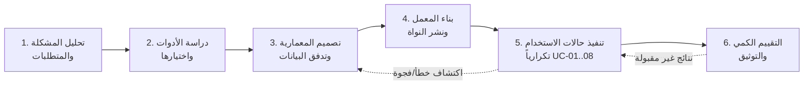
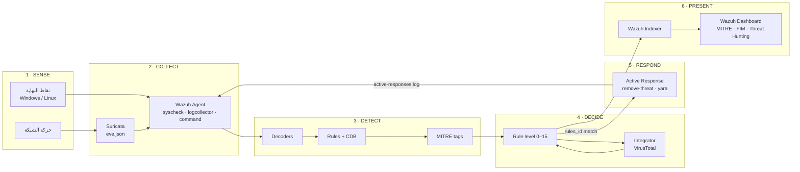

# الفصل الثالث: منهجية البحث وتصميم النظام
## Chapter Three: Research Methodology and System Design

> **حالة الفصل:** مسودة أولى كاملة (v1) — [CLAUDE] 2026-09-09 — مهمة T-21.
> **المصدر الأصلي:** S4 (§3.6 فقط) — أُعيدت صياغته ليتوافق مع الواقع المنفَّذ (`docs/02_ARCHITECTURE.md`) والنية الموحَّدة (`docs/05`). حُذف Zeek وKibana وElasticsearch من التصميم المنفَّذ ونُقلت إلى §3.8 (قابلية التوسع).
> **المخططات:** بصيغة Mermaid — تُصدَّر إلى PNG عند بناء DOCX (T-25). الشكل 3.3 الأصلي (Context Diagram) موجود في `docs/sources/` ويُستبدل بالنسخة المُصحَّحة أدناه.

---

### 3.1 مقدمة الفصل

يعرض هذا الفصل المنهجية التي اتُّبعت في تصميم منصة مركز العمليات الأمنية وتنفيذها وتقييمها، بدءاً من تحديد النموذج البحثي ومراحله، ثم تحليل المتطلبات الوظيفية وغير الوظيفية، فتصميم المعمارية العامة وطبقاتها الست، ثم نمذجة تدفق البيانات على ثلاثة مستويات، وتصميم حالات الاستخدام الثماني وسلسلة الاستجابة الآلية، وتصميم بيئة المعمل الافتراضية، وأخيراً منهجية التقييم الكمي. ويلتزم الفصل بمبدأ **المطابقة مع المنفَّذ**: كل مكوّن يُذكر في التصميم له نظير عامل في المعمل، وما لم يُنفَّذ يُذكر صراحةً في قسم قابلية التوسع.

---

### 3.2 منهجية البحث

#### 3.2.1 نوع البحث
يندرج المشروع ضمن **البحث التطبيقي التجريبي** (Applied Experimental Research) القائم على منهج **علم التصميم** (Design Science Research – DSR)، الذي يهدف إلى بناء **مُنتَج معرفي** (Artifact) — هنا منصة SOC مصغّرة — وتقييمه تجريبياً في بيئة مضبوطة، ثم استخلاص المعرفة من عملية البناء والتقييم.

#### 3.2.2 مراحل المنهجية
اتُّبع نموذج تطوير **تكراري متزايد** (Iterative-Incremental) بست مراحل:

| المرحلة | المدخلات | المخرجات | الأدوات |
|---------|----------|----------|---------|
| 1. تحليل المشكلة | أدبيات SOC للمؤسسات الصغيرة (الفصل 2) | مشكلة الدراسة، الأهداف، الحدود (الفصل 1) | مراجعة أدبيات |
| 2. اختيار الأدوات | معايير: التكلفة، التكامل، الاستجابة الآلية، ATT&CK | Wazuh 4.14 + Suricata 8.0 (§2.11) | مصفوفة مقارنة |
| 3. التصميم | المتطلبات (§3.3) | المعمارية الست الطبقات، DFD، سجل القواعد | Mermaid، جداول |
| 4. بناء المعمل | مواصفات الأجهزة | 3 آلات افتراضية مترابطة (§3.7) | VMware Workstation |
| 5. التنفيذ التكراري | runbook لكل حالة | 8 حالات استخدام + إعدادات مُتحقَّقة | Wazuh ruleset، Bash، PowerShell |
| 6. التقييم | خطة اختبار مُقاسة | جداول النتائج (الفصل 5) | سجل محاولات + `alerts.json` |

#### 3.2.3 ضوابط الجودة المنهجية
- **إسناد كل حقيقة معملية إلى دليل** (لقطة شاشة مؤرَّخة أو سجل)؛ ما لا دليل عليه يُعلَّم "غير مُتحقَّق".
- **سجل معرّفات قواعد** موحَّد يمنع التعارض (§3.6.3).
- **فصل سجل المحاولات عن سجل التنبيهات** في التقييم، لتجنّب تحيّز قياس ما كُشف فقط (§3.9).
- **إدارة الإصدارات** لكل الإعدادات والسكربتات والوثائق في مستودع Git مع مراجعة متبادلة.

---

### 3.3 تحليل المتطلبات

#### 3.3.1 المتطلبات الوظيفية (Functional Requirements)

| # | المتطلب | الأولوية | حالة الاستخدام المُحقِّقة |
|---|---------|:--------:|---------------------------|
| FR-01 | جمع الأحداث الأمنية من نقاط نهاية Windows وLinux عبر وكيل موحَّد | يجب | UC-01 |
| FR-02 | كشف إنشاء/تعديل/حذف الملفات في مجلدات حساسة في الوقت الفعلي | يجب | UC-02 |
| FR-03 | إثراء تنبيهات الملفات الجديدة بحكم خارجي (سمعة الملف) واتخاذ إجراء آلي عند الخطورة | يجب | UC-03 |
| FR-04 | كشف الأنشطة الشبكية المشبوهة (فحص المنافذ، توقيعات الهجمات) | يجب | UC-04 |
| FR-05 | تسجيل الأوامر المُنفَّذة على نظام Linux وتصنيفها بدرجات خطورة | يجب | UC-05 |
| FR-06 | كشف محاولات استغلال ثغرات خادم الويب من سجلات الوصول | يجب | UC-06 |
| FR-07 | فحص الملفات الجديدة محلياً بقواعد برمجيات خبيثة دون الاعتماد على الاتصال الخارجي | يجب | UC-07 |
| FR-08 | كشف العمليات المستمعة المشبوهة (قنوات عكسية) | يجب | UC-08 |
| FR-09 | ربط كل تنبيه بتكتيك/تقنية MITRE ATT&CK | يجب | كل الحالات |
| FR-10 | عرض التنبيهات في لوحة مركزية مع تصفية وبحث | يجب | Dashboard |
| FR-11 | تنبيه المحلل خارج اللوحة (بريد/رسالة فورية) عند الخطورة العالية | ينبغي | UC-10 (توسعة) |
| FR-12 | حظر مصدر هجوم القوة الغاشمة آلياً | ينبغي | UC-11 (توسعة) |
| FR-13 | استقبال سجلات أجهزة الشبكة (راوتر/سويتش) عبر Syslog | يمكن | UC-12 (توسعة) |

#### 3.3.2 المتطلبات غير الوظيفية (Non-Functional Requirements)

| # | المتطلب | المقياس/الهدف |
|---|---------|---------------|
| NFR-01 | **التكلفة:** صفر تكلفة ترخيص لكل المكونات | كل الأدوات مفتوحة المصدر |
| NFR-02 | **زمن الكشف (MTTD):** من وقوع الحدث إلى ظهور التنبيه | ≤ 60 ث للحالات الفورية؛ ≤ 60 ث + دورة الاستطلاع للحالات الدورية (UC-08) |
| NFR-03 | **زمن الاستجابة الآلية:** من التنبيه إلى إتمام الإجراء | ≤ 30 ث (باستثناء زمن VirusTotal الخارجي) |
| NFR-04 | **الدقة:** إنذارات كاذبة خلال ساعة نشاط طبيعي | يُقاس ويُوثَّق (هدف: 0 للقواعد المخصصة L≥12) |
| NFR-05 | **الموارد:** يعمل على حاسوب واحد 16 GB RAM | 3 آلات افتراضية متزامنة |
| NFR-06 | **قابلية التكرار:** إعادة النشر من المستودع دون معرفة ضمنية | runbooks + إعدادات مُتحقَّقة آلياً |
| NFR-07 | **الأمان الذاتي:** الاستجابة الآلية لا تُحدث ضرراً | قائمة مسموحة للمسارات، صلاحيات 750 root:wazuh، اختبار داخل VM فقط |
| NFR-08 | **قابلية التوسع:** إضافة مصدر جديد دون تغيير المعمارية | decoder + قواعد فقط (§3.8) |

#### 3.3.3 حدود التصميم (Design Constraints)
- بيئة افتراضية واحدة (VMware) على شبكة معزولة `192.168.100.0/24`؛ لا اتصال بأنظمة إنتاج.
- الاتصال الخارجي محدود بـ VirusTotal API (4 طلبات/دقيقة) ومستودعات الحزم.
- لا تخزين لأي مفتاح API في المستودع.

---

### 3.4 المعمارية العامة للنظام

#### 3.4.1 النموذج المرجعي الست المراحل
صُمّمت المنصة حول خط أنابيب واحد يمرّ به كل حدث أمني بست مراحل. هذا النموذج هو **الإطار الذهني الموحَّد** الذي تُقرأ عليه كل حالة استخدام:

#### 3.4.2 المكونات الفيزيائية والمنطقية

| المكوّن | النوع | الدور | التقنية | الآلة |
|---------|-------|-------|---------|-------|
| Wazuh Manager | خدمة | استقبال الأحداث، التحليل، القرار، تنسيق الاستجابة | wazuh-manager 4.14 (`analysisd`, `remoted`, `integratord`, `execd`) | wazuh-server |
| Wazuh Indexer | خدمة | تخزين وفهرسة التنبيهات | OpenSearch-based | wazuh-server |
| Wazuh Dashboard | خدمة | العرض والتحليل والبحث | OpenSearch Dashboards-based، HTTPS 443 | wazuh-server |
| Filebeat | خدمة داخلية | نقل `alerts.json` إلى Indexer | مدمج في المدير | wazuh-server |
| Wazuh Agent (Linux) | وكيل | FIM، جمع السجلات، تنفيذ الأوامر الدورية، الاستجابة المحلية | wazuh-agent 4.14.7 | kali1 |
| Wazuh Agent (Windows) | وكيل | نفس الوظائف | wazuh-agent 4.14.7 (MSI) | win1 |
| Suricata | حسّاس شبكي | NIDS بتوقيعات ET Open على `eth0` | 8.0.6، af-packet | kali1 |
| auditd | نظام تدقيق | تسجيل استدعاءات `execve` | Linux Audit | kali1 |
| YARA | محرك فحص | مطابقة الملفات بقواعد البرمجيات الخبيثة | 4.5.5 | kali1 (+ win1 مُعدّ) |
| Apache2 | خدمة ضحية | مصدر سجلات ويب لاختبار Shellshock | 2.4.68 | kali1 |
| VirusTotal API | خدمة خارجية | سمعة الملف بالهاش | v3، مفتاح مجاني | إنترنت |

#### 3.4.3 مبادئ التصميم
1. **وكيل واحد، مصادر متعددة:** يُجمّع وكيل Wazuh كل مصادر المضيف (FIM، auditd، Apache، Suricata، ps) فيقلّ عدد القنوات والمنافذ إلى 1514/1515 فقط.
2. **الكشف في المركز، الاستجابة في الطرف:** التحليل والقرار على المدير؛ التنفيذ (`location=local`) على الوكيل صاحب الحدث — يمنع تنفيذ إجراء على جهاز غير معنيّ.
3. **الحلقة المغلقة:** كل استجابة آلية تكتب نتيجتها في `active-responses.log` الذي يقرأه الوكيل نفسه → تنبيه تأكيد (100092/108001) → يُرى في اللوحة. لا إجراء بلا أثر.
4. **الفصل بين الطبقات:** تغيير مصدر بيانات (مثلاً استبدال Suricata) لا يمسّ القواعد المخصصة أو اللوحة.
5. **الأقل امتيازاً:** سكربتات الاستجابة `root:wazuh 750`؛ لا تشغيل كـ root إلا لما يلزم الحذف.

---

### 3.5 تصميم طبقات النظام (النموذج الست الطبقات المُصحَّح)

يُعيد هذا القسم صياغة الجدول (3.1) الأصلي ليعكس **المكونات المنفَّذة فعلاً**، مع تمييز التوسعات:

| الطبقة | المكونات المنفَّذة | العمليات | توسعة (§3.8) |
|--------|--------------------|----------|--------------|
| **1. مصادر البيانات** | win1 (Windows 10 Education)، kali1 (Kali 2025.4)، سجلات Apache، أحداث auditd، قائمة العمليات | توليد الأحداث الخام | أجهزة الشبكة (Syslog) |
| **2. الجمع** | Wazuh Agent 4.14.7: `syscheck` (realtime)، `logcollector` (audit/syslog/json)، `command` (ps كل 30 ث)؛ Suricata 8.0.6 → `eve.json` | التقاط، تغليف، إرسال مشفَّر عبر 1514 | remote syslog على المدير 514 |
| **3. المعالجة والربط** | `wazuh-analysisd`: decoders (مدمجة + `yara_decoder`) → rules (مدمجة + 13 قاعدة مخصصة) → CDB `suspicious-programs` → وسوم ATT&CK | تطبيع، مطابقة، ربط، تقييم مستوى 0–15 | decoders/قواعد 100400+ |
| **4. القرار** | مستوى القاعدة ≥ 3 → تنبيه؛ قواعد المحفّزات (100200/100201، 100300/100301) → Integrator/AR؛ 87105 → AR حذف | هل يُنبَّه؟ هل يُثرى خارجياً؟ هل يُستجاب آلياً؟ | عتبات تكرار (frequency) لـ brute-force |
| **5. الاستجابة والتخزين** | Active Response: `remove-threat.sh/.exe`، `yara.sh/.bat`؛ Integrator → VirusTotal؛ Filebeat → Wazuh Indexer (`wazuh-alerts-4.x-*`) | تنفيذ، تسجيل النتيجة، أرشفة | `firewall-drop`، Telegram/Email |
| **6. الإخراج والعرض** | Wazuh Dashboard: Threat Hunting، File Integrity Monitoring، MITRE ATT&CK، Agents | بحث، تصفية، لوحات، تصدير | تقارير PDF دورية |

> **تعديل عن النسخة الأصلية (S4):** حُذف Zeek من الطبقة 2، واستُبدل "Elastic Stack/Kibana" بـ "Wazuh Indexer/Dashboard"، وحُذفت "Email/Telegram/Syslog" من الطبقة 6 المنفَّذة ونُقلت إلى التوسعات — لضمان مطابقة الرسالة للمعمل (انظر `docs/04_ISSUES_LOG.md` ISSUE-001/003/016).
