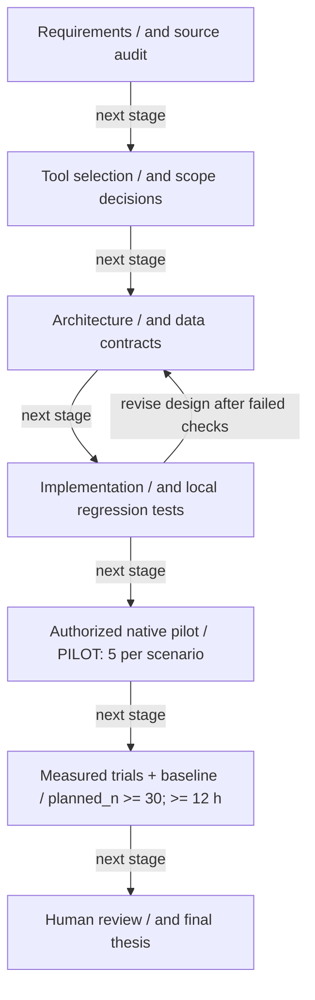
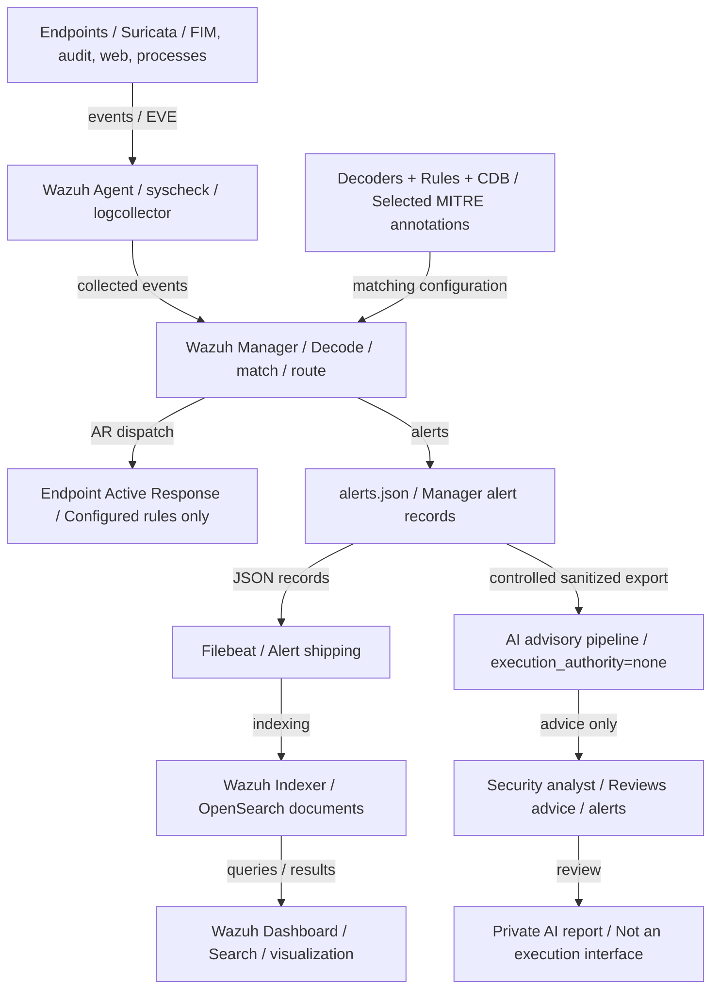
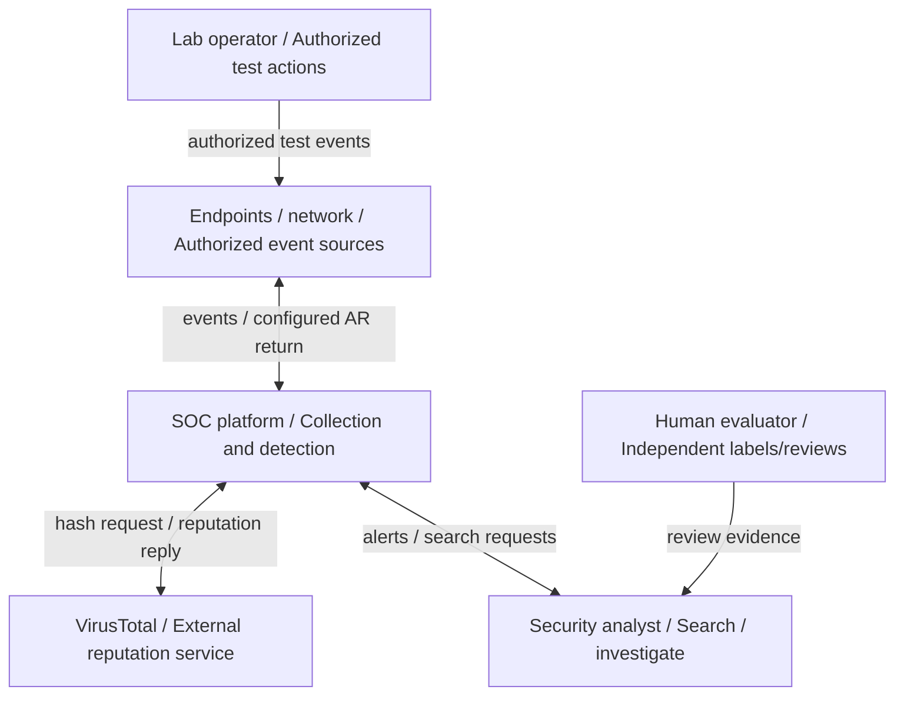
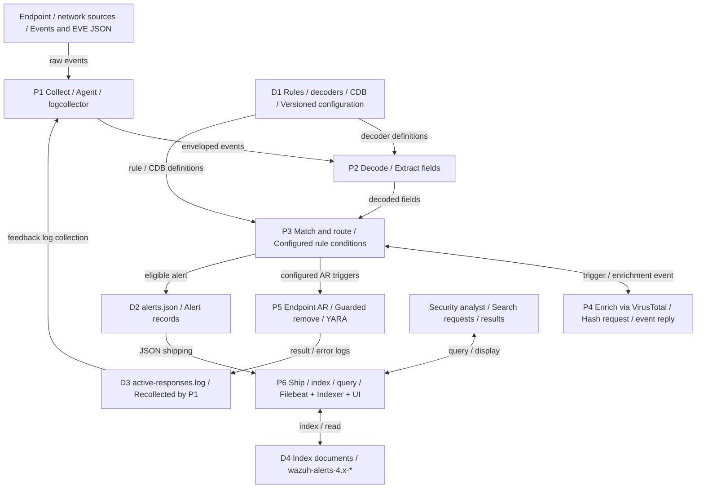
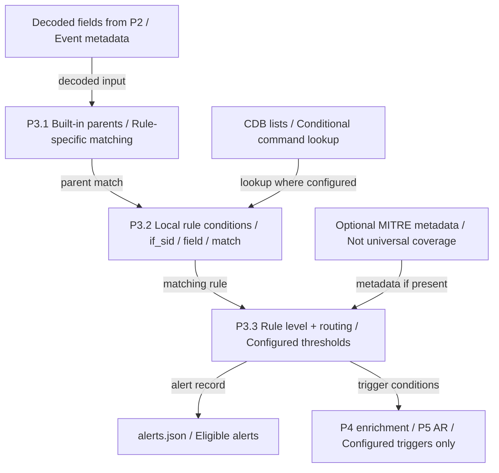
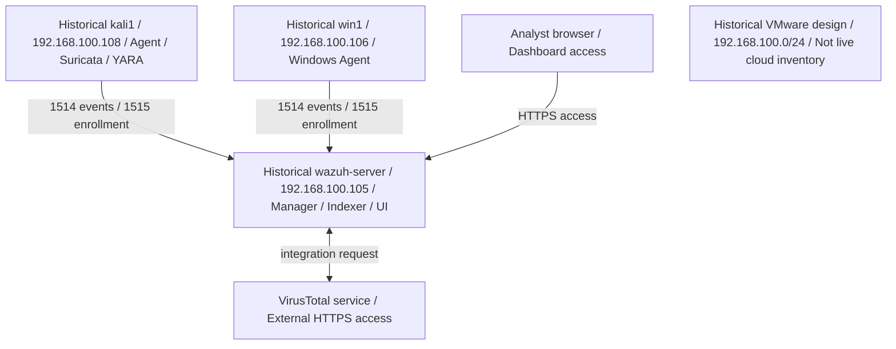

# الفصل الثالث: منهجية البحث وتصميم النظام
## Chapter Three: Research Methodology and System Design

> **حالة الفصل:** مسودة v2 — أصل [CLAUDE] 2026-09-09؛ تصحيح [AI] 2026-09-18 للنطاق ومنهجية القياس. تصميم المعمل أدناه تاريخي وليس جرد السحابة الحالية؛ راجع الفصل الرابع وسجل CLOUD_ENV_ACCESS. لا يعني وجود التصميم قبولاً معملياً حديثاً.
> **المصدر الأصلي:** S4 (§3.6 فقط) — أُعيدت صياغته ليتوافق مع الواقع المنفَّذ (`docs/02_ARCHITECTURE.md`) والنية الموحَّدة (`docs/05`). حُذف Zeek وKibana وElasticsearch من التصميم المنفَّذ ونُقلت إلى §3.8 (قابلية التوسع).
> **تحديث المخططات 2026-09-23:** ثمانية مخططات هذا الفصل أعيد بناؤها من catalog.json مع SVG وMermaid، وسبعة أشكال مكملة في [الفهرس](figures/INDEX.md). التسليم المطلوب Markdown لكاتب المستندات، لا Word/PDF؛ راجع [دليل الكاتب](WRITER_HANDOFF.md). الرسوم شروح تصميم/كود، لا قبولاً معملياً أو نتائج كمية.

---

### 3.1 مقدمة الفصل

يعرض هذا الفصل المنهجية التي اتُّبعت في تصميم منصة مركز العمليات الأمنية وتنفيذها وتقييمها، بدءاً من تحديد النموذج البحثي ومراحله، ثم تحليل المتطلبات الوظيفية وغير الوظيفية، فتصميم المعمارية العامة وطبقاتها الست، ثم نمذجة تدفق البيانات على ثلاثة مستويات، وتصميم حالات الاستخدام الثماني وسلسلة الاستجابة الآلية، وتصميم بيئة المعمل الافتراضية، وأخيراً منهجية التقييم الكمي. يفصل الفصل بين التصميم والتنفيذ البرمجي والدليل المعملي؛ حالة كل مكوّن الحديثة في الفصل الرابع، ولا يفترض أن كل مكوّن مصمم يعمل حالياً في السحابة.

---

### 3.2 منهجية البحث

#### 3.2.1 نوع البحث
يندرج المشروع ضمن **البحث التطبيقي التجريبي** (Applied Experimental Research) القائم على منهج **علم التصميم** (Design Science Research – DSR)، الذي يهدف إلى بناء **مُنتَج معرفي** (Artifact) — هنا منصة SOC مصغّرة — وتقييمه تجريبياً في بيئة مضبوطة، ثم استخلاص المعرفة من عملية البناء والتقييم.

#### 3.2.2 مراحل المنهجية
اتُّبع نموذج تطوير **تكراري متزايد** (Iterative-Incremental) بست مراحل:

[الرسم المتجهي SVG](figures/fig01_methodology.svg) · [المصدر القابل للتحرير](figures/catalog.json) · [Mermaid](figures/fig01_methodology.mmd)



| المرحلة | المدخلات | المخرجات | الأدوات |
|---------|----------|----------|---------|
| 1. تحليل المشكلة | أدبيات SOC للمؤسسات الصغيرة (الفصل 2) | مشكلة الدراسة، الأهداف، الحدود (الفصل 1) | مراجعة أدبيات |
| 2. اختيار الأدوات | معايير: التكلفة، التكامل، الاستجابة الآلية، ATT&CK | Wazuh 4.14 + Suricata 8.0 (§2.11) | مصفوفة مقارنة |
| 3. التصميم | المتطلبات (§3.3) | المعمارية الست الطبقات، DFD، سجل القواعد | Mermaid، جداول |
| 4. بناء المعمل | مواصفات الأجهزة | 3 آلات افتراضية مترابطة (§3.7) | VMware Workstation |
| 5. التنفيذ التكراري | runbook لكل حالة | 8 حالات استخدام + إعدادات مُتحقَّقة | Wazuh ruleset، Bash، PowerShell |
| 6. التقييم | خطة اختبار مُقاسة | جداول النتائج (الفصل 5) | سجل محاولات + `alerts.json` |

#### 3.2.3 ضوابط الجودة المنهجية
- **إسناد كل حقيقة معملية إلى دليل** (لقطة شاشة مؤرَّخة أو سجل)؛ ما لا دليل عليه يُعلَّم "غير مُتحقَّق".
- **سجل معرّفات قواعد** موحَّد يمنع التعارض (§3.6.3).
- **فصل سجل المحاولات عن سجل التنبيهات** في التقييم، لتجنّب تحيّز قياس ما كُشف فقط (§3.9).
- **إدارة الإصدارات** لكل الإعدادات والسكربتات والوثائق في مستودع Git مع مراجعة متبادلة.

---

### 3.3 تحليل المتطلبات

#### 3.3.1 المتطلبات الوظيفية (Functional Requirements)

| # | المتطلب | الأولوية | حالة الاستخدام المُحقِّقة |
|---|---------|:--------:|---------------------------|
| FR-01 | جمع الأحداث الأمنية من نقاط نهاية Windows وLinux عبر وكيل موحَّد | يجب | UC-01 |
| FR-02 | كشف إنشاء/تعديل/حذف الملفات في مجلدات حساسة في الوقت الفعلي | يجب | UC-02 |
| FR-03 | إثراء تنبيهات الملفات الجديدة بحكم خارجي (سمعة الملف) واتخاذ إجراء آلي عند الخطورة | يجب | UC-03 |
| FR-04 | كشف الأنشطة الشبكية المشبوهة (فحص المنافذ، توقيعات الهجمات) | يجب | UC-04 |
| FR-05 | تسجيل الأوامر المُنفَّذة على نظام Linux وتصنيفها بدرجات خطورة | يجب | UC-05 |
| FR-06 | كشف محاولات استغلال ثغرات خادم الويب من سجلات الوصول | يجب | UC-06 |
| FR-07 | فحص الملفات الجديدة محلياً بقواعد برمجيات خبيثة دون الاعتماد على الاتصال الخارجي | يجب | UC-07 |
| FR-08 | كشف العمليات المستمعة المشبوهة (قنوات عكسية) | يجب | UC-08 |
| FR-09 | إظهار وسوم MITRE ATT&CK عندما تدعمها القاعدة؛ لا ضمان لتغطية كل تنبيه | يجب | القواعد ذات الوسوم فقط |
| FR-10 | عرض التنبيهات في لوحة مركزية مع تصفية وبحث | يجب | Dashboard |
| FR-11 | تنبيه المحلل خارج اللوحة (بريد/رسالة فورية) عند الخطورة العالية | ينبغي | UC-10 (توسعة) |
| FR-12 | حظر مصدر هجوم القوة الغاشمة آلياً | ينبغي | UC-11 (توسعة) |
| FR-13 | استقبال سجلات أجهزة الشبكة (راوتر/سويتش) عبر Syslog | يمكن | UC-12 (توسعة) |

#### 3.3.2 المتطلبات غير الوظيفية (Non-Functional Requirements)

| # | المتطلب | المقياس/الهدف |
|---|---------|---------------|
| NFR-01 | **التكلفة:** تفضيل النواة مفتوحة المصدر | كلفة التشغيل والعتاد والسحابة وخطط الخدمات الخارجية والرخص تحتاج توثيقاً مستقلاً |
| NFR-02 | **زمن الكشف (MTTD):** من وقوع الحدث إلى ظهور التنبيه | ≤ 60 ث للحالات الفورية؛ ≤ 60 ث + دورة الاستطلاع للحالات الدورية (UC-08) |
| NFR-03 | **زمن الاستجابة الآلية:** من التنبيه إلى إتمام الإجراء | ≤ 30 ث (باستثناء زمن VirusTotal الخارجي) |
| NFR-04 | **الدقة:** إنذارات كاذبة خلال ساعة نشاط طبيعي | يُقاس ويُوثَّق (هدف: 0 للقواعد المخصصة L≥12) |
| NFR-05 | **الموارد:** يعمل على حاسوب واحد 16 GB RAM | 3 آلات افتراضية متزامنة |
| NFR-06 | **قابلية التكرار:** إعادة النشر من المستودع دون معرفة ضمنية | runbooks + إعدادات مُتحقَّقة آلياً |
| NFR-07 | **الأمان الذاتي:** تقليل مخاطر الاستجابة وفق حدود معلنة، لا ضمان انعدام الضرر | allowlists وواصفات ثابتة ومهل وصلاحيات مدققة؛ قبول native وسباق الاسم النهائي باقيان |
| NFR-08 | **قابلية التوسع:** إضافة مصدر جديد دون تغيير المعمارية | decoder + قواعد فقط (§3.8) |

> أهداف NFR الزمنية أعلاه تاريخية قبل القياس، وليست نتائج أو معيار قبول بديل عن TEST_PLAN المثبت لكل سيناريو. مواصفات الموارد والمنافذ والإصدارات في الجداول التاريخية تحتاج تحققاً حالياً.

#### 3.3.3 حدود التصميم (Design Constraints)
- بيئة افتراضية واحدة (VMware) على شبكة معزولة `192.168.100.0/24`؛ لا اتصال بأنظمة إنتاج.
- حدود VirusTotal الفعلية تعتمد الخطة وشروط الخدمة عند التجربة؛ رقم أربعة طلبات/دقيقة افتراض تاريخي لا حد مثبت لكل حساب. التكاملات الاختيارية اللاحقة لها اتصالات مصرح بها مستقلة.
- لا تخزين لأي مفتاح API في المستودع.

---

### 3.4 المعمارية العامة للنظام

#### 3.4.1 النموذج المرجعي الست المراحل
المراحل الست نموذج ذهني لفهم المنصة، وليست مساراً إلزامياً لكل حدث؛ الإثراء والاستجابة ووسوم MITRE مشروطة بالقواعد. يوضح الرسم أيضاً مسار التخزين ومسار AI الاستشاري المنفصل:

[الرسم المتجهي SVG](figures/fig02_architecture.svg) · [المصدر القابل للتحرير](figures/catalog.json) · [Mermaid](figures/fig02_architecture.mmd)



#### 3.4.2 المكونات الفيزيائية والمنطقية

| المكوّن | النوع | الدور | التقنية | الآلة |
|---------|-------|-------|---------|-------|
| Wazuh Manager | خدمة | استقبال الأحداث، التحليل، القرار، تنسيق الاستجابة | wazuh-manager 4.14 (`analysisd`, `remoted`, `integratord`, `execd`) | wazuh-server |
| Wazuh Indexer | خدمة | تخزين وفهرسة التنبيهات | OpenSearch-based | wazuh-server |
| Wazuh Dashboard | خدمة | العرض والتحليل والبحث | OpenSearch Dashboards-based، HTTPS 443 | wazuh-server |
| Filebeat | ناقل سجلات | نقل `alerts.json` إلى Indexer | خدمة نشر مرافقة للمدير، وليست analysisd نفسه | wazuh-server تاريخياً |
| Wazuh Agent (Linux) | وكيل | FIM، جمع السجلات، تنفيذ الأوامر الدورية، الاستجابة المحلية | wazuh-agent 4.14.7 | kali1 |
| Wazuh Agent (Windows) | وكيل | نفس الوظائف | wazuh-agent 4.14.7 (MSI) | win1 |
| Suricata | حسّاس شبكي | NIDS بتوقيعات ET Open على `eth0` | 8.0.6، af-packet | kali1 |
| auditd | نظام تدقيق | تسجيل استدعاءات `execve` | Linux Audit | kali1 |
| YARA | محرك فحص | مطابقة الملفات بقواعد البرمجيات الخبيثة | 4.5.5 | kali1 (+ win1 مُعدّ) |
| Apache2 | خدمة ضحية | مصدر سجلات ويب لاختبار Shellshock | 2.4.68 | kali1 |
| VirusTotal API | خدمة خارجية | سمعة الملف بالهاش | v3، مفتاح مجاني | إنترنت |

#### 3.4.3 مبادئ التصميم
1. **وكيل واحد، مصادر متعددة:** يُجمّع وكيل Wazuh كل مصادر المضيف (FIM، auditd، Apache، Suricata، ps) فيقلّ عدد القنوات والمنافذ إلى 1514/1515 فقط.
2. **الكشف في المركز، الاستجابة في الطرف:** التحليل والقرار على المدير؛ التنفيذ (`location=local`) على الوكيل صاحب الحدث — يمنع تنفيذ إجراء على جهاز غير معنيّ.
3. **تغذية راجعة مشروطة:** تسجل السكربتات نتائج/أخطاء يعيد الوكيل جمعها؛ قد تطابق قاعدة تأكيد. 108001 نتيجة مطابقة YARA إيجابية، لا إثبات اكتمال لكل scan. غياب السجل أو التنبيه ممكن عند الفشل، وسجل النجاح ليس شاهد t5 مستقلاً.
4. **الفصل بين الطبقات:** تغيير مصدر بيانات (مثلاً استبدال Suricata) لا يمسّ القواعد المخصصة أو اللوحة.
5. **الأقل امتيازاً:** سكربتات الاستجابة `root:wazuh 750`؛ لا تشغيل كـ root إلا لما يلزم الحذف.

---

### 3.5 تصميم طبقات النظام (النموذج الست الطبقات المُصحَّح)

يُعيد هذا القسم صياغة الجدول (3.1) الأصلي ليعكس **المكونات المنفَّذة فعلاً**، مع تمييز التوسعات:

| الطبقة | المكونات المنفَّذة | العمليات | توسعة (§3.8) |
|--------|--------------------|----------|--------------|
| **1. مصادر البيانات** | win1 (Windows 10 Education)، kali1 (Kali 2025.4)، سجلات Apache، أحداث auditd، قائمة العمليات | توليد الأحداث الخام | أجهزة الشبكة (Syslog) |
| **2. الجمع** | Wazuh Agent 4.14.7: `syscheck` (realtime)، `logcollector` (audit/syslog/json)، `command` (ps كل 30 ث)؛ Suricata 8.0.6 → `eve.json` | التقاط، تغليف، إرسال مشفَّر عبر 1514 | remote syslog على المدير 514 |
| **3. المعالجة والربط** | `wazuh-analysisd`: decoders (مدمجة + `yara_decoder`) → rules (مدمجة + 13 قاعدة مخصصة) → CDB `suspicious-programs` → وسوم ATT&CK | تطبيع، مطابقة، ربط، تقييم مستوى 0–15 | decoders/قواعد 100400+ |
| **4. القرار** | مستوى القاعدة ≥ 3 → تنبيه؛ قواعد المحفّزات (100200/100201، 100300/100301) → Integrator/AR؛ 87105 → AR حذف | هل يُنبَّه؟ هل يُثرى خارجياً؟ هل يُستجاب آلياً؟ | عتبات تكرار (frequency) لـ brute-force |
| **5. الاستجابة والتخزين** | Active Response: `remove-threat.sh/.exe`، `yara.sh/.bat`؛ Integrator → VirusTotal؛ Filebeat → Wazuh Indexer (`wazuh-alerts-4.x-*`) | تنفيذ، تسجيل النتيجة، أرشفة | `firewall-drop`، Telegram/Email |
| **6. الإخراج والعرض** | Wazuh Dashboard: Threat Hunting، File Integrity Monitoring، MITRE ATT&CK، Agents | بحث، تصفية، لوحات، تصدير | تقارير PDF دورية |

> **تعديل عن النسخة الأصلية (S4):** حُذف Zeek من الطبقة 2، واستُبدل "Elastic Stack/Kibana" بـ "Wazuh Indexer/Dashboard"، وحُذفت "Email/Telegram/Syslog" من الطبقة 6 المنفَّذة ونُقلت إلى التوسعات — لضمان مطابقة الرسالة للمعمل (انظر `docs/04_ISSUES_LOG.md` ISSUE-001/003/016).

---

### 3.6 نمذجة تدفق البيانات (Data Flow Diagrams)

#### 3.6.1 الرموز المستخدمة (جدول 3.2)
| الرمز | المعنى |
|-------|--------|
| مستطيل | كيان خارجي (External Entity) — مصدر أو مستقبل خارج حدود النظام |
| دائرة/مستطيل مدوَّر | عملية (Process) — تُحوّل البيانات |
| خطان متوازيان / أسطوانة | مخزن بيانات (Data Store) |
| سهم | تدفق بيانات (Data Flow) مع تسميته |

#### 3.6.2 المستوى السياقي (Level 0 — Context Diagram) — الشكل 3.1

[الرسم المتجهي SVG](figures/fig03_context.svg) · [المصدر القابل للتحرير](figures/catalog.json) · [Mermaid](figures/fig03_context.mmd)



**التحليل:** معظم التدفقات ثنائية الاتجاه (نقاط النهاية ترسل أحداثاً وتستقبل أوامر استجابة؛ VirusTotal يستقبل هاشاً ويعيد حكماً)، بينما تدفق المهاجم أحادي الاتجاه نحو الأهداف. ويُلاحَظ أن **المهاجم لا يتفاعل مع المنصة مباشرة** بل تُلاحَظ آثاره عبر نقاط النهاية والشبكة — وهذا جوهر المراقبة السلبية (Passive Monitoring).

#### 3.6.3 المستوى الأول (Level 1 DFD) — الشكل 3.2

[الرسم المتجهي SVG](figures/fig04_dfd1.svg) · [المصدر القابل للتحرير](figures/catalog.json) · [Mermaid](figures/fig04_dfd1.mmd)



**الحلقات المغلقة الثلاث** (ميزة التصميم):
1. **حلقة الإثراء:** P3 → P4 → VirusTotal → P4 → P3 (قاعدة 87105) — قرار مبني على معرفة خارجية.
2. **حلقة الاستجابة:** P3 → P5 → نقطة النهاية → `active-responses.log` → P1 → P2 → P3؛ تنبيه النتيجة مشروط بنجاح الكتابة والجمع والمطابقة، وليس مضموناً لكل إجراء، ولا يستبدل شاهداً سببياً مستقلاً للاكتمال.
3. **حلقة المحلل:** P6 → المحلل → استعلام → P6 — البحث والتصفية.

#### 3.6.4 المستوى الثاني (Level 2 DFD) — تفصيل العملية 3.0 "مطابقة القواعد" — الشكل 3.3

[الرسم المتجهي SVG](figures/fig05_dfd2.svg) · [المصدر القابل للتحرير](figures/catalog.json) · [Mermaid](figures/fig05_dfd2.mmd)



---

### 3.7 تصميم حالات الاستخدام وسلاسل الاستجابة

#### 3.7.1 مصفوفة حالات الاستخدام على النموذج الست المراحل (جدول 3.3)

| UC | SENSE | COLLECT | DETECT (قواعد) | DECIDE (مستوى/محفّز) | RESPOND | PRESENT (ATT&CK) |
|----|-------|---------|----------------|----------------------|---------|------------------|
| 01 نشر الوكلاء | — | تسجيل 1515، أحداث 1514 | — | — | — | Agents: active |
| 02 FIM | ملف | syscheck realtime | 550/553/554 | L5–7 | — | FIM module |
| 03 VirusTotal | ملف جديد | syscheck | 100200/100201 → Integrator → 87105 | L12 | **حذف الملف** (AR local) → 100092 | Threat Hunting |
| 04 Suricata | ترافيك | eve.json (json) | 86600–86601 | L3+ | — | T1046 (فحص) |
| 05 auditd | أمر مُنفَّذ | audit.log (audit) | 80792 → CDB → 100210 | **red → L12** | — | T1059 |
| 06 Shellshock | طلب HTTP | access.log (syslog) | 31168 | L15 | — | T1190 · T1068 |
| 07 YARA | ملف جديد | syscheck | 100300/100301 → AR → yara_decoder → 108001 | L12 | **فحص آلي** (AR local) | T1204.002 |
| 08 Netcat | عملية | ps كل 30 ث (full_command) | 530 → 100050 → 100051 | L7، ignore 900 | — | T1571 |

#### 3.7.2 تسلسل الاستجابة الآلية — UC-03 (الشكل 3.4)

[الرسم المتجهي SVG](figures/fig06_vt_sequence.svg) · [المصدر القابل للتحرير](figures/catalog.json) · [Mermaid](figures/fig06_vt_sequence.mmd)

```mermaid
sequenceDiagram
    participant agent as Agent
    participant manager as Manager
    participant vt as VT integration
    participant execd as execd / wrapper
    participant ar as soc_ar remove
    participant store as Filebeat / Indexer
    agent->>manager: FIM event -&gt; configured 100200/100201 trigger
    manager->>vt: Hash reputation request through integration
    vt->>manager: Reputation event -&gt; rule 87105 when matched
    manager->>execd: Dispatch configured local remove-threat response
    execd->>ar: Read bounded JSON add; delete is a no-op
    ar->>ar: Require rule 87105 and approved path; derive agent/path/md5 keys
    ar->>execd: check_keys handshake
    execd->>ar: abort -&gt; return; continue -&gt; proceed; otherwise reject
    ar->>ar: Open no-follow single-link regular file under pinned parent
    ar->>ar: Compare source MD5 and stable descriptor/name identity
    ar->>ar: os.unlink(basename, dir_fd=parent); final name-swap risk remains
    ar->>agent: Write success/error log; log is not independent completion evidence
    agent->>manager: Recollect log; configured success/failure rules may match
    manager->>store: alerts.json -&gt; Filebeat -&gt; Indexer -&gt; Dashboard
```

التسلسل أعلاه يشرح مسار Linux دون قياس مدد؛ حالات abort/delete/errors لا تنفذ المسار الناجح كاملاً. يفصل عقد القياس D_VT عند توفر t2_prime عن المقاييس الأخرى، ولا يجمع مدد خدمات مفترضة لتكوين نتيجة. الحذف os.unlink تحت أب مثبت بعد فحص MD5 والهوية، مع بقاء مخاطرة تبديل الاسم النهائية؛ راجع SECURITY_REVIEW.

#### 3.7.3 تسلسل الاستجابة الآلية — UC-07 (الشكل 3.5)

[الرسم المتجهي SVG](figures/fig07_yara_sequence.svg) · [المصدر القابل للتحرير](figures/catalog.json) · [Mermaid](figures/fig07_yara_sequence.mmd)

```mermaid
sequenceDiagram
    participant agent as Agent
    participant manager as Manager
    participant ar as soc_ar yara
    participant yara as YARA process
    participant store as Filebeat / Indexer
    agent->>manager: FIM event -&gt; configured Linux trigger 100300 or 100301
    manager->>ar: AR add with exact approved extra_args; delete -&gt; no-op
    ar->>ar: Require allowed path; pin regular single-link file without following links
    ar->>ar: Wait for stable identity; reject if not stable within bounded loop
    ar->>ar: Check root-owned non-writable regular binary and rule file
    ar->>yara: yara -w -a 10 -l 100 RULES /proc/self/fd/FD; no shell or recursion
    yara->>ar: 25 s subprocess timeout; CPU/address-space limits; require exit 0
    ar->>ar: Recheck file identity; validate each rule name and descriptor output
    ar->>agent: Write match lines and scan_complete audit; failures logged separately
    agent->>manager: yara_decoder / 108001 for positive match, not every completed scan
    manager->>store: alerts.json -&gt; Filebeat -&gt; Indexer -&gt; Dashboard
```

#### 3.7.4 سجل معرّفات القواعد المخصصة (جدول 3.4)
اعتُمد نطاق `100000–109999` للقواعد المخصصة وفق توثيق Wazuh، مع تقسيمه داخلياً لمنع التعارض:

| النطاق | الاستخدام | القواعد المُعرَّفة |
|--------|-----------|-------------------|
| 100050–100099 | مراقبة العمليات | 100050، 100051 |
| 100090–100099 | نتائج الاستجابة الآلية (VirusTotal) | 100092، 100093 |
| 100200–100299 | محفّزات FIM → VirusTotal | 100200، 100201 |
| 100210–100219 | تدقيق الأوامر (CDB) | 100210 |
| 100300–100399 | محفّزات FIM → YARA | 100300، 100301 (Linux)، 100303، 100304 (Windows) |
| 100400–100499 | **محجوز** — أجهزة الشبكة (Syslog) | — |
| 100500–100599 | **محجوز** — الإشعارات والتقارير | — |
| 108000–108099 | نتائج YARA | 108000، 108001 |

يُتحقَّق آلياً من عدم التكرار عبر سكربت `check_rule_ids.py` قبل كل تعديل.

---

### 3.8 تصميم بيئة المعمل الافتراضية

#### 3.8.1 الطوبولوجيا (الشكل 3.6)

[الرسم المتجهي SVG](figures/fig08_topology.svg) · [المصدر القابل للتحرير](figures/catalog.json) · [Mermaid](figures/fig08_topology.mmd)



> جدول الأصول التالي تاريخي؛ افتراض OVA والنظام الحالي لا يثبت من الرسم. لا تستخدمه لاتصال أو نشر أو بوصفه جرداً سحابياً حديثاً.

#### 3.8.2 جدول الأصول (جدول 3.5)
| الأصل | الاسم | IP | نظام التشغيل | البرمجيات | الدور |
|-------|-------|----|--------------|-----------|-------|
| الخادم | `wazuh-server` | 192.168.100.105 | Wazuh OVA 4.14 (Linux) | wazuh-manager, indexer, dashboard, filebeat | نواة SOC |
| نقطة نهاية Linux | `kali1` (agent 002) | 192.168.100.108 | Kali GNU/Linux 2025.4 | wazuh-agent 4.14.7, suricata 8.0.6, auditd, apache2 2.4.68, yara 4.5.5, jq | مراقَب + حسّاس شبكي + ضحية ويب + مصدر هجمات محاكاة |
| نقطة نهاية Windows | `win1` (agent 001) | 192.168.100.106 | Windows 10 Education 10.0.19045 | wazuh-agent 4.14.7, Python 3 + PyInstaller (AR) | مراقَب |

#### 3.8.3 مبررات التصميم
- **خادم واحد متكامل (All-in-one):** يُناسب حجم SME ويُبسّط النشر؛ الفصل إلى عقد متعددة ممكن لاحقاً دون تغيير الوكلاء.
- **Kali كنقطة نهاية وضحية ومهاجم في آن:** يُقلّل عدد الآلات (قيد 16 GB RAM) مع الحفاظ على واقعية السجلات؛ ويُوثَّق أن الهجمات الشبكية الخارجية (nmap، curl) تُنفَّذ من جهاز ثانٍ عند توفره.
- **Suricata على نقطة النهاية لا على sensor مستقل:** خيار عملي للمعمل؛ في النشر الحقيقي يُوضع على مرآة منفذ (SPAN) أو gateway.

#### 3.8.4 المنافذ والبروتوكولات (جدول 3.6)
| منفذ | بروتوكول | الاتجاه | الغرض |
|------|----------|---------|-------|
| 1514 | TCP | Agent → Manager | نقل الأحداث؛ إعداد التشفير الفعلي يتحقق من النشر الأصلي |
| 1515 | TCP | Agent → Manager | التسجيل؛ تحقق TLS والشهادات من الإعداد الفعلي |
| 443 | TCP | المحلل → Dashboard | واجهة الويب |
| 55000 | TCP | Dashboard → Manager | Wazuh API |
| 9200 | TCP | Filebeat → Indexer | نقل داخلي وفق إعداد النشر المعتمد |
| 80 | TCP | المهاجم → kali1 | Apache (ضحية) |
| 443 | TCP | Manager → VirusTotal | إثراء خارجي |

---

### 3.9 قابلية التوسع والمكونات غير المنفَّذة

يمكن توسيع النظام بمصادر وقدرات جديدة، لكن ذلك قد يحتاج نقلاً وصلاحيات وتخزيناً وقبولاً إضافياً، ولا يقتصر دائماً على decoder أو قاعدة:

| التوسعة | الطبقة المتأثرة | ما يلزم إضافته | النطاق المحجوز | الحالة |
|---------|-----------------|----------------|----------------|--------|
| SQL Injection detection | 3 | عميل اختبار محدود وسجل Apache؛ 31103 توقيع SQLi و31106 محتمل وفق السطر | — | UC-09 منفذ برمجياً؛ القبول الأصلي متبقٍ |
| إشعار Telegram | 6 | Integrator خاص ومخزن محاولات ومفاتيح خارج Git | لا قاعدة جديدة | UC-10 منفذ برمجياً؛ إرسال معتمد متبقٍ |
| حظر brute-force SSH | 5 | عميل محدود ومولّد إعداد firewall-drop على 5712/5763 باستثناء الإدارة | — | UC-11 منفذ برمجياً؛ اختبار الحظر والإزالة متبقٍ |
| أجهزة الشبكة (راوتر/سويتش) | 1، 2، 3 | `<remote><connection>syslog</connection>` + decoders + قواعد | 100400+ | مقترح UC-12 |
| Zeek (تحليل بروتوكولات) | 2، 3 | decoders لسجلات Zeek JSON | — | عمل مستقبلي |
| TheHive (إدارة الحالات) | 6 | Integrator → TheHive API | — | عمل مستقبلي |
| محلل ذكاء اصطناعي (LLM) | 6 | إسقاط منقح ومعرفة مثبتة وrunner وتقييم وتقرير خاص | 100500+ محجوز | MUST وفق ADR-014؛ أدوات منفذة، لا inference أو C4 أصلي |
| الأجهزة المحمولة | 1 | لا وكيل رسمي؛ عبر MDM/syslog أو مراقبة الترافيك على gateway | — | تحدٍّ بحثي |

---

### 3.10 منهجية التقييم

> التصحيح المنهجي 2026-09-18: يحكم هذا القسم `tests/TEST_PLAN.md` و`tests/README.md`، لا قيم النسخة الأولى (عشر محاولات وساعة baseline). هذه خطة قبل القياس، وليست نتائج نجاح.

#### 3.10.1 وحدة التجربة والمقامات

تسجل كل محاولة في journal مستقل عن التنبيهات بهوية run/trial ثابتة ومرحلة PILOT أو MEASURED أو BASELINE أو SUPPRESSION_CONTROL. خمس محاولات PILOT لكل سيناريو/OS/config، ثم تثبيت `planned_n ≥ 30` قبل MEASURED وقد يزداد وفق SD المرصود: `max(30, ceil((1.96*sigma_hat/margin)**2))`، والهامش الافتراضي ثانية. هذه صيغة تخطيط للمتوسط لا ضمان لدقة P95. لكل فعل FIM (إضافة/تعديل/حذف) مجموعة مستقلة. UC-01 خمس دورات اتصال وليس اختبار كشف هجوم. حالات UC-09..13 تحتاج بروتوكولات قبول خاصة ولا تعتمد بمجرد قبول معرفاتها في أداة الحساب.

المعدل الأساسي `DETECTED / جميع المحاولات` يشمل الاستبعادات، ويعرض إلى جواره المعدل الشرطي `DETECTED/(DETECTED+MISSED)` مع أسباب BLOCKED/INVALID/INTERFERED/AMBIGUOUS. لا تُحذف حالات الفشل أو تُستبدل بمحاولات ناجحة. الكشف بعد الموعد يبقى MISSED ضمن النافذة مع علامة تأخر إضافية.

#### 3.10.2 تعريف الزمن ومصادره

`t0` إطلاق الفعل، `t1` دليل المصدر، `t2` تنبيه المدير، `t3` أول ظهور مرصود بالفهرس، `t4` بدء الاستجابة على endpoint، `t5` اكتمال مستقل، `t6` تأكيد المدير. تصحح الساعات بطرح offset مرة واحدة؛ التخزين epoch ms لا يثبت دقة ms.

| المقياس | الصيغة بعد التصحيح |
|---|---|
| D_source | t1 − t0 |
| MTTD | t2 − t1 |
| MTTD_e2e | t2 − t0 |
| L_vis | t3 − t2 |
| L_AR_trigger | t4 − t2 |
| L_AR_complete | t5 − t4 |
| L_AR_e2e | t5 − t0 |
| L_confirm | t6 − t5 |

في UC-03، `t2_prime` تنبيه VirusTotal و`D_VT=t2_prime−t2` منفصل؛ لا يساوى تأكيد المدير اكتمال الحذف ولا نتيجة YARA بداية الفحص. زمن Suricata من EVE إلى المدير تأخير تكامل لا كامل زمن كشف الهجوم. القيم المفقودة والفروق السالبة تعطي null مع السبب، لا صفراً. ملخصات الزمن شرطية على DETECTED ذي الطابع الصالح، وتعرض n والوسيط والربيعين وIQR وP95 بطريقة type7 والمتوسط وsample SD والمفقود. زمن C4 منفصل ويستخدم nearest-rank لـP95.

#### 3.10.3 الضبط والإحصاء والقبول

- بوابة G2-0: فحص `alert.timestamp` الأصلي ودقة المولد وعدم يقين الساعة؛ عدد الخانات وحده لا يكفي. لكل جهاز قياسات offset وعدم يقين ومراجع قبل/بعد الجولة؛ تجاوز حد 100ms وفق العقد يرفض session كاملة، ولا يُفترض المفقود صفراً.
- حد أدنى 12 ساعة BASELINE لكل OS/config، باتحاد فترات التعرض دون عد مزدوج، ونشاط طبيعي موصوف وتحكيم لكل تنبيه. `FP/h = عدد إنذارات التهديد المحكوم بكذبها / ساعات التعرض`؛ ترافقه قيمة Poisson أحادية عليا 95% وفق الافتراضات. لا تُحسب FPR بلا تعريف TN.
- Wilson95 للنسب الثنائية مع مراجعة استقلال المحاولات وتجانسها، لا لمتوسطات الزمن أو FP/h. لا عينات تعني null لا نجاحاً بنسبة 100% أو خطأ بنسبة صفر.
- مقارنة H4 في `L_AR_complete` تحتاج مجموعتين مستقلتين وشروطاً متكافئة؛ نتيجة Mann–Whitney غير الدالة لا تثبت عدم الدونية أو حد ثانية. ISSUE-054 يبقى للمراجعة المنهجية.
- تنبيهات خام مؤرخة ومراجع مصدر وربط فريد ومراقب مستقل للاكتمال وأول ظهور API؛ المشغّل يستورد مراقبي t3/t4/t5 ولا ينشرهم بنفسه. سجل النافذة كله والملفات المدورة، ولا تنظف logs لتهيئة التجربة.
- اختبار AR بعد مراجعة المسارات والصلاحيات والنسخ والرجوع؛ لا تعطيل Defender تلقائياً، ولا عينات خبيثة تنفيذية. تثبيت حدود النجاح ونوافذ الكشف من TEST_PLAN قبل القياس، وأي تغيير ينشئ run جديدة.

#### 3.10.4 تقييم المحلل الاستشاري C4

وفق UC-14 §10–13: ثلاثون تنبيهاً بشري الوسوم على الأقل، ومخرجات وفشل ورفض ومفقود بالمقام المجمد، دون تسريب gold/rubric إلى النموذج. يستورد runner أدلة البايتات، ويحسب evaluator المقاييس، ويعرض report.py تقريراً خاصاً. شروط Wilson تشمل استقلال الحالات وتميز العناقيد والدفعات وصادرات المصدر؛ لا يعاد تقديم المصدر نفسه كعينة مستقلة. تحكيم الادعاءات بشري ومربوط ببصمة الجواب؛ نقص التحكيم ليس غياب الهلوسة. `execution_authority=none`، ولا تمنح الأدوات موافقة نشر أو تثبت هوية النموذج أو استقلال البشر.

---

### 3.11 خلاصة الفصل

قدّم هذا الفصل منهجية علم التصميم التكرارية التي اتُّبعت، و13 متطلباً وظيفياً و8 غير وظيفية، ومعمارية ست المراحل كنموذج ذهني موحَّد، وتدفق البيانات على ثلاثة مستويات مع الحلقات المغلقة الثلاث (الإثراء، الاستجابة، المحلل)، ومصفوفة الحالات الثماني على النموذج، وتسلسلَي الاستجابة الآلية، وسجل معرّفات القواعد، وبيئة المعمل بثلاث آلات، وقابلية التوسع بلا تغيير معماري، ومنهجية تقييم كمية بسجل محاولات مستقل. ويُشكّل هذا التصميم الأساس الذي يعرض الفصل الرابع تنفيذه، والفصل الخامس نتائج تقييمه.
