# الفصل الأول: المقدمة
## Chapter One: Introduction

---

### 1.1 مقدمة (Introduction)

يشهد العالم في السنوات الأخيرة تحولًا رقميًا متسارعًا نتيجة الاعتماد المتزايد على تقنيات المعلومات والاتصالات في مختلف القطاعات، مثل المؤسسات الحكومية، والقطاع المالي، والتعليم، والرعاية الصحية، والصناعات المختلفة. وقد أدى هذا التحول إلى زيادة الاعتماد على الأنظمة الحاسوبية والشبكات وقواعد البيانات والخدمات السحابية، الأمر الذي جعل هذه المؤسسات أكثر عرضة للهجمات السيبرانية التي تتطور باستمرار من حيث الأساليب والأدوات المستخدمة.

وتعد الهجمات الإلكترونية، مثل برمجيات الفدية (Ransomware)، وهجمات التصيد الاحتيالي (Phishing)، والبرمجيات الخبيثة (Malware)، وهجمات حجب الخدمة (DDoS)، واستغلال الثغرات الأمنية (Exploits)، من أبرز التهديدات التي تواجه المؤسسات الحديثة. ولا تقتصر آثار هذه الهجمات على الخسائر المالية فحسب، بل تمتد إلى فقدان البيانات الحساسة، وتعطيل الخدمات، والإضرار بسمعة المؤسسة، وانخفاض ثقة العملاء.

في المقابل، لم تعد وسائل الحماية التقليدية مثل الجدران النارية (Firewalls) وبرامج مكافحة الفيروسات كافية لمواجهة التهديدات السيبرانية الحديثة، وذلك بسبب تطور أساليب المهاجمين وقدرتهم على تجاوز آليات الحماية التقليدية. لذلك برز مفهوم مركز عمليات الأمن (Security Operations Center – SOC) باعتباره أحد أهم مكونات الأمن السيبراني في المؤسسات الحديثة.

يمثل مركز عمليات الأمن بيئة تشغيلية متخصصة تعمل على مراقبة البنية التحتية التقنية بشكل مستمر، وجمع وتحليل السجلات الأمنية (Logs)، واكتشاف الأنشطة المشبوهة، والاستجابة للحوادث الأمنية في الوقت المناسب. ويعتمد مركز العمليات الأمنية على مجموعة من الأدوات الأمنية المتكاملة مثل أنظمة إدارة معلومات وأحداث الأمن (Security Information and Event Management – SIEM)، وأنظمة كشف التسلل (Intrusion Detection Systems – IDS)، وأدوات تحليل حركة الشبكة، ومنصات عرض البيانات ولوحات المعلومات الأمنية.

غير أن الدراسات الحديثة لمراكز العمليات الأمنية تُظهر أن التحدي الحقيقي لم يعد في **جمع** الأحداث، بل في ثلاثة أمور مترابطة: (1) **توحيد** إشارات متعددة المصادر — الأجهزة الطرفية، والشبكة، والسجلات التطبيقية — في خط معالجة واحد؛ (2) **تقليص الفجوة الزمنية** بين لحظة الكشف ولحظة الاستجابة، وهي الفجوة التي يستغلها المهاجم للانتشار؛ (3) **إثبات الفعالية بأرقام قابلة للتحقق** بدل الاكتفاء بوصف نوعي لما يقدر النظام على كشفه.

يهدف هذا المشروع إلى تصميم وتنفيذ منصة مركز عمليات أمنية متكاملة تعتمد على أدوات مفتوحة المصدر (Open-Source Security Tools)، بحيث تحاكي مركز عمليات أمنية حقيقي داخل مؤسسة صغيرة أو متوسطة الحجم. وتتخذ المنصة من **Wazuh** نواةً لإدارة الأحداث الأمنية والاستجابة، ومن **Suricata** حسّاسًا لحركة الشبكة، وتربطهما مع أدوات إثراء وكشف تكميلية (VirusTotal، YARA، auditd) في خط أنابيب واحد: **كشف ← قرار ← استجابة آلية ← عرض**. ويُفرِّق المشروع نفسه عن مجرد تثبيت الأدوات بثلاثة أمور: استجابة آلية محكومة بسياسة أمنية، وبروتوكول تقييم كمّي مُقاس، وتصميم قابل للتوسع نحو مصادر جديدة (أجهزة الشبكة) دون تغيير المعمارية.

ويركز المشروع على دمج مجموعة من الأدوات الأمنية لتوفير منصة مركزية قادرة على جمع الأحداث الأمنية، وتحليلها، واكتشاف التهديدات، وإرسال التنبيهات، وتنفيذ استجابة آلية للتهديدات عالية الخطورة، وعرض النتائج من خلال لوحات معلومات تفاعلية تساعد محللي الأمن السيبراني في اتخاذ القرارات المناسبة.

---

### 1.2 تعريف المشروع (Project Definition)

يتمثل هذا المشروع في تصميم وتنفيذ مركز عمليات أمنية (Security Operations Center – SOC) يعتمد على مجموعة من أدوات الأمن السيبراني مفتوحة المصدر بهدف مراقبة الشبكة، وجمع السجلات الأمنية، وتحليل الأحداث، واكتشاف الأنشطة المشبوهة، والاستجابة للحوادث الأمنية بطريقة مركزية وفعالة.

يرتكز المشروع على إنشاء بيئة افتراضية (Virtual Environment) تمثل شبكة مؤسسة حقيقية، حيث يتم توزيع عدة أجهزة وخوادم داخل الشبكة، وربطها بخادم مركزي يعمل كمركز عمليات أمنية. ويقوم هذا الخادم باستقبال السجلات الأمنية من مختلف الأجهزة، وتحليلها باستخدام قواعد كشف التهديدات، ثم عرض النتائج عبر لوحات معلومات رسومية (Dashboards) مع إصدار التنبيهات الأمنية عند اكتشاف أي نشاط غير طبيعي.

وقد نُفِّذت البيئة فعليًا على منصة الافتراضية **VMware Workstation** ضمن الشبكة الفرعية `192.168.100.0/24`، وتتكوَّن من ثلاث آلات افتراضية رئيسية يوضحها الشكل (1.1):

- **خادم SOC المركزي** (`wazuh-server`, 192.168.100.105): جهاز Wazuh الافتراضي الجاهز (OVA) الإصدار 4.14، ويضم على آلة واحدة (All-in-one) مكوّنات المدير (Wazuh Manager) والمُفهرِس (Wazuh Indexer) ولوحة المعلومات (Wazuh Dashboard).
- **نقطة نهاية Linux** (`kali1`, 192.168.100.108): توزيعة Kali Linux 2025.4 مزوّدة بوكيل Wazuh 4.14.7، وتعمل في الوقت ذاته كحسّاس شبكة (Suricata 8.0.6)، وخادم ويب ضحية (Apache 2.4.68)، ومنصة تدقيق أوامر (auditd)، ومحرك فحص محلي (YARA 4.5.5).
- **نقطة نهاية Windows** (`win1`, 192.168.100.106): نظام Windows 10 Education بالإصدار 10.0.19045 مزوّد بوكيل Wazuh 4.14.7 مع مراقبة سلامة الملفات (FIM) واستجابة آلية محلية.

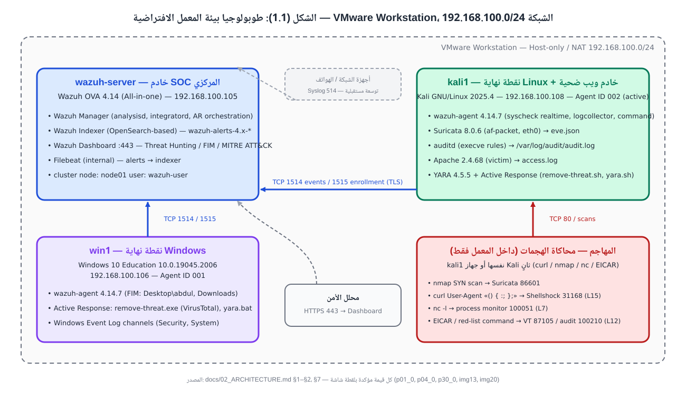

**الشكل (1.1): طوبولوجيا بيئة المعمل الافتراضية — VMware Workstation، الشبكة 192.168.100.0/24.** تتصل نقاط النهاية بالخادم المركزي عبر المنفذ 1514 (الأحداث) و1515 (التسجيل)، ويصل المحلل إلى لوحة المعلومات عبر HTTPS 443. الخانة المنقّطة تمثّل توسعة مستقبلية لاستقبال Syslog من أجهزة الشبكة.

ويُثبت الشكل (1.2) — وهو لقطة حقيقية من لوحة المعلومات في بيئة المعمل — ارتباط الوكيلَين بالمدير المركزي، مع ظهور الإصدار 4.14.7 ونظامَي التشغيل الفعليَّين:

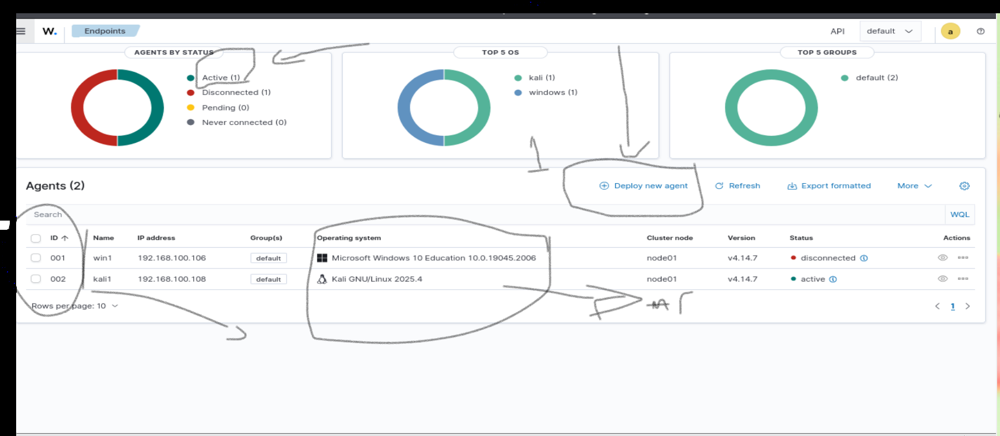

**الشكل (1.2): لوحة إدارة الوكلاء (Endpoints) في Wazuh Dashboard كما ظهرت في بيئة المعمل.** يظهر الوكيل `001/win1` (Microsoft Windows 10 Education 10.0.19045.2006) والوكيل `002/kali1` (Kali GNU/Linux 2025.4)، وكلاهما بالإصدار v4.14.7 على عقدة المجموعة `node01`. المصدر: دليل المعمل، الصفحة 4.

وسيتم استخدام أدوات مفتوحة المصدر تتميز بمرونتها وانخفاض تكلفتها مقارنة بالحلول التجارية، مع إمكانية تطوير النظام وإضافة أدوات أمنية جديدة مستقبلًا وفق احتياجات المؤسسة. ويُميّز المشروع بوضوح بين ثلاث دوائر: **ما نُفِّذ وأُثبِت** في المعمل، و**ما صُمِّم وكُتب برمجيًا** وينتظر القبول المعملي الحي، و**ما وُضع خارج النطاق** صراحةً — كما سيتضح في القسم 1.6.

---

### 1.3 مشكلة الدراسة (Problem Statement)

تعتمد العديد من المؤسسات الصغيرة والمتوسطة على حلول أمنية منفصلة تعمل بصورة مستقلة، مثل برامج مكافحة الفيروسات والجدران النارية، دون وجود منصة مركزية قادرة على جمع وتحليل الأحداث الأمنية بشكل متكامل. ويؤدي هذا الأمر إلى صعوبة اكتشاف الهجمات في مراحلها الأولى، وتأخر الاستجابة للحوادث الأمنية، بالإضافة إلى زيادة احتمالية فقدان البيانات أو تعطل الخدمات.

كما تواجه المؤسسات تحديات إضافية تتمثل في ارتفاع تكلفة حلول مراكز العمليات الأمنية التجارية، والحاجة إلى كوادر متخصصة لإدارة هذه الأنظمة، إضافة إلى تعدد مصادر البيانات الأمنية الناتجة عن الخوادم، ومحطات العمل، وأجهزة الشبكات، مما يجعل عملية التحليل اليدوي غير عملية في البيئات الحديثة.

ويُضاف إلى ذلك إشكال منهجي لاحظه الفريق أثناء مراجعة الأدلة التطبيقية المتاحة لمنصات SOC مفتوحة المصدر: فغالبية تلك الأدلة تعرض حالات الاستخدام منفردةً وتُعلن «نجاحها» وصفيًا دون قياس زمن الكشف أو زمن الاستجابة أو معدل الإنذارات الكاذبة، ودون أن تُغلق الحلقة بين الكشف والاستجابة الآلية. بل إن السكربت المرجعي للاستجابة الآلية في التوثيق الرسمي لإحدى المنصات يحوي عيوبًا أمنية قابلة للإثبات (تنفيذ أمر الحذف خارج شرط التحقق، وغياب التحقق من تجزئة الملف أو قوائم السماح)، وهو ما يجعل نسخه دون تحصين خطرًا على النظام المُراقَب نفسه.

وبناءً على ذلك، تتمثل مشكلة المشروع في **غياب منصة أمنية مركزية منخفضة التكلفة، قادرة على مراقبة الشبكة والأجهزة الطرفية وتحليل الأحداث الأمنية بشكل مستمر، مع توفير إمكانيات اكتشاف التهديدات والاستجابة الآلية الآمنة لها، وإثبات فعاليتها بمقاييس كمّية قابلة للتحقق، باستخدام أدوات مفتوحة المصدر**.

ويمكن تفكيك هذه المشكلة إلى أربعة أسئلة بحثية توجّه بقية الرسالة:

1. **س1 — التكامل:** كيف يمكن توحيد سبع آليات كشف مستقلة (مراقبة سلامة الملفات، وسمعة الملفات، وكشف التسلل الشبكي، وتدقيق الأوامر، وسجلات الويب، والتوقيعات المحلية، ومراقبة العمليات) في منصة واحدة بسجل قواعد بلا تعارض؟
2. **س2 — الاستجابة:** كيف تُصمَّم استجابة آلية للتهديدات عالية الخطورة تكون فعالة وآمنة في الوقت ذاته، بحيث لا تتحوّل هي نفسها إلى ناقل ضرر؟
3. **س3 — القياس:** ما المقاييس والبروتوكول الإحصائي المناسبان لإثبات فعالية المنصة بدل الادعاء الوصفي؟
4. **س4 — التوسع:** هل يمكن إدخال مصدر بيانات جديد (جهاز شبكة، أو رؤية شبكية لجهاز محمول) دون تغيير المعمارية؟

---

### 1.4 أهداف المشروع (Project Objectives)

#### 1.4.1 الهدف العام (General Objective)

تصميم وتنفيذ مركز عمليات أمنية (SOC) يعتمد على أدوات مفتوحة المصدر لمراقبة الشبكة واكتشاف التهديدات وتحليل الحوادث الأمنية والاستجابة لها آليًا بصورة فعالة وآمنة وقابلة للقياس.

#### 1.4.2 الأهداف الخاصة (Specific Objectives)

يسعى المشروع إلى تحقيق الأهداف التالية، وقد رُبط كل هدف بالسؤال البحثي الذي يخدمه وبموضع تحقيقه في المشروع (الجدول 1.1):

**الجدول (1.1): الأهداف الخاصة للمشروع وارتباطها بالأسئلة البحثية**

| # | الهدف الخاص | السؤال البحثي | موضع التحقيق |
|---|---|:---:|---|
| هـ1 | تصميم بنية متكاملة لمركز عمليات الأمن وفق نموذج مرجعي ست المراحل | س1 | الفصل 3 — §3.4 |
| هـ2 | إنشاء بيئة افتراضية تحاكي شبكة مؤسسة حقيقية (خادم مركزي + نقطتا نهاية) | س1 | الفصل 3 — §3.8، الفصل 4 |
| هـ3 | جمع السجلات الأمنية من الخوادم وأجهزة المستخدمين (Windows/Linux) | س1 | الفصل 4 — UC-01، UC-02 |
| هـ4 | مراقبة حركة الشبكة وتحليلها بصورة مستمرة عبر نظام كشف التسلل الشبكي | س1 | الفصل 4 — UC-04 |
| هـ5 | اكتشاف الأنشطة المشبوهة والهجمات الإلكترونية وربطها بإطار MITRE ATT&CK | س1 | الفصل 4 — UC-05، UC-06، UC-08 |
| هـ6 | إنشاء تنبيهات أمنية تلقائية مُدرَّجة بمستويات خطورة عند اكتشاف التهديدات | س1 | الفصل 3 — §3.7.4 |
| هـ7 | تنفيذ استجابة آلية **محكومة بسياسة** للتهديدات عالية الخطورة دون تدخل بشري | س2 | الفصل 4 — UC-03، UC-07 |
| هـ8 | عرض الأحداث الأمنية باستخدام لوحات معلومات تفاعلية | س1 | الفصل 4 |
| هـ9 | اختبار النظام باستخدام سيناريوهات هجومية مختلفة داخل المعمل | س3 | الفصل 5 |
| هـ10 | تقييم أداء النظام كمّيًا (معدل الكشف، زمن الكشف، زمن الاستجابة، الإنذارات الكاذبة) | س3 | الفصل 5 |
| هـ11 | تصميم عقد إدخال لمصدر بيانات جديد يُثبت قابلية التوسع | س4 | الفصل 3 — §3.5، الفصل 5 |
| هـ12 | دمج مساعد تحليل استشاري مبني على نماذج لغوية كبيرة، مُقيَّد بالمعرفة الموثوقة وبلا سلطة تنفيذ | س1، س3 | الفصل 4 |
| هـ13 | تقديم منصة تعليمية موثَّقة وقابلة للتكرار يمكن تطويرها مستقبلاً | — | المستودع، الملاحق |

ويلخّص الشكل (1.3) السلسلة المنطقية التي تربط مشكلة الدراسة بالأهداف وبالإضافة العلمية المتوقعة:

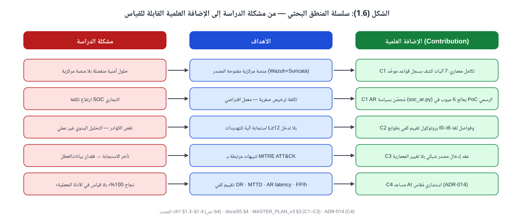

**الشكل (1.3): سلسلة المنطق البحثي — من مشكلة الدراسة إلى الأهداف إلى الإضافة العلمية القابلة للقياس.** كل عنصر في عمود المشكلة يقابله هدف محدد، ويُترجَم إلى إضافة (C1–C4) تُقاس في الفصل الخامس.

---

### 1.5 أهمية المشروع (Project Significance)

تكمن أهمية هذا المشروع في عدة جوانب علمية وعملية، من أهمها:

**أ. الأهمية العملية (Practical Significance)**

- توفير منصة عملية لتطبيق مفاهيم الأمن السيبراني، مبنية بالكامل على مكوّنات مفتوحة المصدر بتكلفة ترخيص صفرية.
- دعم المؤسسات الصغيرة والمتوسطة التي لا تستطيع شراء حلول SOC التجارية أو توظيف فرق تحليل كبيرة.
- دمج عدة أدوات أمنية ضمن منصة واحدة بسجل قواعد موحَّد بلا تعارض، بدل حلول متفرقة.
- تقليل زمن اكتشاف الحوادث الأمنية والاستجابة لها عبر استجابة آلية مُغلقة الحلقة (كشف ← إثراء ← قرار ← إجراء ← تأكيد).
- توفير مستودع توثيقي كامل (إعدادات، سكربتات، أدلة تشغيل خطوة بخطوة) يُمكِّن أي مؤسسة من إعادة النشر.

**ب. الأهمية العلمية والمنهجية (Scientific Significance)**

- الانتقال من التقييم الوصفي («نجح الكشف») إلى بروتوكول قياس كمّي بطوابع زمنية متعددة وفواصل ثقة إحصائية، وهو ما تفتقر إليه أغلب الدراسات التطبيقية على Wazuh.
- تحليل أمني منهجي لسكربت الاستجابة الآلية المرجعي، وتوثيق عيوبه، وتقديم نسخة مُحصَّنة محكومة بسياسة — وهي إضافة قابلة للإثبات والمقارنة.
- إثبات مبدأ «التوسع بلا تغيير معماري» عبر عقد إدخال لمصدر شبكي جديد.
- دمج مساعد تحليل لغوي مُقيَّد بالمعرفة الموثوقة (Retrieval-Augmented Generation – RAG) وتقييم دقته منهجيًا، بدل إطلاق الوعود العامة حول «الذكاء الاصطناعي».

**ج. الأهمية التعليمية (Educational Significance)**

- تدريب الطلبة على بيئة تحاكي مراكز العمليات الأمنية الحقيقية، بأدوار موزعة (بنية، شبكة/هجمات، استجابة، توثيق).
- رفع مستوى الوعي بأهمية المراقبة الأمنية المستمرة وبحدود الأدوات الجاهزة.
- توفير أساس معماري وتوثيقي يمكن للفرق اللاحقة تطويره ليشمل تحليل السلوك، وإدارة الحالات، ومصادر إضافية.

---

### 1.6 حدود المشروع (Project Scope)

يعتمد المشروع منهجية تحديد أولويات صريحة (MoSCoW: Must / Should / Could / Won't) لضبط النطاق، بحيث يعرف الفريق — واللجنة — بدقة ما نُفِّذ، وما خُطِّط له، وما استُبعد ولماذا. يوضح الشكل (1.4) هذه الحدود الثلاثة:

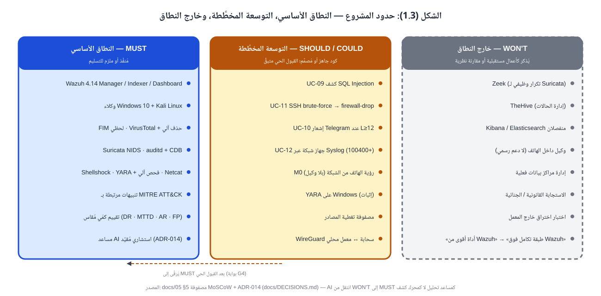

**الشكل (1.4): حدود المشروع — النطاق الأساسي (MUST)، والتوسعة المخطَّطة (SHOULD/COULD)، وخارج النطاق (WON'T).** يُرقَّى عنصر من التوسعة إلى النطاق الأساسي فقط بعد اجتياز القبول المعملي الحي.

#### 1.6.1 حدود المشروع الداخلية (In Scope)

يشمل المشروع:

- تصميم بيئة SOC متكاملة وفق نموذج مرجعي ست المراحل (استشعار، جمع، كشف، قرار، استجابة، عرض).
- مراقبة نظامَي التشغيل **Windows 10** و**Kali Linux** عبر وكلاء Wazuh.
- جمع السجلات الأمنية: سلامة الملفات (FIM)، وسجلات النظام والتطبيقات، وتدقيق الأوامر المُنفَّذة (auditd)، وقوائم العمليات.
- تحليل الأحداث الأمنية عبر مُفكِّكات (Decoders) وقواعد (Rules) وقوائم قواعد بيانات ثابتة (CDB Lists).
- كشف محاولات الاختراق: فحص المنافذ، واستغلال Shellshock عبر خادم الويب، والأوامر عالية الخطورة، والملفات الخبيثة (سمعة VirusTotal وتوقيعات YARA)، ومستمعات الشبكة غير المصرح بها (Netcat).
- إنشاء التنبيهات الأمنية مُدرَّجةً بمستويات خطورة (Levels 3–15) وربطها بإطار **MITRE ATT&CK**.
- الاستجابة الآلية للتهديدات المكتشفة (Active Response): حذف الملفات الخبيثة المؤكَّدة، وفحص الملفات الجديدة تلقائيًا بـ YARA — بسكربت مُحصَّن محكوم بسياسة.
- مراقبة الشبكة باستخدام نظام كشف التسلل الشبكي **Suricata** مع مجموعة توقيعات ET Open.
- إنشاء لوحات معلومات (Dashboards) وعرض التنبيهات وخريطة MITRE.
- اختبار النظام بسيناريوهات هجومية داخل المعمل، محمية بآليات تمنع تشغيلها خارج بيئة مصرَّح بها.
- تقييم أداء النظام كمّيًا: معدل الكشف (Detection Rate)، ومتوسط زمن الكشف (Mean Time To Detect – MTTD)، وزمن الاستجابة الآلية (AR Latency)، ومعدل الإنذارات الكاذبة (False Positives per hour)، بعدد محاولات كافٍ إحصائيًا لكل حالة.
- **مساعد تحليل استشاري** مبني على نماذج لغوية كبيرة: يشرح التنبيه، ويربط التنبيهات المتفرقة في سلسلة هجوم واحدة، ويقترح استجابة — **بلا أي سلطة تنفيذ**، ومع تقييم دقته مقابل تنبيهات مُعلَّمة يدويًا.

**توسعة مخطَّطة (SHOULD/COULD) — كُتبت برمجيًا وتنتظر القبول المعملي الحي:** كشف حقن SQL عبر سجلات الويب (UC-09)، وإشعار Telegram عند التنبيهات الحرجة (UC-10)، وحظر عناوين هجمات SSH بالقوة الغاشمة آليًا عبر `firewall-drop` (UC-11)، واستقبال Syslog من جهاز شبكة واحد بمُفكِّك وقواعد مخصصة (UC-12)، ورؤية شبكية للأجهزة المحمولة دون تثبيت وكيل عليها.

#### 1.6.2 حدود المشروع الخارجية (Out of Scope)

لا يشمل المشروع:

- إدارة مراكز بيانات فعلية أو حماية البنية السحابية الكاملة.
- الاستجابة القانونية أو الجنائية للحوادث (التحليل الجنائي الرقمي، سلسلة الحفظ).
- مراقبة آلاف الأجهزة في بيئة إنتاج حقيقية أو اختبار السعة والأداء التحميلي.
- تطوير محرك كشف جديد من الصفر؛ المشروع **طبقة تكامل وتشغيل فوق Wazuh** لا بديلًا عنه.
- أدوات تحليل البروتوكولات العميق (Zeek) — تكرار وظيفي لـ Suricata في سياق الكشف والاستجابة؛ تُذكر كمقارنة نظرية في الفصل الثاني.
- منصات إدارة الحالات (TheHive) — تُذكر كأعمال مستقبلية.
- الذكاء الاصطناعي **كمحرك كشف** أو **كمُتخذ قرار تنفيذي**؛ الدور المعتمد استشاري فقط (انظر 1.6.1).
- تثبيت وكيل داخل الأجهزة المحمولة (Android/iOS) — لا يوجد وكيل رسمي مدعوم؛ يُكتفى بالرؤية الشبكية.
- اختبار اختراق أنظمة خارج نطاق البيئة المختبرية.

---

### 1.7 الأدوات والتقنيات المستخدمة (Tools and Technologies Used)

يعرض هذا القسم الأدوات والتقنيات التي استُخدمت **فعليًا** في تصميم وتنفيذ المشروع، بإصداراتها المُثبَتة والمُتحقَّق منها في بيئة المعمل. وقد اعتُمدت قاعدة صارمة: لا يُذكر مكوّن في هذه الرسالة إلا إذا كان مُثبَتًا في المعمل، أو موصوفًا صراحةً كتوسعة مخطَّطة أو عمل مستقبلي.

**الجدول (1.2): الأدوات والتقنيات المستخدمة في المشروع**

| الفئة (Category) | الأداة / التقنية | الإصدار | الغرض (Purpose) | الحالة |
|---|---|---|---|:---:|
| منصة الافتراضية | VMware Workstation | — | بيئة المعمل الافتراضية | ✅ |
| نظام تشغيل الخادم | Wazuh OVA (Linux-based virtual appliance) | 4.14 | خادم SOC (Manager + Indexer + Dashboard) | ✅ |
| نظام تشغيل نقطة نهاية | Windows 10 Education | 10.0.19045.2006 | نقطة نهاية مُراقَبة | ✅ |
| نظام تشغيل نقطة نهاية | Kali Linux | 2025.4 | نقطة نهاية مُراقَبة، خادم ويب ضحية، محاكاة هجمات | ✅ |
| SIEM / XDR | Wazuh Manager | 4.14.x | تحليل الأحداث، محرك القواعد، تنسيق الاستجابة الآلية | ✅ |
| مراقبة نقاط النهاية | Wazuh Agent | 4.14.7 | FIM، جمع السجلات، مراقبة الأوامر، استجابة آلية محلية | ✅ |
| التخزين والبحث | Wazuh Indexer (OpenSearch-based) | 4.14 | تخزين التنبيهات وفهرستها والبحث فيها | ✅ |
| العرض | Wazuh Dashboard (OpenSearch Dashboards-based) | 4.14 | لوحات المعلومات، MITRE ATT&CK، Threat Hunting | ✅ |
| كشف التسلل الشبكي | Suricata | 8.0.6 | فحص حركة الشبكة بتوقيعات ET Open | ✅ |
| تدقيق النظام | auditd (Linux Audit Framework) | حسب التوزيعة | تسجيل الأوامر المُنفَّذة (execve) | ✅ |
| كشف البرمجيات الخبيثة | YARA | 4.5.5 | فحص الملفات محليًا بقواعد توقيعات (استجابة آلية) | ✅ |
| استخبارات التهديدات | VirusTotal API | v3 (free tier) | إثراء سمعة الملفات | ✅ |
| خادم ويب (ضحية) | Apache HTTP Server | 2.4.68 | مصدر سجلات لكشف هجمات الويب | ✅ |
| البرمجة والأتمتة | Bash، PowerShell، Python | Python 3.x | سكربتات الاستجابة الآلية، أداة القياس، مساعد التحليل | ✅ |
| إدارة الإصدارات | Git & GitHub | — | الكود، الإعدادات، التوثيق، التكامل المستمر | ✅ |
| إطار مرجعي | MITRE ATT&CK | v19.2 (مجموعة فرعية مثبَّتة) | تصنيف التكتيكات والتقنيات للتنبيهات ولمساعد التحليل | ✅ |
| بيئة تحقق سحابية | Docker (wazuh-docker) على Azure VM | Wazuh 4.14.1 | بيئة ثانية لتشغيل بروتوكول القياس | ✅ |
| مساعد تحليل | نماذج لغوية كبيرة (LLM) عبر واجهة موحَّدة + خيار محلي (Ollama) | model-agnostic | تحليل استشاري مُقيَّد بـ RAG | ◐ |
| إشعارات | Telegram Bot API | — | إشعار المحلل عند التنبيهات الحرجة | ◐ |

*✅ مُثبَت ومُتحقَّق منه في المعمل · ◐ مُنفَّذ برمجيًا باختبارات آلية، والقبول المعملي الحي متبقٍّ.*

> **ملاحظة اصطلاحية:** يعتمد Wazuh 4.x على مكوّنَي **Wazuh Indexer** و**Wazuh Dashboard** المبنيَّين على OpenSearch (تفريعة مفتوحة المصدر من Elasticsearch وKibana). لذلك تُستخدم المسمّيات الرسمية لـ Wazuh في هذه الرسالة، ولا يُشار إلى Elasticsearch أو Kibana كمكوّنات مستقلة. أما Filebeat فهو مكوّن داخلي في خادم Wazuh لنقل التنبيهات إلى المُفهرِس ولا يُعدّ أداة مستقلة.

ويُثبت الشكلان (1.5) و(1.6) إصداري المكوّنَين الرئيسيَّين كما ظهرا فعليًا في بيئة المعمل:

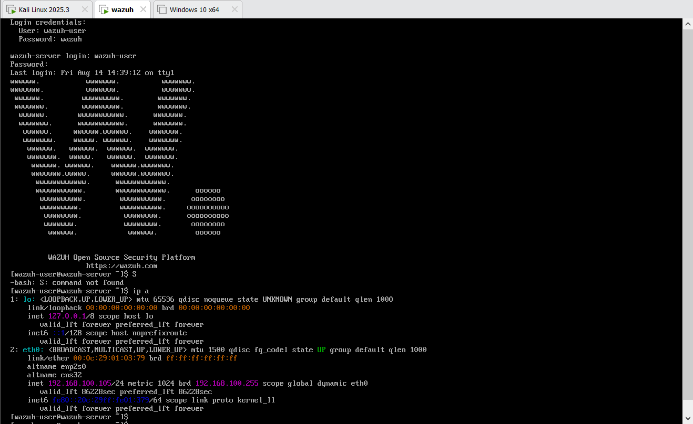

**الشكل (1.5): وحدة تحكم خادم Wazuh (OVA) بعد الإقلاع — يظهر المستخدم `wazuh-user@wazuh-server` وعنوان الواجهة `eth0` هو `192.168.100.105/24`.** المصدر: دليل المعمل، الصفحة 1.

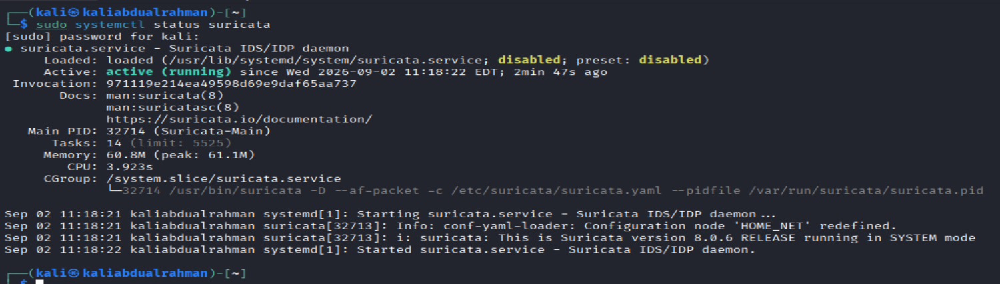

**الشكل (1.6): حالة خدمة Suricata على نقطة النهاية `kali1` — الإصدار 8.0.6 RELEASE يعمل بنمط SYSTEM عبر واجهة af-packet، مع إعادة تعريف `HOME_NET` في ملف الإعداد.** المصدر: دليل المعمل، الصفحة 30.

---

### 1.8 النموذج المرجعي للمنصة ونظرة عامة على حالات الاستخدام

تُقرأ جميع مكوّنات المشروع وحالات استخدامه على **نموذج مرجعي واحد ست المراحل** يوضحه الشكل (1.7). هذا النموذج هو الخيط الذي يربط الفصول اللاحقة: يُفصَّل تصميمه في الفصل الثالث، وتُنفَّذ كل حالة استخدام عليه في الفصل الرابع، وتُقاس مراحله زمنيًا في الفصل الخامس.

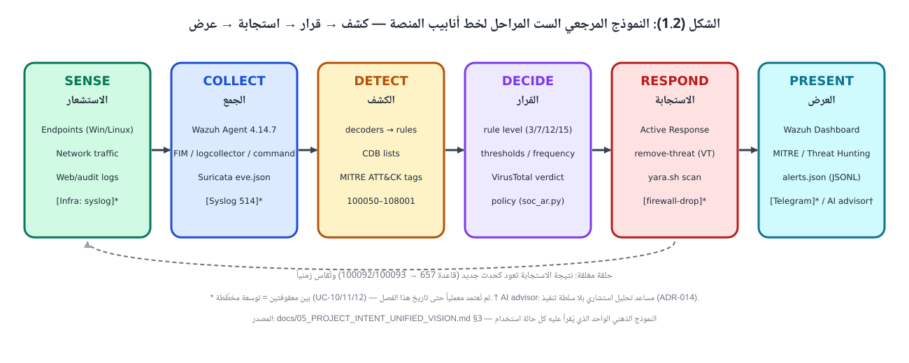

**الشكل (1.7): النموذج المرجعي الست المراحل لخط أنابيب المنصة.** الاستشعار (SENSE) والجمع (COLLECT) على نقاط النهاية والشبكة؛ الكشف (DETECT) والقرار (DECIDE) في مدير Wazuh؛ الاستجابة (RESPOND) على الجهاز المتأثر؛ العرض (PRESENT) في لوحة المعلومات. الحلقة المنقّطة تمثّل عودة نتيجة الاستجابة كحدث جديد يُقاس زمنيًا.

ويقابل هذا النموذجَ المرحليَّ تقسيمٌ طبقيٌّ للمكوّنات الفعلية المُثبَتة يوضحه الشكل (1.8):

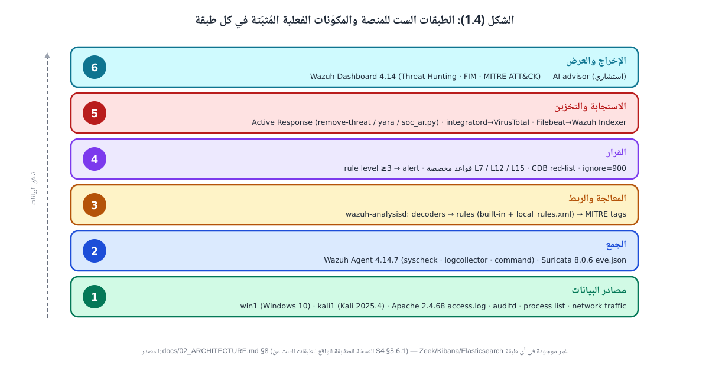

**الشكل (1.8): الطبقات الست للمنصة والمكوّنات الفعلية المُثبَتة في كل طبقة — من مصادر البيانات (الطبقة 1) إلى الإخراج والعرض (الطبقة 6).** لا يظهر في أي طبقة مكوّن غير مُثبَت في المعمل.

أما حالات الاستخدام التي تُشكّل جوهر التنفيذ، فيلخّصها الجدول (1.3) والشكل (1.9). وقد نُفِّذت ثماني حالات وأُثبتت بلقطات شاشة من بيئة المعمل خلال شهر أغسطس 2026، بينما كُتبت أربع حالات إضافية برمجيًا باختبارات آلية وتنتظر القبول المعملي الحي:

**الجدول (1.3): حالات الاستخدام المنفَّذة والمخطَّطة**

| UC | حالة الاستخدام | مرحلة الكشف (القاعدة) | المستوى | الاستجابة الآلية | الحالة |
|:---:|---|---|:---:|---|:---:|
| 01 | نشر الوكلاء (Windows/Linux) وربطها بالمدير | — | — | — | ✅ |
| 02 | مراقبة سلامة الملفات لحظيًا (FIM realtime) | 550 / 553 / 554 | 5–7 | — | ✅ |
| 03 | فحص سمعة الملفات عبر VirusTotal وحذف الخبيث آليًا | 100200/100201 → 87105 | 12 | حذف الملف (`remove-threat`) | ✅ |
| 04 | كشف التسلل الشبكي (Suricata) وإدماج تنبيهاته | 86601 | 3+ | — | ✅ |
| 05 | تدقيق الأوامر عالية الخطورة عبر auditd وقائمة CDB | 80792 + CDB → 100210 | 12 | — | ✅ |
| 06 | كشف استغلال Shellshock عبر سجلات Apache | 31168 | 15 | — | ✅ |
| 07 | فحص الملفات الجديدة آليًا بـ YARA | 100300/100301 → 108001 | 12 | فحص YARA (`yara.sh`) | ✅ |
| 08 | مراقبة العمليات وكشف مستمع Netcat | 100050 → 100051 | 7 | — | ✅ |
| 09 | كشف حقن SQL عبر سجلات الويب | 31103 / 31106 | 6+ | — | ◐ |
| 10 | إشعار Telegram عند التنبيهات الحرجة | L ≥ 12 | — | إشعار | ◐ |
| 11 | هجوم SSH بالقوة الغاشمة وحظر المصدر آليًا | 5763 | 10 | `firewall-drop` | ◐ |
| 14 | مساعد تحليل استشاري (LLM + RAG) | تنبيهات L ≥ 7 | — | اقتراح فقط (بلا تنفيذ) | ◐ |

*✅ مُثبَت في المعمل بلقطات · ◐ كود جاهز باختبارات آلية، القبول الحي متبقٍّ.*

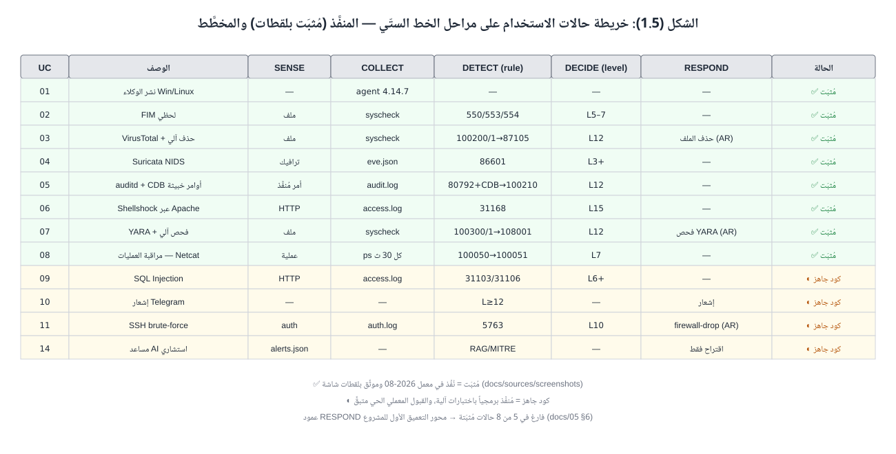

**الشكل (1.9): خريطة حالات الاستخدام على مراحل الخط الستّي.** يُلاحَظ أن عمود الاستجابة (RESPOND) فارغ في خمس من الحالات الثماني المُثبَتة — وهذه هي الفجوة التي يستهدفها محور التعميق الأول للمشروع (UC-11 وما بعدها).

ولإعطاء صورة ملموسة عن طبيعة التنفيذ، يعرض الشكلان (1.10) و(1.11) مقتطفَين حقيقيَّين من ملف القواعد المخصصة `local_rules.xml` على خادم المعمل، ويعرض الشكل (1.12) تنبيهًا فعليًا من المستوى 12 كما ظهر في لوحة المعلومات:

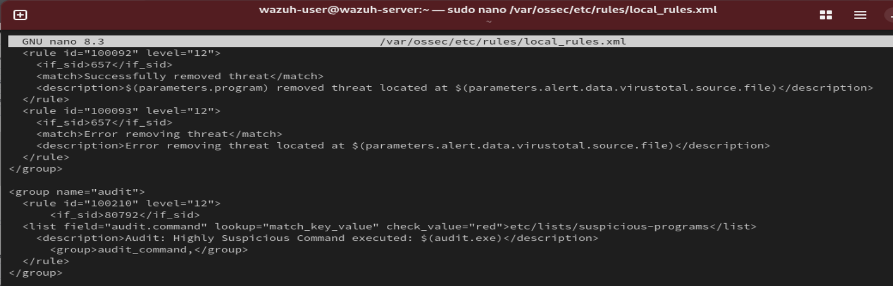

**الشكل (1.10): مقتطف من `local_rules.xml` على خادم المعمل — القاعدتان 100092/100093 (نتيجة حذف التهديد بعد VirusTotal، المستوى 12) والقاعدة 100210 (أمر عالي الخطورة من قائمة CDB `suspicious-programs`، المستوى 12).** المصدر: تقرير التنفيذ، الصورة 10.

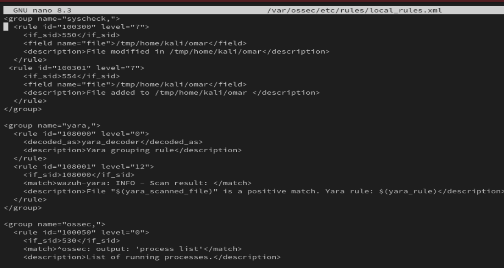

**الشكل (1.11): مقتطف من `local_rules.xml` — قواعد تشغيل فحص YARA عند تغيّر الملفات (100300/100301)، وقاعدة تجميع مخرجات YARA (108000) والمطابقة الإيجابية (108001، المستوى 12)، وبداية قاعدة مراقبة العمليات (100050).** المصدر: تقرير التنفيذ، الصورة 27.

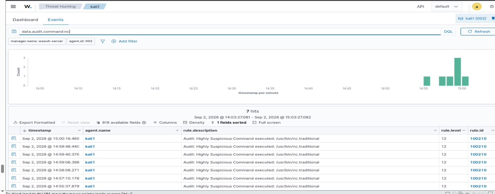

**الشكل (1.12): وحدة Threat Hunting في لوحة المعلومات تعرض سبعة تنبيهات فعلية من القاعدة 100210 (المستوى 12) على الوكيل `kali1` بعد تنفيذ الأمر `nc` المُدرَج في القائمة الحمراء — الاستعلام `data.audit.command:nc`.** المصدر: دليل المعمل، الصفحة 36.

---

### 1.9 الإضافة العلمية للمشروع (Contribution)

الحالات الفردية المذكورة أعلاه مستوحاة في أصلها من التوثيق الرسمي لمنصة Wazuh، وهذا لا يُنكَر. غير أن الإضافة العلمية للمشروع ليست في الأداة ذاتها، بل في **ما يُبنى فوقها ويُثبَت بها**، ويمكن حصرها في أربعة محاور قابلة للعرض والقياس:

- **C1 — التكامل المعماري والاستجابة المُحصَّنة:** توحيد سبع آليات كشف مستقلة في منصة واحدة بسجل قواعد موحَّد بلا تعارض (النطاق 100050–108001)، وتصميم سكربت استجابة آلية محكوم بسياسة (`soc_ar.py`) يعالج ستة عيوب أمنية مُوثَّقة في سكربت الاستجابة المرجعي الرسمي (تنفيذ الحذف خارج شرط التحقق، غياب اقتباس المسارات، غياب التحقق من التجزئة، غياب قوائم السماح، عدم التحقق من الروابط الرمزية، وغياب سجل تدقيق مستقل).
- **C2 — بروتوكول تقييم كمّي:** ستة طوابع زمنية (t0–t6) لكل محاولة هجوم تُشتق منها ثمانية مقاييس، بعدد محاولات لا يقل عن 30 لكل حالة (لضمان أن الحد الأدنى لفاصل الثقة Wilson لمعدل الكشف يتجاوز 0.80 مع تحمّل إخفاق واحد)، وخط أساس لا يقل عن 12 ساعة لكل نظام تشغيل لتقدير الإنذارات الكاذبة. هذا المستوى من الصرامة غائب عن أشهر الدراسات التطبيقية المنشورة على Wazuh.
- **C3 — عقد إدخال مصدر جديد:** توصيف رسمي لكيفية إدخال جهاز شبكة عبر Syslog (مُفكِّك + قواعد في النطاق المحجوز 100400+) دون تعديل المعمارية، مع رؤية شبكية للأجهزة المحمولة بلا وكيل.
- **C4 — مساعد تحليل استشاري مُقاس:** طبقة تحليل مبنية على نماذج لغوية كبيرة، مُقيَّدة بمعرفة موثوقة (MITRE ATT&CK وقواعد المشروع وجرد المعمل) لتقليل الاختلاق، بلا سلطة تنفيذ، وتُقاس دقتها في التصنيف وربط MITRE مقابل تنبيهات مُعلَّمة يدويًا.

> **جملة الدفاع:** لم نبتكر محرك كشف؛ ابتكرنا **منصة متكاملة قابلة للقياس والتوسع**، تُثبت أن مركز عمليات أمنية وظيفيًا يمكن أن يُبنى بتكلفة ترخيص صفرية، وأن استجابته الآلية آمنة، وأن فعاليته مُقاسة لا مُدَّعاة.

---

### 1.10 مراحل المشروع وبوابات الإنجاز

يُنفَّذ المشروع على ست مراحل يوضحها الشكل (1.13)، ويُحكَم الانتقال بينها ببوابات إنجاز صريحة تشترط **دليلًا حيًا** (لقطة، سجل، ملف نتائج) قبل إعلان أي مرحلة «مُنجَزة». وقد أُنجزت مرحلتا التأسيس والمعمل، وتجري مراحل القياس والتوسعة وكتابة الرسالة بالتوازي، بينما تنتظر مرحلة الدفاع اكتمال النتائج.

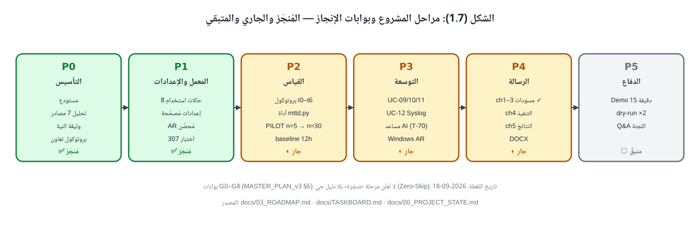

**الشكل (1.13): مراحل المشروع وبوابات الإنجاز — المُنجَز والجاري والمتبقي حتى تاريخ إعداد هذا الفصل.**

---

### 1.11 تنظيم الرسالة (Thesis Organization)

تتكوّن هذه الرسالة من خمسة فصول:

- **الفصل الأول — المقدمة:** يعرض خلفية المشروع، وتعريفه، ومشكلة الدراسة وأسئلتها البحثية، وأهدافه، وأهميته، وحدوده، والأدوات المستخدمة، والنموذج المرجعي، والإضافة العلمية، وتنظيم الرسالة.
- **الفصل الثاني — الإطار النظري والدراسات السابقة:** يُقدِّم مفاهيم مركز عمليات الأمن، وأنظمة SIEM، وكشف التسلل الشبكي، ومراقبة سلامة الملفات، والاستجابة الآلية، وإطار MITRE ATT&CK؛ ويُقارن بين Wazuh وبدائله (OSSEC، ELK، Splunk، Security Onion)، وبين Suricata وSnort وZeek؛ ويُحلِّل الدراسات السابقة نقديًا ويُحدِّد الفجوة البحثية.
- **الفصل الثالث — منهجية البحث وتصميم النظام:** يُفصِّل المنهجية التجريبية التطبيقية، وتحليل المتطلبات الوظيفية وغير الوظيفية، والمعمارية العامة على النموذج الست المراحل، ومخططات تدفق البيانات (DFD) بمستوياتها، وتصميم حالات الاستخدام وسلاسل الاستجابة، وسجل معرّفات القواعد، وتصميم بيئة المعمل.
- **الفصل الرابع — التنفيذ:** يعرض تنفيذ كل حالة استخدام على الخط الستّي خطوةً بخطوة، مع الإعدادات والقواعد والسكربتات ولقطات الشاشة من المعمل، ويشمل تنفيذ الاستجابة المُحصَّنة ومساعد التحليل.
- **الفصل الخامس — الاختبار والنتائج والخاتمة:** يعرض بروتوكول القياس ونتائجه الكمّية لكل حالة (معدل الكشف، MTTD، زمن الاستجابة، الإنذارات الكاذبة) بفواصل الثقة، ونتائج تقييم مساعد التحليل، والتحديات، والاستنتاجات، والأعمال المستقبلية (Zeek، TheHive، إدماج أجهزة الشبكة على نطاق أوسع، الأجهزة المحمولة).

وتتضمن الرسالة قائمة مراجع بنمط IEEE، وملاحق تشمل ملف القواعد المخصصة الكامل، وسكربتات الاستجابة الآلية، وأوامر التثبيت والإعداد.

---

### قائمة الأشكال في هذا الفصل

| الشكل | العنوان | الملف | النوع |
|:---:|---|---|:---:|
| 1.1 | طوبولوجيا بيئة المعمل الافتراضية | `figures/fig_1_1_lab_topology.svg` | متجهي |
| 1.2 | لوحة إدارة الوكلاء في Wazuh Dashboard | `screenshots/scr_1_1_agents_dashboard.png` | لقطة معمل |
| 1.3 | سلسلة المنطق البحثي — من المشكلة إلى الإضافة | `figures/fig_1_6_problem_objectives_contribution.svg` | متجهي |
| 1.4 | حدود المشروع (MUST / SHOULD-COULD / WON'T) | `figures/fig_1_3_scope_boundary.svg` | متجهي |
| 1.5 | وحدة تحكم خادم Wazuh (OVA) | `screenshots/scr_1_2_wazuh_server_console.png` | لقطة معمل |
| 1.6 | حالة خدمة Suricata 8.0.6 على kali1 | `screenshots/scr_1_3_suricata_version.png` | لقطة معمل |
| 1.7 | النموذج المرجعي الست المراحل | `figures/fig_1_2_six_stage_pipeline.svg` | متجهي |
| 1.8 | الطبقات الست للمنصة | `figures/fig_1_4_platform_layers.svg` | متجهي |
| 1.9 | خريطة حالات الاستخدام على الخط الستّي | `figures/fig_1_5_usecase_coverage.svg` | متجهي |
| 1.10 | قواعد VirusTotal وauditd في local_rules.xml | `screenshots/scr_1_4_local_rules_vt_audit.png` | لقطة معمل |
| 1.11 | قواعد YARA ومراقبة العمليات في local_rules.xml | `screenshots/scr_1_5_local_rules_yara_process.png` | لقطة معمل |
| 1.12 | تنبيهات القاعدة 100210 في Threat Hunting | `screenshots/scr_1_6_threat_hunting_100210.png` | لقطة معمل |
| 1.13 | مراحل المشروع وبوابات الإنجاز | `figures/fig_1_7_phases_gates.svg` | متجهي |

### قائمة الجداول في هذا الفصل

| الجدول | العنوان |
|:---:|---|
| 1.1 | الأهداف الخاصة للمشروع وارتباطها بالأسئلة البحثية |
| 1.2 | الأدوات والتقنيات المستخدمة في المشروع |
| 1.3 | حالات الاستخدام المنفَّذة والمخطَّطة |
