# فهرس المخططات ومصادرها

مولد من `catalog.json` بواسطة `scripts/build_writer_package.py`. المصادر القابلة للتحرير JSON، وMermaid مشتق للعلاقات لا لتطابق التخطيط.

الأشكال تصميم/شرح للكود وليست لقطات تشغيل أو نتائج تجارب. النص التقني داخل SVG بالإنجليزية، والوصف العربي أسفل كل شكل.

## fig01_methodology — Iterative research and acceptance workflow

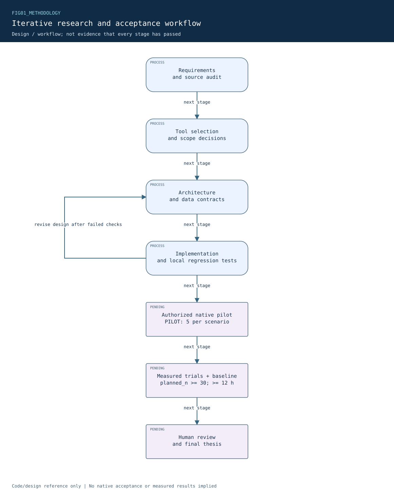

مراحل البحث والتطوير. الانتقال مرهون بأدلة المرحلة؛ فشل التحقق يعيد العمل إلى التصميم أو التنفيذ. وجود الأداة أو الرسم لا يعني اجتياز القبول.

**الحالة:** Design / workflow; not evidence that every stage has passed

[SVG](fig01_methodology.svg) · [Mermaid](fig01_methodology.mmd) · المصدر: كائن `fig01_methodology` في [catalog.json](catalog.json).

**المراجع داخل المستودع:** `tests/TEST_PLAN.md`, `docs/03_ROADMAP.md`

## fig02_architecture — SOC architecture and advisory boundary

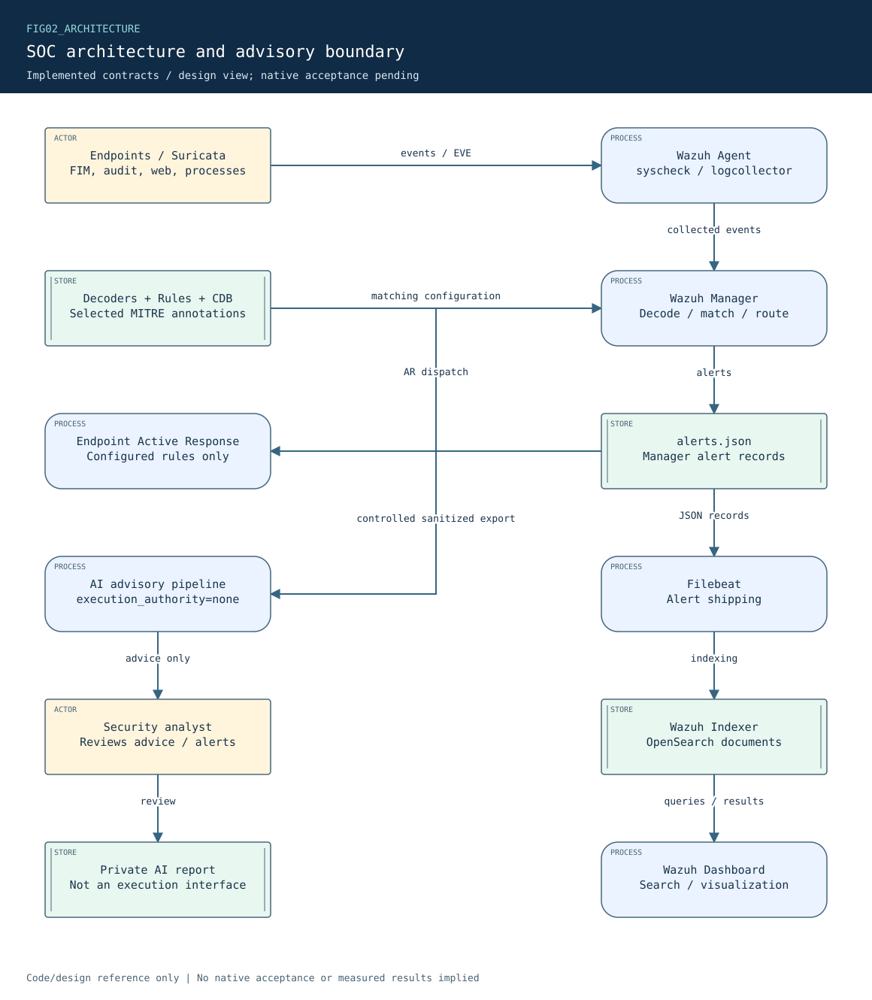

مسار الجمع والتحليل والتخزين: alerts.json ثم Filebeat ثم Wazuh Indexer ثم العرض. مسار الاستجابة مستقل عن المحلل الاستشاري؛ لا سهم تنفيذ من AI إلى AR. هذه معمارية منطقية، لا جرد نشر حالي.

**الحالة:** Implemented contracts / design view; native acceptance pending

[SVG](fig02_architecture.svg) · [Mermaid](fig02_architecture.mmd) · المصدر: كائن `fig02_architecture` في [catalog.json](catalog.json).

**المراجع داخل المستودع:** `docs/02_ARCHITECTURE.md`, `wazuh/manager/rules/local_rules.xml`, `wazuh/agents/linux/active-response/soc_ar.py`, `ai_agent/analyst.py`

## fig03_context — DFD level 0 - SOC context

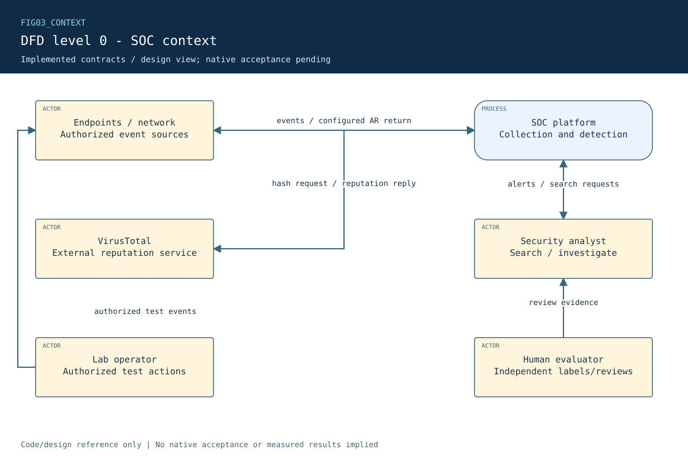

السياق يميز نقاط النهاية وحركة الشبكة والخدمات الخارجية والمحلل. الاستجابة أوامر من قواعد Wazuh، وليست أوامر النموذج. المحاكاة المصرح بها تقع على نقاط النهاية؛ لا يلزم اتصال المهاجم بالمنصة.

**الحالة:** Implemented contracts / design view; native acceptance pending

[SVG](fig03_context.svg) · [Mermaid](fig03_context.mmd) · المصدر: كائن `fig03_context` في [catalog.json](catalog.json).

**المراجع داخل المستودع:** `docs/02_ARCHITECTURE.md`, `wazuh/agents/linux/active-response/soc_ar.py`, `docs/lab/UC-14_ai_analyst.md`

## fig04_dfd1 — DFD level 1 - collection, enrichment and storage

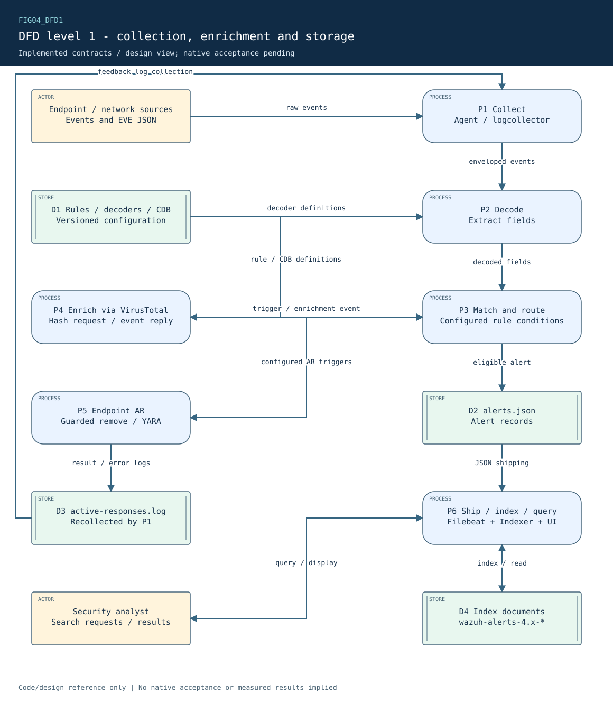

تفكيك DFD تشغيلي. الإثراء يعاد كحدث للتحليل، وسجل AR يعاد إلى الجمع ولا يثبت بمفرده t5. يشمل P6 النقل والفهرسة والاستعلام، ولا اتصال مباشر بين المخزن والمحلل دون عملية استعلام.

**الحالة:** Implemented contracts / design view; native acceptance pending

[SVG](fig04_dfd1.svg) · [Mermaid](fig04_dfd1.mmd) · المصدر: كائن `fig04_dfd1` في [catalog.json](catalog.json).

**المراجع داخل المستودع:** `docs/02_ARCHITECTURE.md`, `wazuh/manager/rules/local_rules.xml`, `wazuh/agents/linux/active-response/soc_ar.py`

## fig05_dfd2 — DFD level 2 - rule matching detail

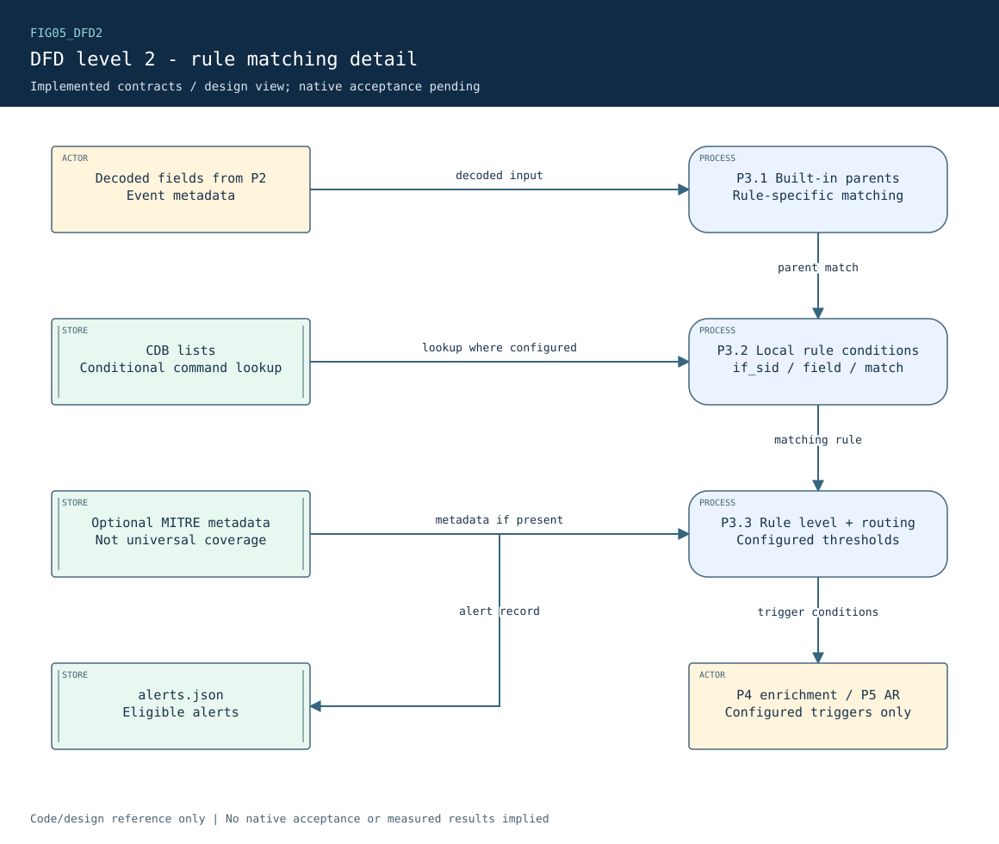

تفصيل منطقي لعملية المطابقة P3، لا ادعاء مراحل داخلية مستقلة في analysisd. CDB ووسوم MITRE مشروطة بالقاعدة ولا تمر بهما كل الأحداث. تصدر التنبيهات ومحفزات التكامل والاستجابة وفق الإعداد.

**الحالة:** Implemented contracts / design view; native acceptance pending

[SVG](fig05_dfd2.svg) · [Mermaid](fig05_dfd2.mmd) · المصدر: كائن `fig05_dfd2` في [catalog.json](catalog.json).

**المراجع داخل المستودع:** `wazuh/manager/rules/local_rules.xml`, `wazuh/manager/decoders/local_decoder.xml`

## fig06_vt_sequence — UC-03 - guarded Linux removal sequence

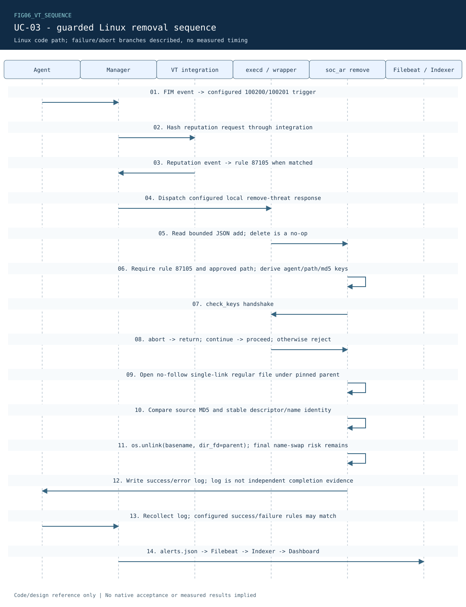

التسلسل المصحح لـLinux: قاعدة 87105 والمسار المعتمد، ثم check_keys ورد continue أو abort، ثم مقارنة MD5 وهوية الملف قبل os.unlink تحت واصف أب مثبت. لا rm -f. تبقى نافذة تبديل الاسم النهائية موثقة في SECURITY_REVIEW؛ سجل النجاح ليس شاهد t5 مستقلاً.

**الحالة:** Linux code path; failure/abort branches described, no measured timing

[SVG](fig06_vt_sequence.svg) · [Mermaid](fig06_vt_sequence.mmd) · المصدر: كائن `fig06_vt_sequence` في [catalog.json](catalog.json).

**المراجع داخل المستودع:** `wazuh/agents/linux/active-response/soc_ar.py`, `wazuh/manager/rules/local_rules.xml`, `tests/SECURITY_REVIEW.md`

## fig07_yara_sequence — UC-07 - bounded Linux YARA scan sequence

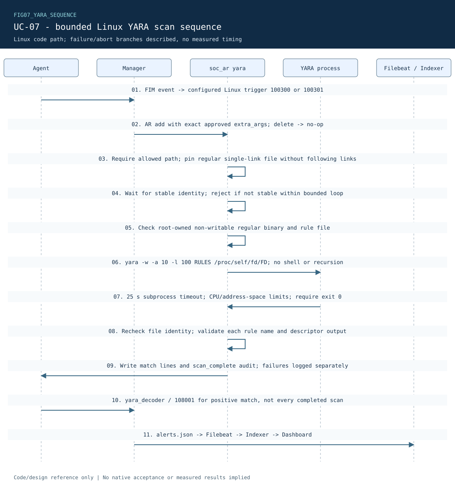

فحص واصف ملف ثابت دون recursion أو shell. يتحقق الكود من المحفزات والمعاملات وثقة الملف التنفيذي والقواعد والمهلة وهوية الملف بعد الفحص. 108001 خاص بالمطابقة الإيجابية؛ scan_complete سجل تدقيق ذاتي لا شاهد سببي مستقل.

**الحالة:** Linux code path; failure/abort branches described, no measured timing

[SVG](fig07_yara_sequence.svg) · [Mermaid](fig07_yara_sequence.mmd) · المصدر: كائن `fig07_yara_sequence` في [catalog.json](catalog.json).

**المراجع داخل المستودع:** `wazuh/agents/linux/active-response/soc_ar.py`, `wazuh/manager/rules/local_rules.xml`, `tests/test_security.py`

## fig08_topology — Historical lab topology - not current cloud inventory

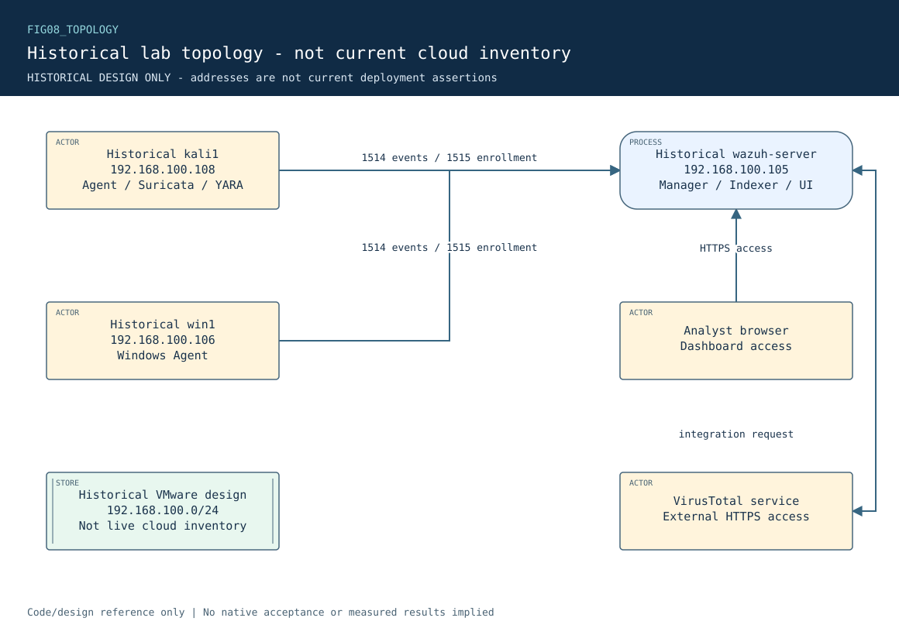

إعادة رسم التصميم التاريخي دون تحويله إلى جرد سحابي حالي. العناوين أدناه مرجع docs/02_ARCHITECTURE فقط؛ يجب التحقق المؤرخ من الأنظمة والإصدارات والمنافذ والتشفير قبل أي نشر أو قياس.

**الحالة:** HISTORICAL DESIGN ONLY - addresses are not current deployment assertions

[SVG](fig08_topology.svg) · [Mermaid](fig08_topology.mmd) · المصدر: كائن `fig08_topology` في [catalog.json](catalog.json).

**المراجع داخل المستودع:** `docs/02_ARCHITECTURE.md`, `docs/lab/CLOUD_ENV_ACCESS.md`

## fig09_actors — Actors, use cases and authority boundaries

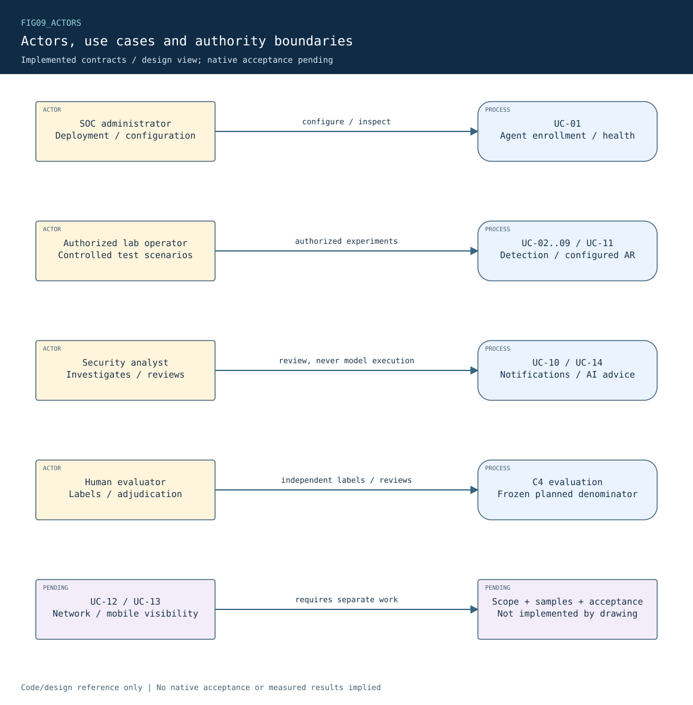

خريطة فاعلين وحالات استخدام وليست مخطط صلاحيات RBAC منفذاً. المسؤول يضبط النشر؛ المشغّل يجري المحاكاة المصرح بها؛ المحلل يراجع؛ والمراجع البشري يوسم ويحكم مستقلاً. AI استشاري ولا يمتلك سلطة AR. UC-12/13 مقترحان وليسا قبولاً منفذاً.

**الحالة:** Implemented contracts / design view; native acceptance pending

[SVG](fig09_actors.svg) · [Mermaid](fig09_actors.mmd) · المصدر: كائن `fig09_actors` في [catalog.json](catalog.json).

**المراجع داخل المستودع:** `tests/TEST_PLAN.md`, `docs/DEMO_SCRIPT.md`, `docs/lab/UC-14_ai_analyst.md`

## fig10_ai_sequence — UC-14 - advisory evidence and evaluation sequence

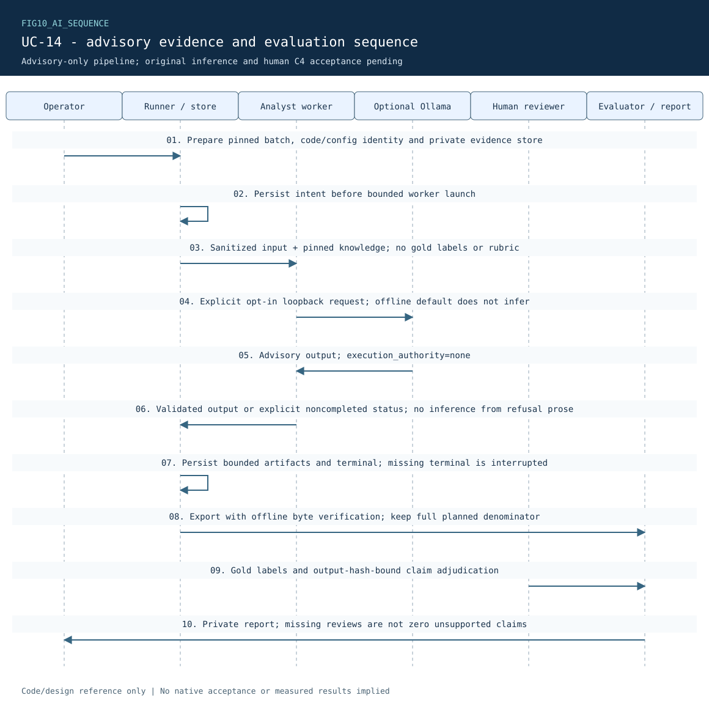

المدخلات المنقحة والمعرفة المثبتة تدخل مسار المحلل. gold وrubric لا يرسلان إلى النموذج. سجل intent يسبق العامل، ويحفظ الفشل/الرفض/الانقطاع ولا يعيد المحاولة خفية. التحقق من البايتات لا يثبت هوية النموذج أو استقلال البشر. لا سهم نحو AR.

**الحالة:** Advisory-only pipeline; original inference and human C4 acceptance pending

[SVG](fig10_ai_sequence.svg) · [Mermaid](fig10_ai_sequence.mmd) · المصدر: كائن `fig10_ai_sequence` في [catalog.json](catalog.json).

**المراجع داخل المستودع:** `ai_agent/runner.py`, `ai_agent/analyst.py`, `ai_agent/evaluate.py`, `ai_agent/report.py`

## fig11_measurement_model — Measurement logical records - not SQL tables

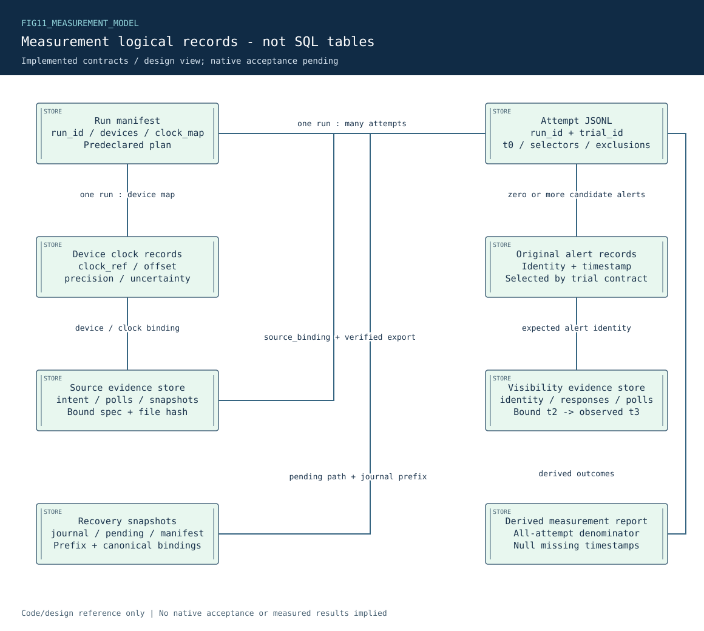

نموذج علاقات منطقي لعقود JSON/JSONL، لا جداول SQL أو مفاتيح أجنبية ينفذها OpenSearch. run_id/trial_id هوية المحاولة؛ manifest يصف الساعات والتخطيط؛ التنبيهات تربط بالهوية والنافذة والمحددات؛ مخازن المراقبين تحفظ بايتات مستقلة. t4/t5 ما زالا عملاً محلياً.

**الحالة:** Implemented contracts / design view; native acceptance pending

[SVG](fig11_measurement_model.svg) · [Mermaid](fig11_measurement_model.mmd) · المصدر: كائن `fig11_measurement_model` في [catalog.json](catalog.json).

**المراجع داخل المستودع:** `scripts/measure/mttd.py`, `scripts/measure/trial_runner.py`, `scripts/measure/source_observer.py`, `scripts/measure/visibility_observer.py`, `scripts/measure/recovery.py`

## fig12_c4_model — C4 logical entities and cardinalities

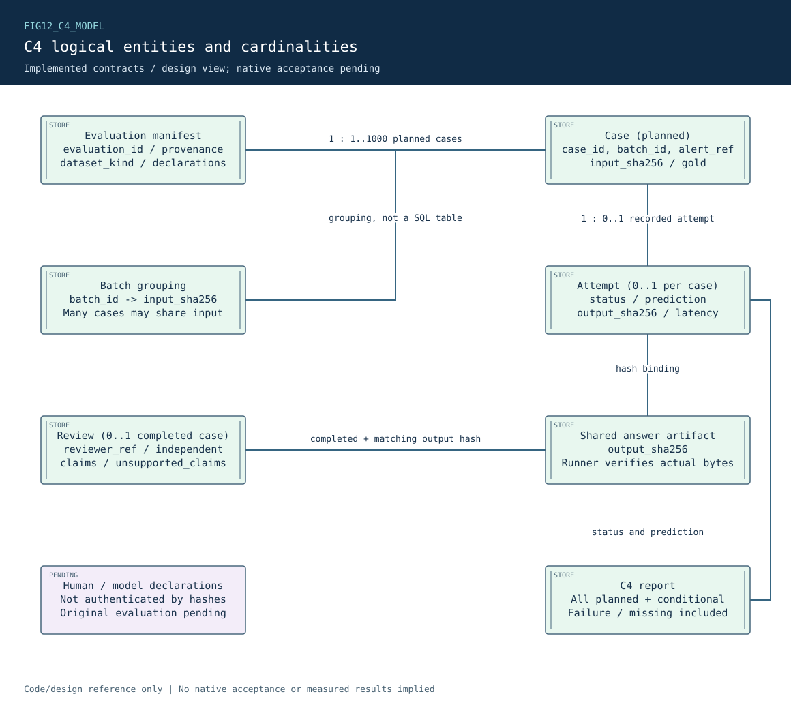

عقود C4 الفعلية: cases داخل manifest؛ لكل case صفر أو محاولة واحدة، ولكل completed attempt صفر أو مراجعة واحدة مربوطة ببصمة الجواب. batch_id يجمع حالات من نفس المدخلات؛ تكرار المصدر لا يصنع عينة مستقلة. provenance يتضمن rubric لكنه لا يرسل إلى النموذج.

**الحالة:** Implemented contracts / design view; native acceptance pending

[SVG](fig12_c4_model.svg) · [Mermaid](fig12_c4_model.mmd) · المصدر: كائن `fig12_c4_model` في [catalog.json](catalog.json).

**المراجع داخل المستودع:** `ai_agent/evaluate.py`, `ai_agent/runner.py`, `ai_agent/report.py`

## fig13_storage — Storage zones and document model

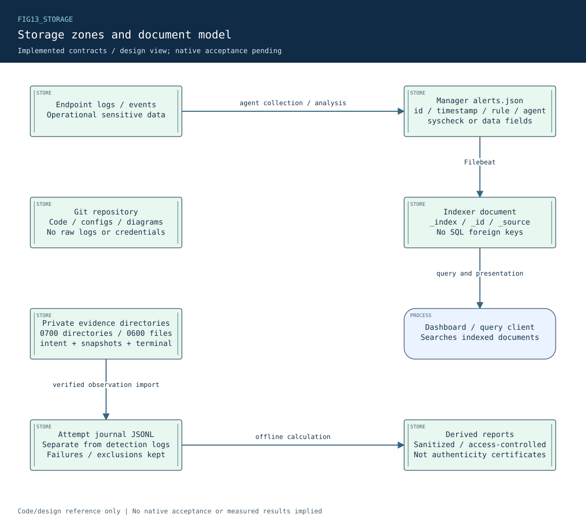

Wazuh Indexer مخزن وثائق OpenSearch؛ id داخل التنبيه ليس افتراضاً أنه _id الفهرس. السجلات الخاصة وJSONL ليست قاعدة علائقية. مخازن الأدلة 0700 والملفات 0600 في أدوات الأدلة، ولا يعمم ذلك على كل ملفات Wazuh. Git يحوي كوداً وتصميماً لا أسراراً أو سجلات خام.

**الحالة:** Implemented contracts / design view; native acceptance pending

[SVG](fig13_storage.svg) · [Mermaid](fig13_storage.mmd) · المصدر: كائن `fig13_storage` في [catalog.json](catalog.json).

**المراجع داخل المستودع:** `docs/02_ARCHITECTURE.md`, `scripts/measure/mttd.py`, `ai_agent/runner.py`, `scripts/measure/recovery.py`

## fig14_recovery — Interrupted trial recovery activity

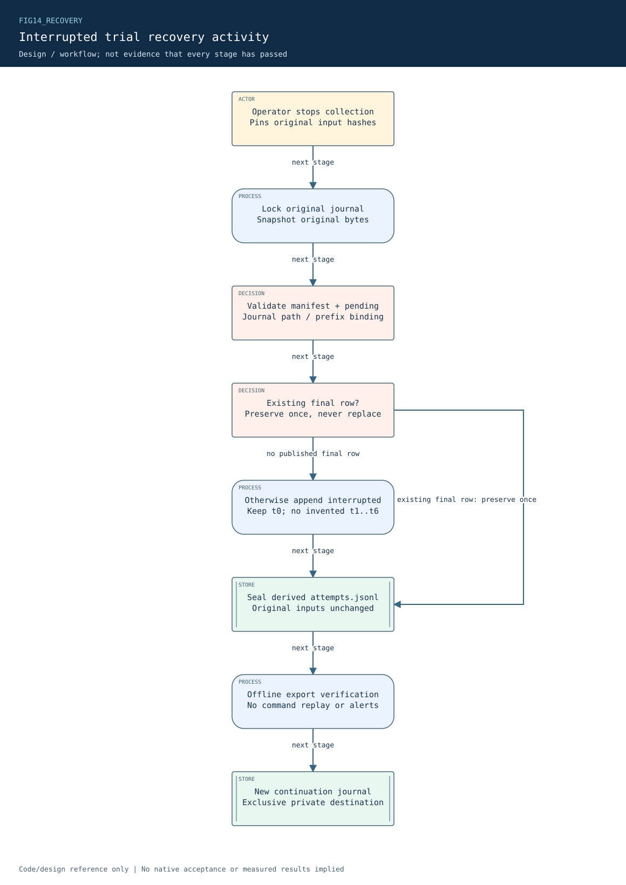

نشاط الاستعادة غير الهدامة. يفحص الربط والبادئة ويشتق سجلاً جديداً؛ الصف المنشور يحفظ مرة واحدة، والمنقطع لا يختلق له بدء أو خروج أو أزمنة مفقودة. أي رفض أو إخفاق يبقي الأدلة الأصلية؛ تصريح توقف المشغّل ليس إثبات موت العمليات.

**الحالة:** Design / workflow; not evidence that every stage has passed

[SVG](fig14_recovery.svg) · [Mermaid](fig14_recovery.mmd) · المصدر: كائن `fig14_recovery` في [catalog.json](catalog.json).

**المراجع داخل المستودع:** `scripts/measure/recovery.py`, `scripts/measure/trial_runner.py`, `tests/test_recovery.py`

## fig15_timeline — Measurement timeline and evidence boundaries

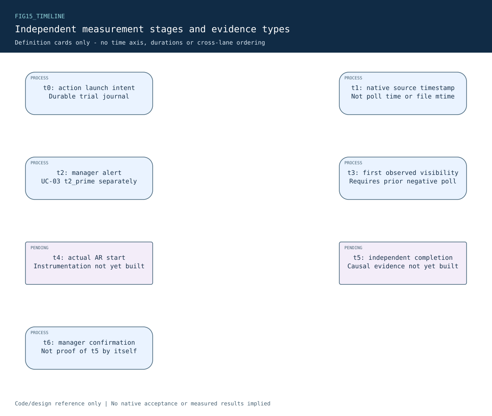

خريطة تعريفات وليست محوراً زمنياً بمقياس أو رسماً لنتائج. event/action_confirmed من M2-A يثبت فعل الملف ولا يملأ t1. t2 وt6 من التنبيهات الأصلية، وt3 مراقب ظهور مستقل. t4/t5 غير منفذين بعد، ولا يثبت اختفاء الملف وحده سببية الحذف.

**الحالة:** Conceptual stages, NOT a guaranteed ordering of t3 versus AR stages

[SVG](fig15_timeline.svg) · [Mermaid](fig15_timeline.mmd) · المصدر: كائن `fig15_timeline` في [catalog.json](catalog.json).

**المراجع داخل المستودع:** `scripts/measure/mttd.py`, `scripts/measure/trial_runner.py`, `scripts/measure/source_observer.py`, `scripts/measure/visibility_observer.py`

