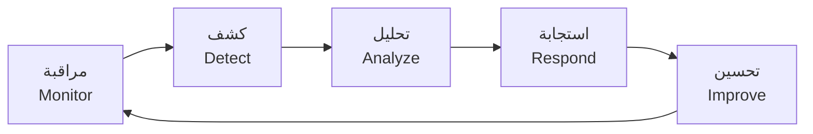

# الفصل الأول: المقدمة
# Chapter One: Introduction

## 1.1 مقدمة (Introduction)

يشهد العالم في السنوات الأخيرة تحولاً رقمياً متسارعاً نتيجة الاعتماد المتزايد على تقنيات المعلومات والاتصالات في مختلف القطاعات، مثل المؤسسات الحكومية، والقطاع المالي، والتعليم، والرعاية الصحية، والصناعات المختلفة. وقد أدى هذا التحول إلى زيادة الاعتماد على الأنظمة الحاسوبية والشبكات وقواعد البيانات والخدمات السحابية، الأمر الذي جعل هذه المؤسسات أكثر عرضة للهجمات السيبرانية التي تتطور باستمرار من حيث الأساليب والأدوات المستخدمة.

وتُعدّ الهجمات الإلكترونية، مثل برمجيات الفدية (Ransomware)، وهجمات التصيد الاحتيالي (Phishing)، والبرمجيات الخبيثة (Malware)، وهجمات حجب الخدمة (DDoS)، واستغلال الثغرات الأمنية (Exploits)، من أبرز التهديدات التي تواجه المؤسسات الحديثة. ولا تقتصر آثار هذه الهجمات على الخسائر المالية فحسب، بل تمتد إلى فقدان البيانات الحساسة، وتعطيل الخدمات، والإضرار بسمعة المؤسسة، وانخفاض ثقة العملاء.

في المقابل، لم تعد وسائل الحماية التقليدية مثل الجدران النارية (Firewalls) وبرامج مكافحة الفيروسات كافية بمفردها لمواجهة التهديدات الحديثة، وذلك بسبب تطور أساليب المهاجمين وقدرتهم على تجاوز آليات الحماية التقليدية. لذلك برز مفهوم مركز عمليات الأمن (Security Operations Center – SOC) باعتباره أحد أهم مكونات الأمن السيبراني في المؤسسات الحديثة [1].

يمثل مركز عمليات الأمن بيئة تشغيلية متخصصة تعمل على مراقبة البنية التحتية التقنية بشكل مستمر، وجمع السجلات الأمنية (Logs) وتحليلها، واكتشاف الأنشطة المشبوهة، والاستجابة للحوادث الأمنية في الوقت المناسب. ويعتمد على مجموعة من الأدوات المتكاملة، مثل أنظمة إدارة معلومات وأحداث الأمن (SIEM)، وأنظمة كشف التسلل (IDS)، وأدوات تحليل حركة الشبكة، ولوحات المعلومات الأمنية.

يهدف هذا المشروع إلى تصميم وتنفيذ بيئة SOC متكاملة تعتمد على أدوات مفتوحة المصدر (Open-Source Security Tools)، تحاكي مركز عمليات أمنية حقيقياً داخل مؤسسة متوسطة الحجم، وتجمع في منصة واحدة جمعَ الأحداث وتحليلها واكتشاف التهديدات والاستجابة الآلية لها وعرض النتائج عبر لوحات معلومات تفاعلية، مع طبقة تحليل بالذكاء الاصطناعي تساعد المحلل على فهم التنبيهات واتخاذ القرار.

**شكل (1.1): الحلقة الأساسية لمركز العمليات الأمنية**

## 1.2 تعريف المشروع (Project Definition)

يتمثل هذا المشروع في تصميم وتنفيذ مركز عمليات أمنية يعتمد على أدوات أمن سيبراني مفتوحة المصدر، بهدف مراقبة الأجهزة والشبكة، وجمع السجلات الأمنية، وتحليل الأحداث، واكتشاف الأنشطة المشبوهة، والاستجابة للحوادث بطريقة مركزية وفعالة.

يرتكز المشروع على بيئة افتراضية (Virtual Environment) تمثل شبكة مؤسسة، تتصل فيها نقاط النهاية (Windows وLinux) وجهاز شبكة (راوتر) بخادم مركزي يعمل مركزاً للعمليات الأمنية. ويستقبل هذا الخادم السجلات من مختلف المصادر، ويحللها بقواعد كشف مرتبطة بإطار MITRE ATT&CK، ويتخذ إجراءات استجابة آلية محدودة وآمنة، ثم يعرض النتائج عبر لوحات معلومات رسومية (Dashboards) ويرسل التنبيهات عالية الخطورة إلى المحلل.

ويمكن تلخيص المشروع في الجملة الآتية: **طبقة تكامل وتشغيل فوق Wazuh توحّد إشارات الأجهزة الطرفية وأجهزة الشبكة وحركة الشبكة في خط أنابيب واحد — كشف، ثم قرار محكوم بسياسة، ثم استجابة آلية محدودة وآمنة، ثم عرض — مُثبتة بسيناريوهات هجوم مقاسة منهجياً، وقابلة لإضافة مصادر جديدة دون تغيير المعمارية.**

## 1.3 مشكلة الدراسة (Problem Statement)

تعتمد كثير من المؤسسات الصغيرة والمتوسطة على حلول أمنية منفصلة تعمل بصورة مستقلة، مثل برامج مكافحة الفيروسات والجدران النارية، دون منصة مركزية قادرة على جمع الأحداث الأمنية وتحليلها بشكل متكامل. ويؤدي ذلك إلى صعوبة اكتشاف الهجمات في مراحلها الأولى، وتأخر الاستجابة، وزيادة احتمالية فقدان البيانات أو تعطل الخدمات.

كما تواجه هذه المؤسسات تحديات إضافية، أبرزها:

1. **ارتفاع تكلفة** حلول مراكز العمليات الأمنية التجارية وتراخيصها.
2. **نقص الكوادر المتخصصة** وإرهاق المحللين من كثرة التنبيهات (Alert Fatigue) [1].
3. **تعدد مصادر البيانات** (خوادم، محطات عمل، أجهزة شبكة، هواتف) بصيغ مختلفة، بعضها لا تفهمه منصات SIEM مفتوحة المصدر دون تخصيص.
4. **الاستجابة الآلية غير الآمنة:** السكربتات المرجعية المتاحة للاستجابة الآلية قد تحذف ملفات دون تحقق كافٍ، فتتحول أداة الدفاع إلى مصدر ضرر.
5. **غياب القياس:** كثير من التطبيقات تكتفي بعبارة "تم الكشف بنجاح" دون قياس زمن الكشف أو معدل الإنذارات الكاذبة.

وبناءً على ذلك، **تتمثل مشكلة المشروع في غياب منصة أمنية مركزية منخفضة التكلفة، قادرة على مراقبة الأجهزة والشبكة وتحليل الأحداث بشكل مستمر، والاستجابة للتهديدات آلياً بشكل آمن ومُقاس، باستخدام أدوات مفتوحة المصدر.**

## 1.4 أسئلة الدراسة (Research Questions)

- **س1:** هل يمكن بناء منصة SOC متكاملة بأدوات مفتوحة المصدر تغطي نقاط النهاية وأجهزة الشبكة وحركة الشبكة ضمن معمارية واحدة؟
- **س2:** ما معدل الكشف وزمنه لكل سيناريو هجوم مختار، وما معدل الإنذارات الكاذبة في النشاط الطبيعي؟
- **س3:** هل يمكن جعل الاستجابة الآلية آمنة (لا تحذف ولا تحظر بالخطأ) دون زيادة ملموسة في زمنها؟
- **س4:** هل يمكن إضافة مصدر غير مدعوم أصلاً (راوتر MikroTik، رؤية الهواتف) دون تعديل نواة المنصة؟
- **س5:** هل يمكن لمحلل بالذكاء الاصطناعي أن يشرح التنبيهات ويربطها ويقترح استجابات دون أن يختلق معلومات أو ينفّذ إجراءً دون موافقة بشرية؟

## 1.5 أهداف المشروع (Project Objectives)

### 1.5.1 الهدف العام (General Objective)

تصميم وتنفيذ مركز عمليات أمنية (SOC) يعتمد على أدوات مفتوحة المصدر لمراقبة الأجهزة والشبكة، واكتشاف التهديدات، وتحليل الحوادث الأمنية، والاستجابة لها بصورة آلية آمنة وقابلة للقياس.

### 1.5.2 الأهداف الخاصة (Specific Objectives)

1. تصميم بنية متكاملة لمركز عمليات الأمن ذات مراحل واضحة (استشعار، جمع، كشف، قرار، استجابة، عرض).
2. إنشاء بيئة افتراضية تحاكي شبكة مؤسسة حقيقية.
3. جمع السجلات الأمنية من نقاط نهاية Windows وLinux عبر وكيل موحّد.
4. مراقبة حركة الشبكة وتحليلها بنظام كشف تسلل شبكي (Suricata).
5. استقبال سجلات أجهزة الشبكة (راوتر MikroTik) وتحليلها عبر Syslog.
6. اكتشاف الأنشطة المشبوهة والهجمات الإلكترونية وربطها بإطار MITRE ATT&CK.
7. إنشاء تنبيهات أمنية تلقائية، وإرسال التنبيهات عالية الخطورة إلى المحلل عبر Telegram.
8. تنفيذ استجابة آلية آمنة للتهديدات عالية الخطورة (حذف الملفات الخبيثة بعد التحقق، وحظر مصادر هجمات القوة الغاشمة مؤقتاً).
9. توفير رؤية للأجهزة والهواتف التي تنضم إلى الشبكة دون وكيل عليها.
10. بناء محلل أمني بالذكاء الاصطناعي يشرح التنبيهات ويربطها في حوادث ويقترح إجراءات لا تُنفَّذ إلا بموافقة بشرية.
11. عرض الأحداث الأمنية عبر لوحات معلومات تفاعلية.
12. اختبار النظام بسيناريوهات هجومية مختلفة، وتقييم أدائه كمياً (معدل الكشف، زمن الكشف، زمن الاستجابة، الإنذارات الكاذبة).
13. تقديم منصة تعليمية موثقة قابلة لإعادة النشر والتطوير مستقبلاً.

## 1.6 أهمية المشروع (Project Significance)

**الأهمية العلمية:**
- تقديم نموذج مرجعي موثّق وقابل للتكرار لمركز عمليات أمنية مصغّر مفتوح المصدر.
- تقديم بروتوكول قياس كمي لأزمنة الكشف والاستجابة بفواصل ثقة إحصائية، وهو ما تفتقده كثير من الدراسات التطبيقية.
- إثبات عيوب أمنية محددة في سكربت الاستجابة المرجعي، واقتراح بديل مُحصَّن.

**الأهمية العملية:**
- دعم المؤسسات التي لا تستطيع شراء حلول SOC التجارية بمنصة بتكلفة ترخيص صفرية.
- تقليل زمن اكتشاف الحوادث والاستجابة لها من ساعات إلى ثوانٍ في الحالات المؤتمتة.
- دمج عدة أدوات أمنية ضمن منصة واحدة، وتوسيعها لتشمل أجهزة الشبكة ورؤية الهواتف.
- تخفيف عبء المحلل عبر الترابط الآلي للتنبيهات وشرحها بلغة مفهومة.
- تدريب الطلبة على بيئة تحاكي مراكز العمليات الأمنية الحقيقية.

## 1.7 حدود المشروع (Project Scope)

### 1.7.1 داخل النطاق (In Scope)

- تصميم بيئة SOC متكاملة وتنفيذها في معمل افتراضي.
- مراقبة نقاط النهاية: Windows 10 وKali Linux.
- مراقبة الشبكة بنظام Suricata.
- استقبال سجلات راوتر MikroTik عبر Syslog وتحليلها بمفككات وقواعد مخصصة.
- رؤية الأجهزة والهواتف التي تنضم إلى الشبكة من سجلات DHCP في الراوتر (رؤية شبكية، لا مراقبة داخل الهاتف).
- جمع السجلات الأمنية وتحليلها وربطها بإطار MITRE ATT&CK.
- الاستجابة الآلية: حذف الملفات الخبيثة بعد التحقق، وفحص الملفات الجديدة بقواعد YARA، وحظر مصدر هجمات القوة الغاشمة مؤقتاً.
- إرسال التنبيهات عالية الخطورة إلى المحلل عبر Telegram.
- محلل أمني بالذكاء الاصطناعي بثلاثة مستويات: الشرح، والترابط، واقتراح الاستجابة بموافقة بشرية.
- لوحات المعلومات (Wazuh Dashboard).
- اختبار النظام بسيناريوهات هجومية وتقييمه كمياً.

### 1.7.2 خارج النطاق (Out of Scope)

- إدارة مراكز بيانات فعلية أو مراقبة آلاف الأجهزة في بيئة إنتاج، أو اختبار السعة القصوى.
- حماية البنية السحابية الكاملة.
- الاستجابة القانونية أو الجنائية للحوادث.
- تطوير محرك كشف جديد من الصفر بدلاً من Wazuh.
- تثبيت وكيل داخل الهواتف المحمولة أو مراقبة محتوى الهاتف (لا وكيل Wazuh رسمي للهواتف).
- أدوات إدارة الحالات (TheHive) وتحليل البروتوكولات العميق (Zeek) — تُذكر أعمالاً مستقبلية.
- أي تنفيذ آلي لإجراء يقترحه الذكاء الاصطناعي دون موافقة بشرية صريحة.
- اختبار اختراق أنظمة خارج البيئة المختبرية.

## 1.8 الأدوات والتقنيات المستخدمة (Tools and Technologies Used)

**جدول (1.1): الأدوات والتقنيات المستخدمة في المشروع**

| الفئة | الأداة / التقنية | الإصدار | الغرض |
|---|---|---|---|
| خادم SOC | Wazuh Manager | 4.14 | تحليل الأحداث، محرك القواعد، تنسيق الاستجابة الآلية |
| تخزين وبحث | Wazuh Indexer (مبني على OpenSearch) | 4.14 | تخزين التنبيهات وفهرستها |
| العرض | Wazuh Dashboard (مبني على OpenSearch Dashboards) | 4.14 | لوحات المعلومات، MITRE ATT&CK، البحث عن التهديدات |
| مراقبة نقاط النهاية | Wazuh Agent | 4.14.7 | مراقبة سلامة الملفات، جمع السجلات، الاستجابة المحلية |
| نقطة نهاية | Windows 10 Education | 10.0.19045 | جهاز مستخدم مراقَب |
| نقطة نهاية | Kali Linux | 2025.4 | جهاز مراقَب، ضحية ويب، ومحاكاة الهجمات |
| كشف تسلل شبكي | Suricata | 8.0 | فحص حركة الشبكة بتوقيعات ET Open |
| جهاز شبكة | MikroTik RouterOS | v6 / v7 | مصدر سجلات Syslog (دخول، إعدادات، جدار ناري، DHCP) |
| تدقيق النظام | auditd (Linux Audit) | — | تسجيل تنفيذ الأوامر (execve) |
| كشف البرمجيات الخبيثة | YARA | 4.5 | فحص الملفات بقواعد محلية |
| استخبارات التهديدات | VirusTotal API | v3 | سمعة الملفات بالبصمة |
| خادم ويب (ضحية) | Apache HTTP Server | 2.4 | مصدر سجلات لكشف هجمات الويب |
| الإشعارات | Telegram Bot API | — | إرسال التنبيهات عالية الخطورة |
| الذكاء الاصطناعي | نموذج لغوي متوافق مع OpenAI API (سحابي أو محلي عبر Ollama) | — | شرح التنبيهات وربطها واقتراح الاستجابة |
| إطار المعرفة | MITRE ATT&CK Enterprise | v19 | تصنيف التكتيكات والتقنيات |
| البرمجة | Python 3، Bash، PowerShell | 3.x | سكربتات الاستجابة، التكامل، القياس |
| المحاكاة الافتراضية | VMware Workstation | — | بيئة المعمل |
| إدارة الإصدارات | Git وGitHub | — | إدارة الشيفرة والإعدادات والتوثيق |

> **ملاحظة اصطلاحية:** يعتمد Wazuh 4.x على مكونَي Wazuh Indexer وWazuh Dashboard المبنيين على OpenSearch (تفريعة من Elasticsearch وKibana)، لذلك تُستخدم المسميات الرسمية لـ Wazuh في هذه الرسالة.

## 1.9 منهجية المشروع باختصار

اتُّبع منهج **بحث علم التصميم** (Design Science Research) [2]، [3] الذي يقوم على بناء منتج تقني (Artifact) وتقييمه تجريبياً، بدورات تطوير تكرارية: تحليل المشكلة، ثم اختيار الأدوات، ثم التصميم، ثم بناء المعمل، ثم تنفيذ حالات الاستخدام، ثم التقييم الكمي. ويُفصَّل ذلك في الفصل الثالث.

## 1.10 هيكل الرسالة (Thesis Organization)

- **الفصل الأول — المقدمة:** خلفية المشروع ومشكلته وأسئلته وأهدافه وأهميته وحدوده وأدواته.
- **الفصل الثاني — الإطار النظري والدراسات السابقة:** مفاهيم SOC وSIEM وIDS وFIM والاستجابة الآلية وMITRE ATT&CK وSyslog والذكاء الاصطناعي في SOC، ومقارنة الحلول، والدراسات السابقة، والفجوة البحثية.
- **الفصل الثالث — المنهجية وتصميم النظام:** المنهجية، والمتطلبات، والمعمارية، ومخططات تدفق البيانات، وحالات الاستخدام، وتصميم البيانات، والمعمل، ومنهجية التقييم.
- **الفصل الرابع — التنفيذ:** تنفيذ كل حالة استخدام وإعداداتها وشيفرتها.
- **الفصل الخامس — النتائج والمناقشة والخاتمة:** النتائج المقاسة، والإجابة عن أسئلة الدراسة، والقيود، والأعمال المستقبلية.

## مراجع الفصل الأول

[1] M. Vielberth, F. Böhm, I. Fichtinger, and G. Pernul, "Security Operations Center: A Systematic Study and Open Challenges," *IEEE Access*, vol. 8, pp. 227756–227779, 2020, doi: 10.1109/ACCESS.2020.3045514.

[2] A. R. Hevner, S. T. March, J. Park, and S. Ram, "Design Science in Information Systems Research," *MIS Quarterly*, vol. 28, no. 1, pp. 75–106, 2004, doi: 10.2307/25148625.

[3] K. Peffers, T. Tuunanen, M. A. Rothenberger, and S. Chatterjee, "A Design Science Research Methodology for Information Systems Research," *Journal of Management Information Systems*, vol. 24, no. 3, pp. 45–77, 2007, doi: 10.2753/MIS0742-1222240302.
