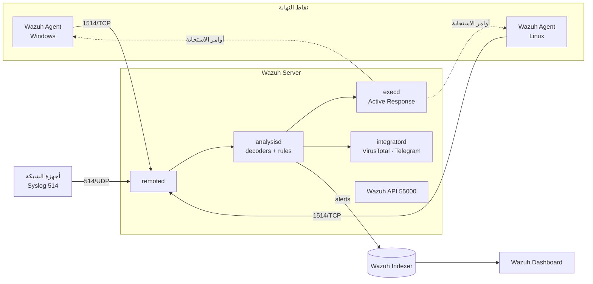
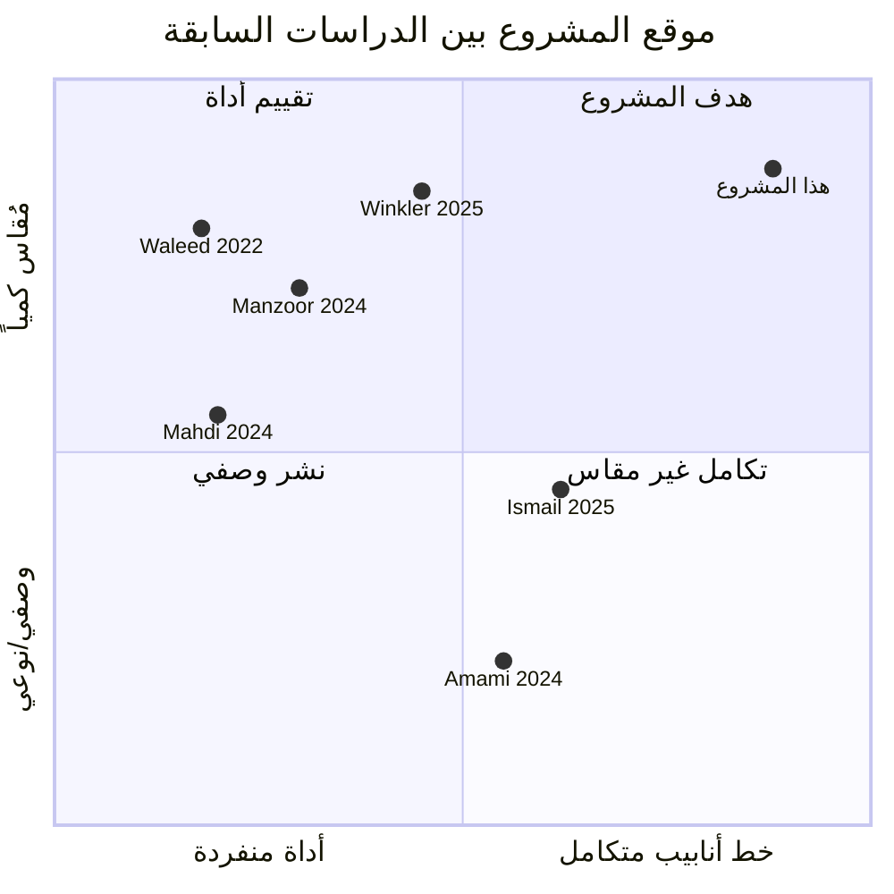

# الفصل الثاني: الإطار النظري والدراسات السابقة
# Chapter Two: Theoretical Background and Literature Review

## 2.1 مقدمة الفصل

يهدف هذا الفصل إلى بناء الأساس النظري الذي يستند إليه المشروع، وذلك من خلال استعراض المفاهيم الجوهرية لمراكز عمليات الأمن (Security Operations Center – SOC) وأنظمة إدارة معلومات وأحداث الأمن (Security Information and Event Management – SIEM)، وأنظمة كشف التسلل (Intrusion Detection Systems – IDS)، وآليات مراقبة سلامة الملفات (File Integrity Monitoring – FIM)، والاستجابة الآلية للتهديدات (Automated/Active Response)، وإطار MITRE ATT&CK لتصنيف سلوك المهاجمين، وإدارة السجلات وبروتوكول Syslog لأجهزة الشبكة، وتطبيقات الذكاء الاصطناعي في مراكز العمليات الأمنية. ثم يستعرض الفصل الدراسات السابقة ذات الصلة بتقييم الحلول مفتوحة المصدر في هذا المجال، ويقارن بين أبرز الأدوات المتاحة، ويُبرّر اختيار المكونات التي بُني عليها المشروع، وينتهي بتحديد الفجوة البحثية التي يسعى المشروع إلى معالجتها.

## 2.2 مركز عمليات الأمن (Security Operations Center – SOC)

### 2.2.1 التعريف والوظائف
يُعرَّف مركز عمليات الأمن بأنه وحدة تنظيمية مركزية تجمع بين **الأفراد** و**العمليات** و**التقنيات** بهدف المراقبة المستمرة للوضع الأمني للمؤسسة، واكتشاف الحوادث الأمنية وتحليلها والاستجابة لها [1]. وقد قدّم Vielberth وزملاؤه [1] دراسة منهجية شاملة لأدبيات SOC خلصت إلى أن الوظائف الأساسية لأي مركز عمليات أمنية تتمحور حول: جمع السجلات (Log Collection)، والمراقبة (Monitoring)، والتحليل (Analysis)، والكشف (Detection)، والاستجابة (Response)، وإدارة الثغرات، والتقارير والامتثال.

### 2.2.2 دورة حياة الاستجابة للحوادث
يُحدد المعيار NIST SP 800-61 Rev. 2 [2] دورة حياة التعامل مع الحوادث الأمنية في أربع مراحل: **التحضير** (Preparation)، و**الكشف والتحليل** (Detection & Analysis)، و**الاحتواء والاستئصال والتعافي** (Containment, Eradication & Recovery)، و**نشاط ما بعد الحادثة** (Post-Incident Activity). ويُلاحَظ أن المشروع الحالي يُغطي المراحل الثلاث الأولى تقنياً: التحضير (نشر الوكلاء والقواعد)، والكشف والتحليل (محرك القواعد وإطار ATT&CK)، والاحتواء (الاستجابة الآلية بحذف الملفات الخبيثة أو فحصها).

### 2.2.3 التحديات المفتوحة
حدّدت الدراسة المنهجية في [1] عدة تحديات مفتوحة لمراكز العمليات الأمنية، من أبرزها: **الإرهاق من التنبيهات** (Alert Fatigue) الناتج عن الحجم الكبير للإنذارات الكاذبة، و**نقص الكوادر المؤهلة**، و**ارتفاع تكلفة** الحلول التجارية، و**صعوبة تكامل** الأدوات المتعددة. وتُشير هذه التحديات مباشرة إلى مشكلة الدراسة المطروحة في الفصل الأول، إذ تُعاني المؤسسات الصغيرة والمتوسطة منها بشكل أشد بسبب محدودية الموارد.

## 2.3 أنظمة إدارة معلومات وأحداث الأمن (SIEM)

### 2.3.1 المفهوم والمكونات
يمثّل نظام SIEM العمود الفقري التقني لمركز العمليات الأمنية؛ فهو يجمع السجلات من مصادر متعددة (خوادم، محطات عمل، أجهزة شبكة، تطبيقات)، ويُطبّعها (Normalization) إلى صيغة موحدة، ويُطبّق عليها قواعد الربط (Correlation Rules) للكشف عن الأنماط المشبوهة، ثم يولّد التنبيهات ويُخزّن الأحداث لأغراض التحقيق والامتثال [3]. ويتألف نظام SIEM النموذجي من طبقات: الجمع (Collection)، والتطبيع والتحليل (Parsing/Decoding)، والربط والكشف (Correlation Engine)، والتخزين والفهرسة (Indexing)، والعرض والتقارير (Visualization).

### 2.3.2 الحلول مفتوحة المصدر للمؤسسات الصغيرة والمتوسطة
قدّم Manzoor وزملاؤه [4] في دراسة منشورة عام 2024 تقييماً تقنياً شاملاً لأبرز حلول SIEM مفتوحة المصدر المناسبة للمؤسسات الصغيرة والمتوسطة (SMEs)، شمل Wazuh وELK Stack وSecurity Onion وغيرها، من حيث قدرات الكشف والأداء وسهولة النشر والتكلفة الإجمالية. وخلصت الدراسة إلى أن الحلول مفتوحة المصدر قادرة على توفير مستوى كشف مقبول بتكلفة ترخيص صفرية، مع الإشارة إلى أن **Wazuh** يتميّز بتكامل وظائف الكشف على مستوى المضيف (HIDS) والاستجابة الآلية ضمن منصة واحدة، وهو ما يُقلّل من عبء التكامل الذي أشارت إليه [1].

كما قدّم Amami وزملاؤه [5] دراسة استكشافية لأدوات SIEM مفتوحة المصدر انتهت إلى نشر حل مبني على Wazuh لتعزيز الدفاع السيبراني، مؤكّدين مرونته وقابليته للتخصيص عبر القواعد المحلية (Local Rules) وأدوات فك الترميز (Decoders).

## 2.4 منصة Wazuh

### 2.4.1 نشأة المنصة ومعماريتها
انطلقت Wazuh عام 2015 كتفريعة (Fork) من مشروع OSSEC مفتوح المصدر لكشف التسلل على مستوى المضيف، ثم تطوّرت إلى منصة موحّدة تجمع بين SIEM وXDR [6]. وتتكوّن معمارية Wazuh 4.x من ثلاثة مكونات مركزية [6]:
1. **Wazuh Server (Manager):** يستقبل الأحداث من الوكلاء، ويُحلّلها عبر محرك `wazuh-analysisd` باستخدام أدوات فك الترميز والقواعد، ويولّد التنبيهات، ويُدير وحدة التكامل (Integrator) والاستجابة النشطة.
2. **Wazuh Indexer:** محرك بحث وتحليلات موزّع لتخزين التنبيهات وفهرستها، مبني على **OpenSearch** (الذي هو بدوره تفريعة من Elasticsearch 7.10).
3. **Wazuh Dashboard:** واجهة ويب للعرض والتحليل، مبنية على OpenSearch Dashboards (تفريعة من Kibana).

**شكل (2.1): معمارية Wazuh 4.x ومسارات البيانات المستخدمة في المشروع** (المصدر: من إعداد الباحثين استناداً إلى [6])

> **ملاحظة اصطلاحية:** كثيراً ما تُستخدم في الأدبيات الأقدم مسمّيات Elasticsearch وKibana عند وصف Wazuh (كما في الإصدارات ≤ 4.2 التي كانت تعتمد عليهما فعلاً). أما في الإصدار 4.14 المستخدم في هذا المشروع فالمكوّنان هما **Wazuh Indexer** و**Wazuh Dashboard**، ويُلتزَم بهذين المسمّيَين في كامل الرسالة.

### 2.4.2 الوحدات الوظيفية ذات الصلة بالمشروع
**جدول (2.1): الوحدات الوظيفية في Wazuh ذات الصلة بالمشروع**

| الوحدة | الوظيفة | حالة الاستخدام في المشروع |
|--------|---------|---------------------------|
| **Syscheck (FIM)** | مراقبة سلامة الملفات في الوقت الفعلي (إنشاء/تعديل/حذف) مع بيانات المستخدم والعملية | UC-02، وكمحفّز لـ UC-03 وUC-07 |
| **Log Collector** | قراءة ملفات السجلات المحلية بصيغ متعددة (syslog, json, audit, full_command) | UC-04 (Suricata)، UC-05 (auditd)، UC-06 (Apache)، UC-08 (ps) |
| **Ruleset (Decoders + Rules)** | تفكيك السجلات ومطابقتها بقواعد ذات مستويات خطورة 0–15 وربطها بـ ATT&CK | كل الحالات |
| **CDB Lists** | قوائم مفاتيح/قيم مُجمَّعة للمطابقة السريعة داخل القواعد | UC-05 (تصنيف الأوامر) |
| **Integrator** | الاتصال بواجهات برمجية خارجية (VirusTotal, Slack, …) لإثراء التنبيهات | UC-03 |
| **Active Response** | تنفيذ سكربتات على الوكيل أو المدير استجابةً لقواعد محددة | UC-03 (حذف)، UC-07 (فحص YARA) |
| **MITRE ATT&CK module** | ربط التنبيهات بالتكتيكات والتقنيات وعرضها | UC-06 وغيرها |
| **Remote (Syslog)** | استقبال سجلات أجهزة لا يُثبَّت عليها وكيل عبر UDP/TCP 514 | UC-12، UC-13 |
| **RESTful API** | إدارة المنصة وإطلاق الاستجابة النشطة برمجياً (`PUT /active-response`) | UC-14 |

### 2.4.3 Wazuh في الأبحاث الحديثة
اقترح Winkler وSharma [7] عام 2025 إطاراً تقييمياً متوافقاً مع MITRE ATT&CK لقياس **تغطية الكشف** و**زمن الاستجابة** لنظام Wazuh عبر منصات متعددة، مؤكّدين الحاجة إلى مقاييس كمية بدلاً من الادعاءات النوعية عند تقييم أنظمة SIEM — وهو المنهج الذي يتبنّاه هذا المشروع في الفصل الخامس. كما قدّم Ismail وزملاؤه [8] دراسة لتعزيز الاستجابة لأحداث Wazuh باستخدام نماذج لغوية كبيرة مع التوليد المعزّز بالاسترجاع (RAG)، مما يُبيّن أن Wazuh يُشكّل أساساً بحثياً نشطاً للتوسعات المستقبلية القائمة على الذكاء الاصطناعي.

## 2.5 أنظمة كشف التسلل الشبكي (Network IDS)

### 2.5.1 التصنيف
تُصنَّف أنظمة كشف التسلل بحسب موقعها إلى **مضيفية** (HIDS) تراقب النشاط داخل الجهاز، و**شبكية** (NIDS) تراقب حركة المرور. وبحسب آلية الكشف إلى **قائمة على التوقيعات** (Signature-based) تُطابق أنماطاً معروفة، و**قائمة على السلوك/الشذوذ** (Anomaly-based). ويعمل Wazuh كـ HIDS بينما يُكمّله Suricata كـ NIDS قائم على التوقيعات.

### 2.5.2 المقارنة بين Suricata وSnort وZeek
أجرى Waleed وزملاؤه [9] مقارنة تجريبية بين ثلاثة أنظمة IDS مفتوحة المصدر (Snort وSuricata وZeek) في وضعَي IDS وIPS، وخلصوا إلى أن **Suricata يتفوّق في الأداء** بفضل معماريته متعددة الخيوط (Multi-threaded) وقدرته على معالجة حركة مرور أعلى دون فقدان الحزم. أما Zeek فيتميّز بأنه **محلل شبكة** (Network Analysis Framework) يولّد سجلات وصفية مفصّلة للبروتوكولات أكثر من كونه نظام تنبيه بالتوقيعات، مما يجعله أنسب للتحليل الجنائي والصيد اليدوي للتهديدات (Threat Hunting) منه للكشف الفوري.

وفي دراسة أحدث (2026)، وجد Qutqut وزملاؤه [10] أن Suricata تفوّق على Snort في كشف تسريب البيانات عبر DNS، مع تقارب بينهما في سيناريوهات أخرى؛ مما يُؤكّد أن اختيار Suricata خيار مبرَّر لنظام كشف شبكي حديث.

### 2.5.3 تبرير اختيار Suricata دون Zeek في هذا المشروع
**جدول (2.2): مقارنة Suricata وZeek لأغراض المشروع**

| المعيار | Suricata | Zeek |
|---------|----------|------|
| نمط المخرجات | تنبيهات فورية (EVE JSON) بتوقيعات ET Open | سجلات وصفية (conn.log, dns.log, http.log…) بلا تنبيهات مباشرة |
| التكامل مع Wazuh | دعم أصلي بأدوات فك ترميز وقواعد مدمجة (86600+) | يحتاج أدوات فك ترميز مخصصة لكل نوع سجل |
| الملاءمة لهدف المشروع | **كشف → قرار → استجابة** فورية | تحليل جنائي لاحق |
| استهلاك الموارد في معمل افتراضي | مقبول (~60 MB RAM في المعمل) | أعلى مع حجم سجلات كبير |

بناءً على ذلك، اعتُمد Suricata كنظام كشف التسلل الشبكي الوحيد، مع الإشارة إلى Zeek في الأعمال المستقبلية كطبقة تحليل تكميلية.

## 2.6 مراقبة سلامة الملفات (File Integrity Monitoring – FIM)

تُعدّ FIM إحدى الضوابط الأمنية الأساسية التي تشترطها أطر الامتثال مثل PCI DSS (المتطلب 11.5) وNIST SP 800-53 (الضابط SI-7)؛ وتقوم على حساب بصمات تشفيرية (MD5/SHA-1/SHA-256) للملفات الحساسة ومقارنتها دورياً أو في الوقت الفعلي لكشف أي تغيير غير مصرَّح به [6]. وتُثري وحدة FIM في Wazuh بيانات التنبيه بمعلومات "من" (who-data) عبر تكامل مع نظام التدقيق auditd على Linux، مما يُتيح تحديد المستخدم والعملية المسؤولَين عن التغيير. وفي هذا المشروع تُستخدم FIM ليس فقط للكشف، بل **كمحفّز لسلسلة الاستجابة الآلية**: فكل ملف جديد في مجلد مراقَب يُرسل هاشه إلى VirusTotal (UC-03) أو يُفحص محلياً بقواعد YARA (UC-07).

## 2.7 كشف البرمجيات الخبيثة: YARA وVirusTotal

**YARA** أداة مفتوحة المصدر طوّرتها VirusTotal لوصف عائلات البرمجيات الخبيثة وتصنيفها عبر قواعد نصية تعتمد على السلاسل والأنماط الثنائية والشروط المنطقية [11]. وقد بيّن Mahdi وTrabelsi [12] فاعلية قواعد YARA في كشف البرمجيات الخبيثة عند دمجها في خط أنابيب آلي، مع التنبيه إلى اعتماد جودة الكشف على حداثة القواعد وشمولها.

**VirusTotal** خدمة سحابية تُجمّع نتائج أكثر من 70 محرك مكافحة فيروسات؛ ويُتيح تكاملها مع Wazuh إثراء تنبيهات FIM بحكم جماعي على الملف دون الحاجة لتثبيت محرك مكافحة فيروسات محلي، مع قيد معدل 4 طلبات/دقيقة للمفتاح المجاني [6].

ويُمثّل الجمع بينهما في المشروع **طبقتَي دفاع متكاملتَين**: طبقة سحابية (VirusTotal) وطبقة محلية غير معتمدة على الاتصال (YARA).

## 2.8 الاستجابة الآلية للتهديدات (Active Response)

تُشير الاستجابة الآلية إلى تنفيذ إجراء دفاعي تلقائياً فور تحقّق شرط كشف محدد، دون انتظار تدخل بشري؛ وتهدف إلى تقليص **زمن الاحتواء** (Time to Contain) من دقائق أو ساعات إلى ثوانٍ [2]. وتُنفَّذ في Wazuh عبر وحدة Active Response التي تُشغّل سكربتاً (Bash/Python/Batch) على الوكيل (`local`) أو المدير (`server`) عند إطلاق قاعدة أو مجموعة قواعد محددة، مع دعم الإجراءات ذات المهلة (Stateful) التي تتراجع تلقائياً بعد مدة [6]. وتشمل الاستجابات المدمجة: `firewall-drop` (حظر IP عبر iptables)، و`host-deny`، و`disable-account`، و`restart-wazuh`، إضافة إلى إمكانية كتابة استجابات مخصصة كما في هذا المشروع (`remove-threat.sh` و`yara.sh`).

وتُبرز الدراسة المنهجية [1] أن **أتمتة الاستجابة** أحد أهم مسارات تخفيف عبء المحللين ومعالجة الإرهاق من التنبيهات، وهو ما يجعلها محوراً رئيسياً في تصميم هذا المشروع.

## 2.9 إدارة السجلات وأجهزة الشبكة عبر Syslog

تُعرّف إرشادات NIST SP 800-92 [16] إدارةَ السجلات الأمنية بأنها عملية توليد السجلات ونقلها وتخزينها وتحليلها والتخلص منها، وتؤكد أن أجهزة البنية التحتية للشبكة (الموجّهات والمبدّلات والجدران النارية) مصادر أساسية للسجلات الأمنية لأنها تشهد محاولات الوصول الإداري وتغييرات الإعدادات وحركة المرور المرفوضة. وتُصدِّر هذه الأجهزة سجلاتها عادةً عبر بروتوكول **Syslog**، الذي وثّقت صيغته التقليدية (BSD) الوثيقة RFC 3164 [17]، ثم وحّدته RFC 5424 [18] بصيغة مُهيكلة تتضمن الأولوية والطابع الزمني واسم المضيف والرسالة.

وتتيح أنظمة MikroTik RouterOS — الشائعة في الشبكات الصغيرة والمتوسطة ولدى مزودي الخدمة في المنطقة — إرسال سجلاتها إلى خادم بعيد مصنّفةً بـ"مواضيع" (Topics) مثل `system` (الدخول والإعدادات) و`dhcp` (توزيع العناوين) و`firewall` (قواعد الجدار الناري) [19]. غير أن مجموعة القواعد الافتراضية في Wazuh 4.14 **لا تتضمن مفككات (Decoders) لرسائل RouterOS**، وهو ما تحقق منه المشروع تجريبياً: أي رسالة RouterOS تصل إلى المدير إما لا تُفكَّك أو تُطابق قاعدة عامة (2501) بلا حقول مفيدة. لذلك يلزم لأي جهاز شبكة غير مدعوم: (1) مسار نقل (Syslog إلى المدير مع تقييد عناوين المصدر)، (2) مفكّك يستخرج الحقول (المستخدم، العنوان، الإجراء)، (3) قواعد كشف وربط. ويسمي المشروع هذا الثلاثي **"عقد إدخال مصدر"** قابلاً للتكرار لأي جهاز جديد دون تغيير النواة.

### 2.9.1 رؤية الهواتف من الشبكة

لا يوفّر Wazuh وكيلاً رسمياً لأنظمة Android وiOS، كما أن مراقبة محتوى الهاتف تتطلب أدوات إدارة الأجهزة المحمولة (MDM) خارج نطاق المشروع. لكن كل جهاز ينضم إلى الشبكة يحصل على عنوان من خادم DHCP في الراوتر، فيُسجَّل عنوانه الفيزيائي (MAC) واسم الجهاز. وتستخدم أنظمة Android 10 فأحدث وiOS 14 فأحدث افتراضياً **عناوين MAC عشوائية** لكل شبكة حفاظاً على الخصوصية [20]، [21]، وتتميّز هذه العناوين بأنها "مُدارة محلياً" (Locally Administered)، أي أن البت الثاني من البايت الأول يساوي 1، فتكون الخانة الست عشرية الثانية أحد القيم 2 أو 6 أو A أو E. ويستغل المشروع ذلك لتقديم **رؤية شبكية** للأجهزة الجديدة والهواتف غير المعروفة (جهاز غير مسجّل في قائمة الأجهزة المعتمدة، وبعنوان عشوائي) وربطها بتقنية ATT&CK T1200 (Hardware Additions) [13]، مع التصريح بأن ذلك لا يرى ما يجري داخل الهاتف.

## 2.10 إطار MITRE ATT&CK

يُعدّ MITRE ATT&CK قاعدة معرفية عالمية موثَّقة لتكتيكات (Tactics) وتقنيات (Techniques) الخصوم المستندة إلى ملاحظات واقعية [13]. ويُنظَّم الإطار في مصفوفة تُمثّل أعمدتها التكتيكات (مثل Initial Access, Execution, Privilege Escalation, Defense Evasion, Command and Control) وخلاياها التقنيات المعرَّفة بمعرّفات فريدة (مثل T1190 Exploit Public-Facing Application). ويُوفّر الإطار لغة مشتركة لتصنيف التنبيهات وقياس تغطية الكشف [7]. وتُضمّن Wazuh هذا الربط في قواعدها المدمجة وتُتيحه للقواعد المخصصة عبر العنصر `<mitre>`، وقد استُخدم في المشروع لربط كشف Shellshock بـ T1190 وT1068، والأوامر المشبوهة بـ T1059، واتصالات Netcat بـ T1571.

## 2.11 مخاطر الاستجابة الآلية ومتطلبات تحصينها

رغم أن الاستجابة الآلية تقلّص زمن الاحتواء، فإنها تُدخل خطراً جديداً: **إجراءٌ آلي بصلاحيات عالية يُحرّكه محتوى قادم من مصدر قد يتحكم فيه المهاجم** (اسم ملف، مسار، عنوان IP). وتنصّ إرشادات NIST SP 800-61 المحدَّثة [22] على أن إجراءات الاحتواء يجب أن تكون محددة ومُختبرة ومحكومة بسياسة، مع إمكانية التراجع. ويوفّر توثيق Wazuh [6] سكربتاً مرجعياً لحذف الملفات التي يحكم عليها VirusTotal بأنها خبيثة؛ وقد حلّل المشروع هذا السكربت فتبيّن أنه:
1. يُنفّذ أمر الحذف خارج شرط التحقق من نوع الأمر (`add`)، فقد يحذف عند أوامر أخرى؛
2. يستخدم المسار دون اقتباس، فتتأثر المسارات التي تحتوي فراغات؛
3. لا يتحقق من أن الملف الحالي هو نفسه الذي فُحص (لا مقارنة بصمة)؛
4. لا يقيّد الحذف بالمجلدات المراقبة (قائمة مسموحة)؛
5. لا يرفض الروابط الرمزية (Symlinks) ولا المسارات غير القانونية (`../`)؛
6. لا يسجّل نتيجة يمكن التحقق منها بصورة موثوقة.

كما أن الاستجابات ذات الحالة (مثل `firewall-drop`) تحتاج إلى **قائمة استثناء** لعناوين الإدارة حتى لا يحظر النظام المسؤول عنه، وإلى **مهلة تراجع** تلقائية. وتُشكّل هذه النقاط متطلبات التحصين التي يبني عليها المشروع مساهمته الأولى (الفصل الثالث).

## 2.12 الذكاء الاصطناعي في مراكز العمليات الأمنية

تُسهم النماذج اللغوية الكبيرة (LLMs) في مهام المحلل الأمني مثل تلخيص التنبيهات وشرحها واقتراح خطوات التحقيق. غير أن هذه النماذج معرّضة لـ"الهلوسة" (Hallucination)، أي توليد معلومات تبدو معقولة لكنها غير صحيحة، وهو أمر بالغ الخطورة في الأمن السيبراني (مثل اختلاق معرّف قاعدة أو تقنية هجوم). ولمعالجة ذلك اقترح Lewis وزملاؤه [23] أسلوب **التوليد المعزّز بالاسترجاع** (RAG)، الذي يُزوّد النموذج بمقاطع موثوقة مسترجعة من قاعدة معرفة قبل التوليد، فيرتبط الجواب بالأدلة. ويعتمد الاسترجاع في أبسط صوره وأكثرها قابلية للتفسير على خوارزمية **BM25** الاحتمالية للترتيب [24].

وقد طبّق Ismail وزملاؤه [8] هذا الأسلوب فوق Wazuh لتحسين الاستجابة لأحداثه، مؤكّدين جدواه. ويؤكد إطار NIST لإدارة مخاطر الذكاء الاصطناعي [25] ضرورة الشفافية وقابلية التتبع والإشراف البشري على الأنظمة ذات الأثر. ويبني المشروع على ذلك محللاً ذكياً بثلاثة مستويات (الشرح، والترابط، واقتراح الاستجابة) بثلاث ضمانات: (1) أن كل ادعاء مُسنَد إلى دليل مسترجع، ويُرفض الجواب إن ذكر معرّفاً غير موجود في قاعدة المعرفة؛ (2) أن النموذج لا يملك صلاحية إضافة إجراء خارج قائمة مسموحة ثابتة؛ (3) أن أي إجراء لا يُنفَّذ إلا بموافقة بشرية صريحة مسجَّلة.

## 2.13 الثغرات والهجمات المُحاكاة في المشروع

- **Shellshock (CVE-2014-6271):** ثغرة في معالجة GNU Bash لمتغيرات البيئة تُتيح تنفيذ أوامر عشوائية عبر حقن دالة مُصاغة بالنمط `() { :; };` في ترويسات HTTP تُمرَّر إلى Bash عبر CGI [14]. وقد نمذج Zhang وزملاؤه [15] آلية الاستغلال باستخدام شبكات Petri، مُبيّنين أن الكشف يمكن أن يعتمد على مطابقة النمط المميز في سجلات خادم الويب — وهو بالضبط ما تُنفّذه قاعدة Wazuh 31168. وتُصنَّف الثغرة تحت T1190 (استغلال تطبيق موجَّه للعامة) في إطار ATT&CK.
- **الأوامر ذات الاستخدام المزدوج (Dual-use tools):** أدوات مثل `nc` و`tcpdump` و`whoami` مشروعة بذاتها لكنها مؤشرات شائعة على مراحل الاستطلاع (T1082/T1033) أو القناة العكسية (T1571 Non-Standard Port) في سلاسل الهجوم؛ ومن هنا جاءت فكرة تصنيفها بقوائم CDB بدرجات خطورة (UC-05) بدلاً من حظرها.
- **فحص المنافذ (Port Scanning):** أول خطوات الاستطلاع الشبكي (T1046)؛ تكشفه توقيعات ET Open في Suricata (UC-04).
- **حقن SQL:** إدخال عبارات SQL في معاملات الطلب للتلاعب باستعلامات قاعدة البيانات (T1190)؛ تكشفه قواعد Wazuh المدمجة 31103/31106 من سجلات Apache.
- **القوة الغاشمة على SSH وواجهات إدارة الراوتر:** تخمين كلمات المرور تكراراً (T1110)؛ تكشفه قواعد التكرار في Wazuh (5712/5763) ومفككات المشروع لـ RouterOS، ويتبعه الحظر الآلي.
- **إضافة جهاز غير معروف إلى الشبكة:** (T1200) مثل هاتف أو جهاز دخيل؛ تُرصد من سجلات DHCP.
- **البرمجيات الخبيثة الاختبارية:** ملف EICAR القياسي لاختبار محركات مكافحة الفيروسات بلا ضرر، وعينات حقيقية (Mirai, Xbash, VPNFilter, WebShell) من مستودع توثيق Wazuh لاختبار YARA داخل بيئة معزولة (UC-03، UC-07).

## 2.14 مقارنة الحلول البديلة وتبرير الاختيار

**جدول (2.3): مقارنة الحلول البديلة**

| المعيار | **Wazuh** | Splunk (Enterprise/Free) | ELK Stack (خام) | OSSEC | Security Onion |
|---------|-----------|--------------------------|-----------------|-------|----------------|
| الترخيص/التكلفة | مفتوح المصدر، مجاني بالكامل | تجاري؛ النسخة المجانية محدودة الحجم (500 MB/يوم) | مفتوح جزئياً (SSPL/Elastic License) | مفتوح المصدر | مفتوح المصدر |
| HIDS/FIM مدمج | ✅ وكيل متعدد المنصات | ❌ يحتاج Universal Forwarder + تطبيقات | ❌ يحتاج Beats + قواعد يدوية | ✅ (الأصل التاريخي لـ Wazuh) | ✅ عبر Wazuh مدمج |
| استجابة آلية (Active Response) | ✅ مدمجة | عبر إضافات/SOAR منفصل | ❌ | ✅ محدودة | عبر Wazuh |
| تكامل تهديدات خارجي (VirusTotal…) | ✅ وحدة Integrator | عبر تطبيقات | يدوي | ❌ | محدود |
| ربط MITRE ATT&CK | ✅ في القواعد واللوحة | ✅ (Enterprise Security مدفوع) | يدوي | ❌ | جزئي |
| واجهة عرض | Wazuh Dashboard مدمجة | ✅ قوية | Kibana | ❌ (نص فقط) | ✅ |
| ملاءمة SMEs (وفق [4]) | **عالية** | منخفضة (تكلفة) | متوسطة (جهد تكامل) | متوسطة (بلا واجهة) | عالية لكن أثقل موارد |

يتّضح أن Wazuh هو الحل الوحيد في المقارنة الذي يجمع **بدون تكلفة ترخيص** بين: HIDS/FIM، ومحرك قواعد SIEM، واستجابة آلية، وتكامل خارجي، وربط ATT&CK، وواجهة عرض — في منصة واحدة، وهو ما يُطابق نتائج [4] و[5] ويُقلّل عبء التكامل الذي حدّدته [1] كتحدٍّ مركزي.

## 2.15 الدراسات السابقة: ملخص وتحليل نقدي

**جدول (2.4): ملخص الدراسات السابقة**

| # | الدراسة | المنهج | أبرز النتائج | ما يُضيفه مشروعنا عليها |
|---|---------|--------|--------------|-------------------------|
| [1] | Vielberth et al., 2020 — IEEE Access | مراجعة منهجية لأدبيات SOC | تحديد الوظائف والتحديات المفتوحة (إرهاق التنبيهات، التكامل، الكوادر) | تطبيق عملي يُعالج تحدّيَي التكامل والأتمتة في سياق SME |
| [4] | Manzoor et al., 2024 — PLOS ONE | تقييم تجريبي لحلول SIEM مفتوحة المصدر لـ SMEs | Wazuh بين الأنسب تكلفةً وقدرةً | تجاوز التقييم المعزول للأداة إلى بناء خط أنابيب متكامل مع استجابة آلية |
| [5] | Amami et al., 2024 — IEEE CoDIT | استكشاف ونشر حل Wazuh | إثبات جدوى النشر | إضافة القياس الكمي وسلسلة الاستجابة |
| [7] | Winkler & Sharma, 2025 — Computers & Security | إطار تقييم Wazuh متوافق مع ATT&CK | ضرورة مقاييس كمية للتغطية والاستجابة | تبنّي مقاييس MTTD/زمن الاستجابة/FP في بيئة SME مصغّرة |
| [8] | Ismail et al., 2025 — Sensors | تعزيز استجابة Wazuh بـ LLM + RAG | جدوى الذكاء الاصطناعي فوق Wazuh | إضافة حارس ضد الاختلاق وقائمة إجراءات مسموحة وموافقة بشرية وسجل تدقيق |
| [9] | Waleed et al., 2022 — Computer Networks | مقارنة تجريبية Snort/Suricata/Zeek | تفوّق أداء Suricata | تبرير اختيار Suricata ودمجه مع HIDS |
| [10] | Qutqut et al., 2026 — J. Cybersecurity & Privacy | Snort vs Suricata في تسريب البيانات | تفوّق Suricata في DNS exfiltration | دعم إضافي للاختيار |
| [12] | Mahdi & Trabelsi, 2024 — IEEE SSD | كشف البرمجيات الخبيثة بقواعد YARA | فاعلية YARA مع اعتمادها على حداثة القواعد | دمج YARA كاستجابة آلية مُحفَّزة بـ FIM لا كفحص يدوي |

**التحليل النقدي:** تتناول الدراسات السابقة إما (أ) الأداة منفردة (تقييم SIEM أو IDS أو YARA)، أو (ب) الإطار النظري لـ SOC دون تنفيذ، أو (ج) توسعات متقدمة (AI) تفترض وجود أساس ناضج. ولا تُقدّم أيٌّ منها **نموذجاً مرجعياً متكاملاً وقابلاً للتكرار** لمركز عمليات أمنية مصغّر يربط كشف المضيف والشبكة وأجهزة الشبكة بالاستجابة الآلية **المُحصَّنة**، ويُقيَّم كمياً في بيئة تُحاكي مؤسسة صغيرة، ويضيف طبقة ذكاء اصطناعي خاضعة للإشراف البشري.

## 2.16 الفجوة البحثية وموقع المشروع

بناءً على ما سبق، تتحدد الفجوة التي يعالجها المشروع في ثلاثة أبعاد:

1. **فجوة التكامل:** غياب نموذج موثَّق يُوحّد FIM وNIDS وتدقيق الأوامر وسجلات الويب وفحص البرمجيات الخبيثة **وأجهزة الشبكة غير المدعومة أصلاً** في خط أنابيب واحد بسجل قواعد بلا تعارض — بدلاً من أدلة منفصلة لكل ميزة.
2. **فجوة الاستجابة الآمنة:** معظم التطبيقات الأكاديمية لـ Wazuh تتوقف عند "الكشف والعرض"، أو تستخدم السكربتات المرجعية كما هي؛ بينما يُغلق هذا المشروع الدورة بالاستجابة الآلية (إثراء خارجي ← قرار ← إجراء على الجهاز ← تأكيد) وفق NIST 800-61 [2]، [22] بعد تحصينها ضد العيوب الستة (§2.11).
3. **فجوة القياس:** الاعتماد على ادعاءات نوعية ("تم الكشف بنجاح")؛ يتبنّى المشروع منهجية قياس كمية (معدل الكشف، MTTD، زمن الاستجابة، الإنذارات الكاذبة/ساعة) على غرار [7]، بسجل محاولات مستقل عن سجل التنبيهات (انظر `tests/TEST_PLAN.md`).

4. **فجوة الإشراف على الذكاء الاصطناعي:** الدراسات التي تضيف LLM فوق Wazuh [8] تركّز على جودة الشرح، ولا تُقدّم ضمانات تنفيذية تمنع النموذج من اختلاق الأدلة أو تنفيذ إجراء دون إنسان.

ويُموضع المشروع نفسه بذلك كـ **"نموذج مرجعي قابل للتكرار لمركز عمليات أمنية مصغّر مفتوح المصدر مع استجابة آلية مُقاسة"**، موجَّه للمؤسسات الصغيرة والمتوسطة التي حدّدتها [1] و[4] كالأكثر حاجة والأقل قدرة.

**شكل (2.2): موقع المشروع بين الدراسات السابقة** (تقدير نوعي من إعداد الباحثين؛ للتوضيح لا للقياس)

## 2.17 خلاصة الفصل

استعرض هذا الفصل مفهوم مركز عمليات الأمن ووظائفه وتحدياته، ونظام SIEM ومعمارية Wazuh ووحداته، وأنظمة كشف التسلل الشبكي مع تبرير اختيار Suricata، ومراقبة سلامة الملفات، وكشف البرمجيات الخبيثة بـ YARA وVirusTotal، والاستجابة الآلية ومخاطرها، وإدارة السجلات وSyslog لأجهزة الشبكة ورؤية الهواتف، وإطار MITRE ATT&CK، والذكاء الاصطناعي في SOC، ثم قارن الحلول البديلة وحلّل الدراسات السابقة وحدّد أربع فجوات: التكامل، والاستجابة الآمنة، والقياس، والإشراف على الذكاء الاصطناعي. ويعرض الفصل الثالث المنهجية والتصميم اللذين يعالجان هذه الفجوات.

## مراجع الفصل الثاني

[1] M. Vielberth, F. Böhm, I. Fichtinger, and G. Pernul, "Security Operations Center: A Systematic Study and Open Challenges," *IEEE Access*, vol. 8, pp. 227756–227779, 2020, doi: 10.1109/ACCESS.2020.3045514.

[2] P. Cichonski, T. Millar, T. Grance, and K. Scarfone, "Computer Security Incident Handling Guide," NIST Special Publication 800-61 Rev. 2, National Institute of Standards and Technology, Aug. 2012, doi: 10.6028/NIST.SP.800-61r2.

[3] G. González-Granadillo, S. González-Zarzosa, and R. Diaz, "Security Information and Event Management (SIEM): Analysis, Trends, and Usage in Critical Infrastructures," *Sensors*, vol. 21, no. 14, art. 4759, 2021, doi: 10.3390/s21144759.

[4] J. Manzoor, A. Waleed, A. F. Jamali, and A. Masood, "Cybersecurity on a budget: Evaluating security and performance of open-source SIEM solutions for SMEs," *PLOS ONE*, vol. 19, no. 3, art. e0301183, 2024, doi: 10.1371/journal.pone.0301183.

[5] R. Amami, M. Charfeddine, and S. Masmoudi, "Exploration of Open Source SIEM Tools and Deployment of an Appropriate Wazuh-Based Solution for Strengthening Cyberdefense," in *Proc. 10th Int. Conf. Control, Decision and Information Technologies (CoDIT)*, 2024, pp. 1–7, doi: 10.1109/CoDIT62066.2024.10708476.

[6] Wazuh Inc., "Wazuh documentation — version 4.14," 2025. [Online]. Available: https://documentation.wazuh.com/4.14/ (accessed Sep. 2026).

[7] A. M. Winkler and P. Sharma, "Proactive threat detection in enterprise systems using Wazuh: A MITRE ATT&CK evaluation framework," *Computers & Security*, vol. 159, art. 104702, 2025, doi: 10.1016/j.cose.2025.104702.

[8] Ismail, R. Kurnia, F. Widyatama, I. M. Wibawa, Z. A. Brata, Ukasyah, et al., "Enhancing Security Operations Center: Wazuh Security Event Response with Retrieval-Augmented-Generation-Driven Large Language Models," *Sensors*, vol. 25, no. 3, art. 870, 2025, doi: 10.3390/s25030870.

[9] A. Waleed, A. F. Jamali, and A. Masood, "Which open-source IDS? Snort, Suricata or Zeek," *Computer Networks*, vol. 213, art. 109116, 2022, doi: 10.1016/j.comnet.2022.109116.

[10] M. H. Qutqut, A. Ahmed, M. K. Taqi, J. Abimanyu, E. T. Ajes, and F. Alhaj, "A Comparative Evaluation of Snort and Suricata for Detecting Data Exfiltration Tunnels in Cloud Environments," *Journal of Cybersecurity and Privacy*, vol. 6, no. 1, art. 17, 2026, doi: 10.3390/jcp6010017.

[11] VirusTotal, "YARA — The pattern matching swiss knife for malware researchers," documentation v4.5. [Online]. Available: https://yara.readthedocs.io/ (accessed Sep. 2026).

[12] R. Mahdi and H. Trabelsi, "Detection of Malware by Using YARA Rules," in *Proc. 21st Int. Multi-Conf. Systems, Signals & Devices (SSD)*, 2024, pp. 1–8, doi: 10.1109/SSD61670.2024.10549308.

[13] B. E. Strom, A. Applebaum, D. P. Miller, K. C. Nickels, A. G. Pennington, and C. B. Thomas, "MITRE ATT&CK: Design and Philosophy," MITRE Corporation, Technical Report MP180360R1, Mar. 2020. [Online]. Available: https://attack.mitre.org/resources/

[14] MITRE, "CVE-2014-6271: GNU Bash Shellshock," Common Vulnerabilities and Exposures, Sep. 2014. [Online]. Available: https://cve.mitre.org/cgi-bin/cvename.cgi?name=CVE-2014-6271

[15] L. Zhang, X. Deng, and Y. Wang, "Shellshock Bash Vulnerability Modeling Analysis Based on Petri Net," in *Proc. Int. Conf. Networking and Network Applications (NaNA)*, 2021, pp. 242–247, doi: 10.1109/NaNA53684.2021.00049.

[16] K. Kent and M. Souppaya, "Guide to Computer Security Log Management," NIST Special Publication 800-92, National Institute of Standards and Technology, Sep. 2006, doi: 10.6028/NIST.SP.800-92.

[17] C. Lonvick, "The BSD Syslog Protocol," RFC 3164, Internet Engineering Task Force, Aug. 2001, doi: 10.17487/RFC3164.

[18] R. Gerhards, "The Syslog Protocol," RFC 5424, Internet Engineering Task Force, Mar. 2009, doi: 10.17487/RFC5424.

[19] MikroTik, "RouterOS documentation — Log," help.mikrotik.com. [Online]. Available: https://help.mikrotik.com/docs/spaces/ROS/pages/328094/Log (accessed Sep. 2026).

[20] Android Open Source Project, "Implement MAC randomization," source.android.com. [Online]. Available: https://source.android.com/docs/core/connect/wifi-mac-randomization (accessed Sep. 2026).

[21] Apple Inc., "Use private Wi-Fi addresses on Apple devices," Apple Support, article 102509. [Online]. Available: https://support.apple.com/en-us/102509 (accessed Sep. 2026).

[22] A. Nelson, S. Rekhi, M. Souppaya, and K. Scarfone, "Incident Response Recommendations and Considerations for Cybersecurity Risk Management: A CSF 2.0 Community Profile," NIST Special Publication 800-61 Rev. 3, National Institute of Standards and Technology, Apr. 2025, doi: 10.6028/NIST.SP.800-61r3.

[23] P. Lewis, E. Perez, A. Piktus, F. Petroni, V. Karpukhin, N. Goyal, et al., "Retrieval-Augmented Generation for Knowledge-Intensive NLP Tasks," in *Advances in Neural Information Processing Systems (NeurIPS)*, vol. 33, 2020, pp. 9459–9474, arXiv:2005.11401.

[24] S. Robertson and H. Zaragoza, "The Probabilistic Relevance Framework: BM25 and Beyond," *Foundations and Trends in Information Retrieval*, vol. 4, no. 1–2, pp. 1–174, 2009, doi: 10.1561/1500000019.

[25] E. Tabassi, "Artificial Intelligence Risk Management Framework (AI RMF 1.0)," NIST AI 100-1, National Institute of Standards and Technology, Jan. 2023, doi: 10.6028/NIST.AI.100-1.
