# الفصل الثالث: المنهجية وتصميم النظام
# Chapter Three: Methodology and System Design

## 3.1 مقدمة الفصل

يعرض هذا الفصل المنهجية التي اتُّبعت في تصميم منصة مركز العمليات الأمنية وتنفيذها وتقييمها، ثم تحليل المتطلبات الوظيفية وغير الوظيفية، فالمعمارية العامة بمراحلها الست وطبقاتها، ثم نمذجة تدفق البيانات على ثلاثة مستويات، وتصميم حالات الاستخدام الأربع عشرة وسلاسل الاستجابة الآلية، وتصميم البيانات (مخزن التنبيهات وقوائم CDB وسجل المحاولات وسجل التدقيق)، وتصميم الأمان الذاتي للمنصة، وبيئة المعمل الافتراضية، وأخيراً منهجية التقييم الكمي ومصفوفة تتبع المتطلبات. ويلتزم الفصل بمبدأ **المطابقة مع المنفَّذ**: كل مكوّن يرد في التصميم له نظير عامل، وما لم يُنفَّذ يُذكر صراحةً في قسم قابلية التوسع.

## 3.2 منهجية البحث

### 3.2.1 نوع البحث

يندرج المشروع ضمن **البحث التطبيقي التجريبي** القائم على منهج **بحث علم التصميم** (Design Science Research – DSR) [1]، الذي يهدف إلى بناء **منتج معرفي** (Artifact) — هنا منصة SOC مصغّرة — لحل مشكلة ذات صلة، ثم تقييمه بصرامة، واستخلاص المعرفة من عمليتي البناء والتقييم. وقد اتُّبعت مراحل منهجية DSR الست التي اقترحها Peffers وزملاؤه [2]: تحديد المشكلة ودافعها، وتحديد أهداف الحل، والتصميم والتطوير، والعرض التوضيحي، والتقييم، والتواصل (النشر والتوثيق).

### 3.2.2 مراحل المنهجية

اتُّبع نموذج تطوير **تكراري متزايد** (Iterative-Incremental)، إذ تُنفَّذ حالات الاستخدام واحدة تلو الأخرى، ويعود أي خطأ أو فجوة تُكتشف أثناء التنفيذ أو التقييم إلى مرحلة التصميم.

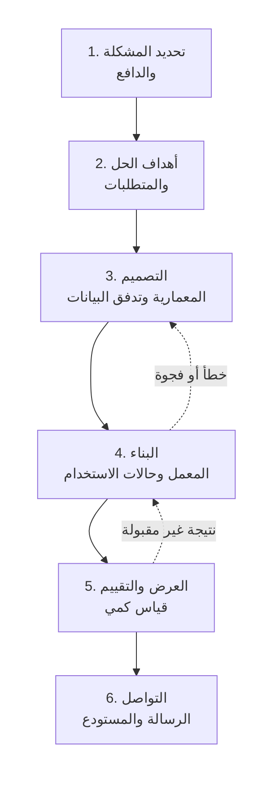
**شكل (3.1): مراحل منهجية علم التصميم التكرارية المتبعة** (من إعداد الباحثين استناداً إلى [2])

**جدول (3.1): مراحل المنهجية ومدخلاتها ومخرجاتها**

| المرحلة | المدخلات | المخرجات | الأدوات |
|---|---|---|---|
| 1. تحديد المشكلة | أدبيات SOC للمؤسسات الصغيرة (الفصل 2) | مشكلة الدراسة وأسئلتها (الفصل 1) | مراجعة أدبيات |
| 2. أهداف الحل | المشكلة، قيود الموارد | 15 متطلباً وظيفياً و8 غير وظيفية (§3.3) | تحليل المتطلبات |
| 3. التصميم | المتطلبات، مقارنة الأدوات (§2.14) | المعمارية، مخططات DFD، حالات الاستخدام، سجل القواعد، تصميم البيانات | Mermaid، جداول |
| 4. البناء | التصميم | معمل افتراضي، 14 حالة استخدام، سكربتات وإعدادات مُتحقَّقة آلياً | Wazuh، Suricata، Python، Bash |
| 5. التقييم | خطة اختبار، سيناريوهات هجوم | جداول نتائج بفواصل ثقة (الفصل 5) | سجل محاولات مستقل، أداة قياس |
| 6. التواصل | كل ما سبق | الرسالة، مستودع Git موثّق | Git، GitHub |

### 3.2.3 ضوابط الجودة المنهجية

- **إسناد كل حقيقة إلى دليل:** كل ادعاء بالكشف يُسند إلى معرّف قاعدة ومستواها وسطر من سجل التنبيهات؛ وما لا دليل عليه يُعلَّم "غير مُتحقَّق".
- **التحقق على المحرك الفعلي لا على الصيغة فقط:** كل قاعدة ومفكّك يُختبر بأداة `wazuh-logtest` على محرك Wazuh حقيقي، إضافة إلى فحص صحة XML. وقد كشف هذا الضابط أخطاء لم يكشفها فحص الصيغة (مثل قاعدة تمنع تشغيل المدير كلياً).
- **سجل معرّفات قواعد موحّد** يمنع التعارض، ويُفحص آلياً قبل كل تعديل (§3.7.5).
- **فصل سجل المحاولات عن سجل التنبيهات** في التقييم، لتجنّب تحيّز قياس ما كُشف فقط (§3.11).
- **إدارة الإصدارات والمراجعة:** كل إعداد وسكربت ووثيقة في مستودع Git، ولا تُدمج التغييرات إلا بعد نجاح الاختبارات الآلية.
- **لا أسرار في المستودع:** مفاتيح API وكلمات المرور خارج Git، مع فحص آلي للأسرار.

## 3.3 تحليل المتطلبات

### 3.3.1 أصحاب المصلحة

**جدول (3.2): أصحاب المصلحة واحتياجاتهم**

| صاحب المصلحة | الحاجة |
|---|---|
| محلل الأمن (SOC Analyst) | رؤية مركزية، تنبيهات دقيقة ومفهومة، أدوات تحقيق، تقليل الإنذارات الكاذبة |
| مسؤول النظام | استجابة آلية لا تُلحق ضرراً، إمكانية التراجع، سهولة النشر |
| إدارة المؤسسة | تكلفة منخفضة، مؤشرات أداء قابلة للقياس |
| المستخدم النهائي | عدم تعطيل العمل أو حظر الأجهزة المشروعة بالخطأ |

### 3.3.2 المتطلبات الوظيفية (Functional Requirements)

**جدول (3.3): المتطلبات الوظيفية**

| # | المتطلب | الأولوية | حالة الاستخدام |
|---|---|:---:|---|
| FR-01 | جمع الأحداث الأمنية من نقاط نهاية Windows وLinux عبر وكيل موحّد | يجب | UC-01 |
| FR-02 | كشف إنشاء الملفات وتعديلها وحذفها في مجلدات حساسة في الوقت الفعلي | يجب | UC-02 |
| FR-03 | إثراء تنبيهات الملفات الجديدة بحكم سمعة خارجي، وحذف الملف آلياً عند ثبوت خبثه **بعد التحقق من بصمته ومساره** | يجب | UC-03 |
| FR-04 | كشف الأنشطة الشبكية المشبوهة (فحص المنافذ، توقيعات الهجمات) | يجب | UC-04 |
| FR-05 | تسجيل الأوامر المنفّذة على Linux وتصنيفها بدرجات خطورة | يجب | UC-05 |
| FR-06 | كشف أنماط استغلال خادم الويب (Shellshock، حقن SQL) من سجلات الوصول | يجب | UC-06، UC-09 |
| FR-07 | فحص الملفات الجديدة محلياً بقواعد برمجيات خبيثة دون اتصال خارجي | يجب | UC-07 |
| FR-08 | كشف العمليات المستمعة المشبوهة (Netcat listener) بصيغها المختلفة | يجب | UC-08 |
| FR-09 | ربط التنبيهات الأمنية بتقنيات MITRE ATT&CK حيث ينطبق ذلك | يجب | كل الحالات |
| FR-10 | عرض التنبيهات في لوحة مركزية مع تصفية وبحث | يجب | Dashboard |
| FR-11 | إشعار المحلل خارج اللوحة (Telegram) عند الخطورة العالية (المستوى ≥ 12) | يجب | UC-10 |
| FR-12 | حظر مصدر هجوم القوة الغاشمة آلياً ومؤقتاً مع استثناء عناوين الإدارة | يجب | UC-11 |
| FR-13 | استقبال سجلات أجهزة الشبكة (راوتر MikroTik) عبر Syslog وكشف: فشل الدخول، القوة الغاشمة، الدخول بعد القوة الغاشمة، التغييرات الأمنية، فحص المنافذ | يجب | UC-12 |
| FR-14 | رصد الأجهزة الجديدة والهواتف التي تنضم إلى الشبكة وتمييز غير المعروف منها | ينبغي | UC-13 |
| FR-15 | شرح التنبيهات بلغة مفهومة، وربطها في حوادث، واقتراح إجراءات من قائمة مسموحة تُنفَّذ بموافقة بشرية | ينبغي | UC-14 |

> **ملاحظة:** المتطلبات FR-01 إلى FR-13 هي النطاق الأساسي، وأُضيف FR-14 وFR-15 عند توسيع النطاق ليشمل رؤية الأجهزة المحمولة والمحلل الذكي؛ وجميعها منفَّذة ومختبرة في المعمل.

### 3.3.3 المتطلبات غير الوظيفية (Non-Functional Requirements)

**جدول (3.4): المتطلبات غير الوظيفية**

| # | المتطلب | المقياس / الهدف | طريقة التحقق |
|---|---|---|---|
| NFR-01 | **التكلفة:** لا تكلفة ترخيص لمكونات المنصة الأساسية | كل المكونات الأساسية مفتوحة المصدر؛ الخدمات الخارجية الاختيارية (VirusTotal، نموذج لغوي سحابي) لها بدائل مجانية أو محلية | مراجعة التراخيص |
| NFR-02 | **زمن الكشف** من وقوع الحدث إلى إنشاء التنبيه على المدير | الوسيط ≤ 10 ث، والمئين 95 ≤ 30 ث للحالات الفورية؛ الحالات الدورية تُضاف إليها دورة الاستطلاع | أداة القياس (§3.11) |
| NFR-03 | **زمن الاستجابة الآلية** من تنبيه المحفّز إلى اكتمال الإجراء | ≤ 30 ث باستثناء زمن VirusTotal الخارجي | تأكيد مستقل (اختفاء الملف / قاعدة الحظر) |
| NFR-04 | **الدقة:** الإنذارات الكاذبة للقواعد المخصصة عالية الخطورة | الحد الأعلى لفاصل ثقة Poisson 95% < 0.5 إنذار/ساعة | 12 ساعة نشاط طبيعي لكل نظام |
| NFR-05 | **الموارد:** يعمل على حاسوب واحد | ذاكرة 16 GB لثلاث آلات افتراضية | مراقبة الاستهلاك |
| NFR-06 | **قابلية التكرار:** إعادة النشر من المستودع دون معرفة ضمنية | سكربت نشر + أدلة تشغيل + اختبارات آلية | إعادة بناء من الصفر |
| NFR-07 | **الأمان الذاتي:** الاستجابة الآلية والذكاء الاصطناعي لا يُحدثان ضرراً | قائمة مسموحة للمسارات والإجراءات، تحقق البصمة، رفض الروابط الرمزية، استثناء الإدارة، موافقة بشرية، سجل تدقيق | اختبارات هجومية على السكربتات نفسها |
| NFR-08 | **قابلية التوسع:** إضافة مصدر جديد دون تغيير المعمارية | "عقد إدخال مصدر": نقل + مفكّك + قواعد في نطاق معرّفات محجوز | إضافة MikroTik دون تعديل النواة |

### 3.3.4 حدود التصميم (Design Constraints)

- بيئة افتراضية معزولة على شبكة `192.168.100.0/24`، ولا اتصال بأنظمة إنتاج.
- الاتصال الخارجي محدود بخدمة VirusTotal (حد المفتاح المجاني: 4 طلبات في الدقيقة و500 في اليوم)، وTelegram، والنموذج اللغوي الاختياري، ومستودعات الحزم.
- لا تُخزَّن مفاتيح API أو كلمات المرور في المستودع.
- كل هجوم محاكى يُنفَّذ بسكربتات تشترط الخيار `--lab` وعناوين شبكات خاصة فقط.

## 3.4 المعمارية العامة للنظام

### 3.4.1 النموذج المرجعي ذو المراحل الست

صُمّمت المنصة حول خط أنابيب واحد يمرّ به كل حدث أمني في ست مراحل. هذا النموذج هو **الإطار الموحّد** الذي تُقرأ عليه كل حالة استخدام، ويُجيب عن السؤال: من أين يأتي الحدث، وكيف يُجمع، وكيف يُكشف، ومن يقرّر، وماذا يُفعل، وأين يُعرض؟

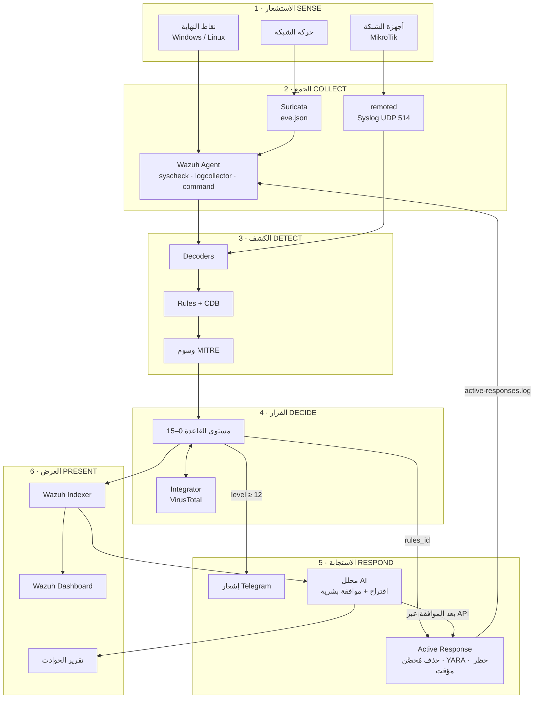
**شكل (3.2): النموذج المرجعي ذو المراحل الست**

### 3.4.2 المساهمات الثلاث فوق Wazuh

للإجابة عن سؤال "ما الذي يضيفه المشروع على Wazuh؟" حُدّدت ثلاث مساهمات قابلة للقياس، إضافة إلى طبقة الذكاء الاصطناعي:

**جدول (3.5): المساهمات الثلاث فوق Wazuh وطريقة إثباتها**

| الرمز | المساهمة | كيف تُثبت |
|---|---|---|
| C1 | **استجابة آلية مُحصَّنة بسياسة:** سكربت حذف يتحقق من نوع الأمر، والقائمة المسموحة للمسارات، ونوع الملف (ملف عادي بارتباط واحد، لا رابط رمزي)، وتطابق البصمة، وثبات هوية الملف أثناء الفحص، ويسجّل نتيجة يفهمها المدير | اختبار العيوب الستة (§2.11) على السكربت المرجعي ونسخة المشروع؛ ومقارنة زمنية (H4، H5) |
| C2 | **بروتوكول تقييم كمّي:** سبعة طوابع زمنية لكل محاولة، وثمانية مقاييس، وفواصل ثقة Wilson وPoisson، واختبار Mann-Whitney | الفصل الخامس |
| C3 | **عقد إدخال مصدر شبكي + رؤية الهواتف:** مفككات وقواعد لـ RouterOS الذي لا يدعمه Wazuh أصلاً، واستقبال Syslog مقيّد بعناوين المصدر، ورصد الأجهزة الجديدة من DHCP | إضافة المصدر دون تعديل نواة المنصة (NFR-08) |
| AI | **محلل أمني ذكي خاضع للإشراف:** شرح، وترابط، واقتراح من قائمة مسموحة، وحارس ضد الاختلاق، وموافقة بشرية، وسجل تدقيق | اختبارات الحارس والمنفّذ، وقياس دقة الشرح |

### 3.4.3 المكونات المنطقية والفيزيائية

**جدول (3.6): المكونات المنطقية والفيزيائية**

| المكوّن | الدور | التقنية | الموقع |
|---|---|---|---|
| Wazuh Manager | استقبال الأحداث، التحليل، القرار، تنسيق الاستجابة | `remoted`، `analysisd`، `integratord`، `execd`، `apid` | wazuh-server |
| Wazuh Indexer | تخزين التنبيهات وفهرستها | مبني على OpenSearch | wazuh-server |
| Wazuh Dashboard | العرض والبحث | مبني على OpenSearch Dashboards، HTTPS | wazuh-server |
| Wazuh Agent (Linux) | FIM، جمع السجلات، الأوامر الدورية، الاستجابة المحلية | wazuh-agent 4.14.7 | kali1 |
| Wazuh Agent (Windows) | FIM، جمع السجلات، الاستجابة المحلية | wazuh-agent 4.14.7 | win1 |
| Suricata | حسّاس شبكي بتوقيعات ET Open | Suricata 8 (af-packet) | kali1 |
| auditd | تسجيل `execve` | Linux Audit | kali1 |
| YARA | فحص الملفات محلياً | YARA 4.5 | kali1 (win1 مُعدّ) |
| Apache | خدمة ويب ضحية ومصدر سجلات | Apache 2.4 | kali1 |
| راوتر MikroTik | بوابة الشبكة، DHCP، جدار ناري، مصدر Syslog | RouterOS v6/v7 | router |
| سكربت الحذف المُحصَّن | AR لحذف الملفات بعد التحقق | Python 3 (`soc_ar.py`) | على الوكلاء |
| تكامل Telegram | إشعارات المستوى ≥ 12 | Python 3 (مكتبة قياسية) | wazuh-server |
| المحلل الذكي | شرح/ترابط/اقتراح + منفّذ بموافقة | Python 3 + نموذج لغوي متوافق مع OpenAI API | wazuh-server أو محطة المحلل |
| VirusTotal API | سمعة الملف | خدمة خارجية | الإنترنت |

### 3.4.4 مبادئ التصميم

1. **وكيل واحد، مصادر متعددة:** يجمّع وكيل Wazuh كل مصادر المضيف (FIM، auditd، Apache، Suricata، قائمة العمليات)، فتقل القنوات إلى المنفذين 1514/1515.
2. **الكشف في المركز والاستجابة في الطرف:** التحليل والقرار على المدير، والتنفيذ (`location=local`) على الوكيل صاحب الحدث فقط.
3. **الحلقة المغلقة:** كل استجابة آلية تكتب نتيجتها في `active-responses.log` الذي يقرؤه الوكيل نفسه، فيولّد المدير تنبيه تأكيد (100092 أو 100093 أو 651). لا إجراء بلا أثر مرئي.
4. **الفصل بين الطبقات:** استبدال مصدر بيانات لا يمسّ القواعد المخصصة أو اللوحة.
5. **الأقل امتيازاً والفشل الآمن:** سكربتات الاستجابة بملكية `root:wazuh` وصلاحية 750؛ وعند أي شك (بصمة مختلفة، مسار خارج القائمة، رابط رمزي) يرفض السكربت ويسجّل الخطأ بدلاً من التنفيذ.
6. **الإنسان في الحلقة للإجراءات غير المؤتمتة:** ما يقترحه الذكاء الاصطناعي لا يُنفَّذ إلا بموافقة صريحة مرتبطة ببصمة الاقتراح.

## 3.5 تصميم طبقات النظام

**جدول (3.7): طبقات النظام ومكوناتها**

| الطبقة | المكونات | العمليات |
|---|---|---|
| **1. مصادر البيانات** | win1، kali1، سجلات Apache، أحداث auditd، قائمة العمليات، حركة الشبكة، راوتر MikroTik | توليد الأحداث الخام |
| **2. الجمع** | Wazuh Agent (`syscheck` في الوقت الفعلي، `logcollector` بصيغ audit/syslog/apache/json، `command` كل 30 ث)؛ Suricata ← `eve.json`؛ `remoted` لاستقبال Syslog على UDP 514 مع `allowed-ips` | التقاط وتغليف وإرسال مشفّر عبر 1514 |
| **3. المعالجة والربط** | `wazuh-analysisd`: المفككات (المدمجة + `yara_decoder` + مفككات MikroTik) ← القواعد (المدمجة + 25 قاعدة مخصصة) ← قوائم CDB (`suspicious-programs`، `known-devices`) ← وسوم ATT&CK | تطبيع، مطابقة، ربط زمني، تقييم المستوى 0–15 |
| **4. القرار** | المستوى ≥ 3 ← تنبيه؛ محفزات FIM ← VirusTotal أو YARA؛ 87105 ← حذف؛ 5712/5763 ← حظر؛ المستوى ≥ 12 ← Telegram | هل يُنبَّه؟ هل يُثرى؟ هل يُستجاب آلياً؟ |
| **5. الاستجابة والتخزين** | الحذف المُحصَّن، فحص YARA، `firewall-drop` بمهلة 300 ث، Telegram، المحلل الذكي؛ نقل التنبيهات إلى Wazuh Indexer | تنفيذ، تسجيل النتيجة، أرشفة |
| **6. الإخراج والعرض** | Wazuh Dashboard (Threat Hunting، FIM، MITRE ATT&CK، Agents)، تقرير الحوادث من المحلل الذكي | بحث، تصفية، لوحات، تقارير |

## 3.6 نمذجة تدفق البيانات (Data Flow Diagrams)

### 3.6.1 الرموز المستخدمة

**جدول (3.8): رموز مخططات تدفق البيانات**

| الرمز | المعنى |
|---|---|
| مستطيل | كيان خارجي (External Entity): مصدر أو مستقبل خارج حدود النظام |
| دائرة | عملية (Process): تحوّل البيانات |
| أسطوانة | مخزن بيانات (Data Store) |
| سهم مُسمّى | تدفق بيانات (Data Flow) |

### 3.6.2 المستوى السياقي (المستوى 0)

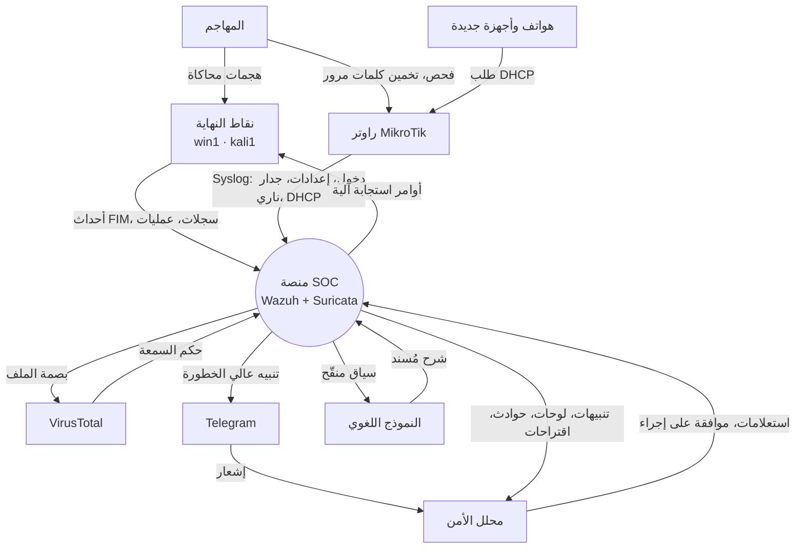
**شكل (3.3): مخطط السياق (DFD المستوى 0)**

**التحليل:** معظم التدفقات ثنائية الاتجاه (نقاط النهاية ترسل أحداثاً وتستقبل أوامر استجابة؛ VirusTotal والنموذج اللغوي يستقبلان مدخلات ويعيدان نتائج)، بينما تدفقات المهاجم أحادية الاتجاه نحو الأهداف. **المهاجم لا يتفاعل مع المنصة مباشرة**، بل تُرصد آثاره عبر نقاط النهاية والراوتر، وهذا جوهر المراقبة السلبية. ويُلاحظ أن البيانات المرسلة إلى النموذج اللغوي **منقّحة** (تُحذف منها كلمات المرور والرموز السرية) قبل مغادرة المنصة.

### 3.6.3 المستوى الأول

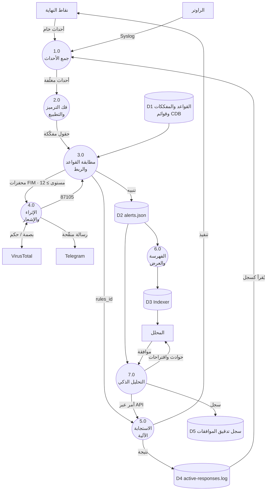
**شكل (3.4): مخطط تدفق البيانات — المستوى الأول**

**الحلقات المغلقة الأربع** (ميزة التصميم):
1. **حلقة الإثراء:** 3.0 ← 4.0 ← VirusTotal ← 4.0 ← 3.0 (قاعدة 87105): قرار مبني على معرفة خارجية.
2. **حلقة الاستجابة:** 3.0 ← 5.0 ← نقطة النهاية ← D4 ← 1.0 ← 2.0 ← 3.0 (100092/100093/651): كل إجراء يولّد تنبيه تأكيد.
3. **حلقة المحلل:** 6.0 ← المحلل ← استعلام ← 6.0.
4. **حلقة الموافقة:** 7.0 ← اقتراح ← المحلل ← موافقة ← 7.0 ← D5 ← 5.0: لا إجراء مقترح بلا موافقة مسجّلة.

### 3.6.4 المستوى الثاني — تفصيل العملية 3.0 (مطابقة القواعد والربط)

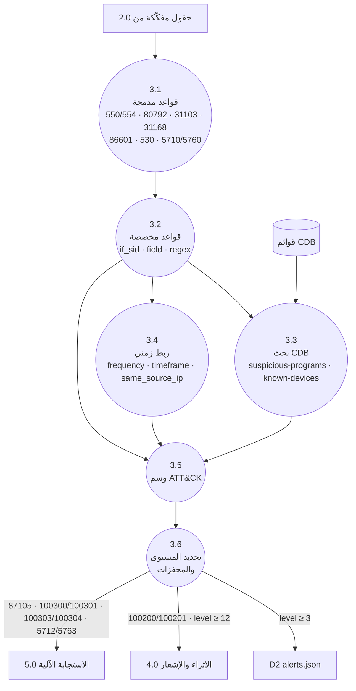
**شكل (3.5): مخطط تدفق البيانات — المستوى الثاني (العملية 3.0)**

وتُمثّل العملية 3.4 (الربط الزمني) قلب كشف الهجمات المتكررة: فمثلاً القاعدة 100402 تُطلق عند خمس محاولات دخول فاشلة إلى الراوتر من العنوان نفسه خلال 120 ثانية، والقاعدة 100404 تُطلق عند دخول ناجح من العنوان نفسه بعد 100402، أي أن الربط يحوّل أحداثاً منخفضة الخطورة منفردةً إلى مؤشر اختراق عالي الخطورة.

## 3.7 تصميم حالات الاستخدام (Use-Case Design)

### 3.7.1 الفاعلون ومخطط حالات الاستخدام

حُدّد خمسة فاعلين: **المهاجم** (مصدر الحدث الخبيث)، و**محلل الأمن** (المستخدم الرئيس للمنصة)، و**مسؤول النظام** (النشر والإعداد)، إضافة إلى فاعلَين خارجيين هما **خدمة VirusTotal** و**خدمة Telegram**، والنموذج اللغوي الاختياري. ويجمع الشكل (3.6) حالات الاستخدام الأربع عشرة داخل حدود النظام.

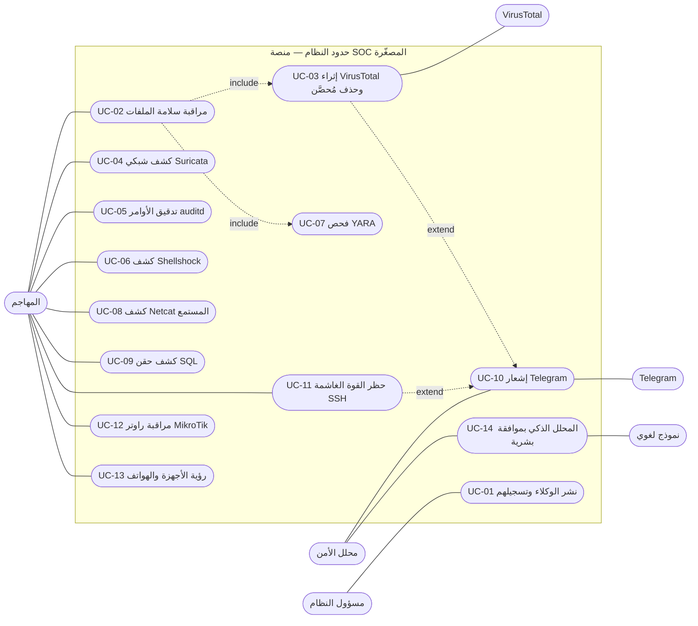
**شكل (3.6): مخطط حالات الاستخدام**

> يستعمل المخطط علاقة **include** حين تكون الحالة جزءاً إلزامياً من أخرى (كل إثراء VirusTotal وفحص YARA يبدأ بحدث FIM)، وعلاقة **extend** حين تُضيف الحالة سلوكاً مشروطاً (يُرسَل إشعار Telegram فقط عندما يبلغ التنبيه المستوى 12 أو أكثر).

### 3.7.2 مصفوفة حالات الاستخدام على المراحل الست

يوضح الجدول (3.9) كيف تمرّ كل حالة استخدام بالمراحل الست للنموذج المرجعي (§3.4.1)، وما القاعدة التي تمثّل "الكشف" فيها، وما الذي يُعدّ استجابة. وبهذا تُقرأ كل الحالات بإطار واحد، ويُعرف موضع أي خلل عند التقييم.

**جدول (3.9): مصفوفة حالات الاستخدام على المراحل الست**

| الحالة | SENSE (المصدر) | COLLECT (الجمع) | DETECT (القاعدة) | DECIDE (القرار) | RESPOND (الاستجابة) | ATT&CK |
|---|---|---|---|---|---|---|
| UC-01 | خدمة الوكيل | 1515 تسجيل، 1514 أحداث | 501/502/503 (مدمجة) | — | — | — |
| UC-02 | نظام الملفات | syscheck (realtime) | 550/553/554 + 100200/100201 | المستوى 7 | تنبيه | — |
| UC-03 | ملف جديد في مجلد مراقَب | syscheck ← integratord | 100200/100201 ← 87105 | إيجابي VirusTotal | `remove-threat` ← 100092/100093 | T1204 |
| UC-04 | حركة الشبكة | Suricata eve.json ← logcollector | 86601 (+ التوقيعات) | المستوى حسب شدة التوقيع | تنبيه | T1046 |
| UC-05 | `execve` | auditd ← logcollector | 80792 ← 100210 (CDB) | المستوى 12 | تنبيه + Telegram | T1059 |
| UC-06 | طلب HTTP | Apache access.log | 31168 | المستوى 15 | تنبيه + Telegram | T1190 |
| UC-07 | ملف جديد | syscheck | 100300/100301، 100303/100304 ← 108001 | تطابق YARA | `yara` AR ← 108001 | T1204.002 |
| UC-08 | قائمة العمليات | `command` كل 30 ث | 530 ← 100050 ← 100051 | المستوى 7 | تنبيه | T1571 |
| UC-09 | طلب HTTP | Apache access.log | 31103/31106 | المستوى 7 وأكثر | تنبيه | T1190 |
| UC-10 | أي تنبيه | integratord | المستوى ≥ 12 | عتبة المستوى | رسالة Telegram | — |
| UC-11 | sshd | auth.log / journald | 5710/5760 ← 5712/5763 | عتبة التكرار | `firewall-drop` 300 ث ← 651/652 | T1110 |
| UC-12 | RouterOS | Syslog UDP 514 | 100401–100406، 100410/100411 | الربط الزمني | تنبيه + Telegram | T1110، T1078، T1046، T1686 |
| UC-13 | خادم DHCP في الراوتر | Syslog UDP 514 | 100420 ← 100422 ← 100421 (CDB) | عدم الوجود في `known-devices` | تنبيه | T1200 |
| UC-14 | ملف التنبيهات | قراءة `alerts.json` | ترابط الحوادث (خارج Wazuh) | اقتراح من قائمة مسموحة | موافقة بشرية ← API ← سجل تدقيق | حسب الحادثة |

> **ملاحظة حول ATT&CK:** في الإصدار 19 من الإطار أُلغيت التقنيتان الفرعيتان T1562.001 وT1562.004 وحلّت محلهما T1685 وT1686؛ وتحتفظ القواعد بالمعرّف القديم لأنه ما يتعرّف عليه Wazuh 4.14، ويعرض المحلل الذكي المعرّف الجديد بجانبه.

### 3.7.3 تسلسل الاستجابة الآلية المُحصَّنة (UC-03)

تُعدّ UC-03 أعقد حالات الاستخدام لأنها تمرّ بخدمة خارجية وتنتهي بفعل مدمِّر (حذف ملف). يبين الشكل (3.7) التسلسل الكامل مع نقاط التحقق التي تُضيفها المساهمة C1، والحلقة المغلقة التي تنتج تنبيه التأكيد.

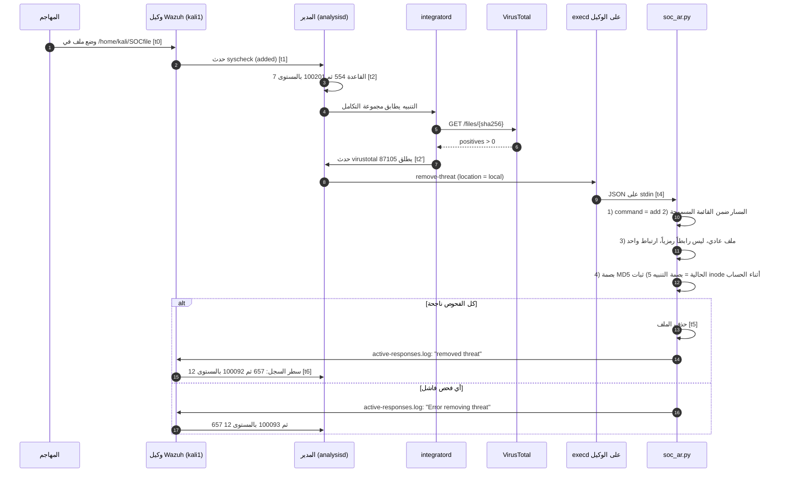
**شكل (3.7): تسلسل الاستجابة الآلية — VirusTotal مع الحذف المُحصَّن (UC-03)**

الفرق الجوهري عن السكربت المرجعي أن الحذف لا يتم إلا بعد اجتياز خمسة فحوص (الخطوات 11–12)، وأن الفشل يُنتج تنبيهاً بالمستوى نفسه (100093) بدلاً من الصمت، فلا توجد استجابة بلا أثر يراه المحلل.

### 3.7.4 تسلسل حظر هجوم القوة الغاشمة (UC-11)

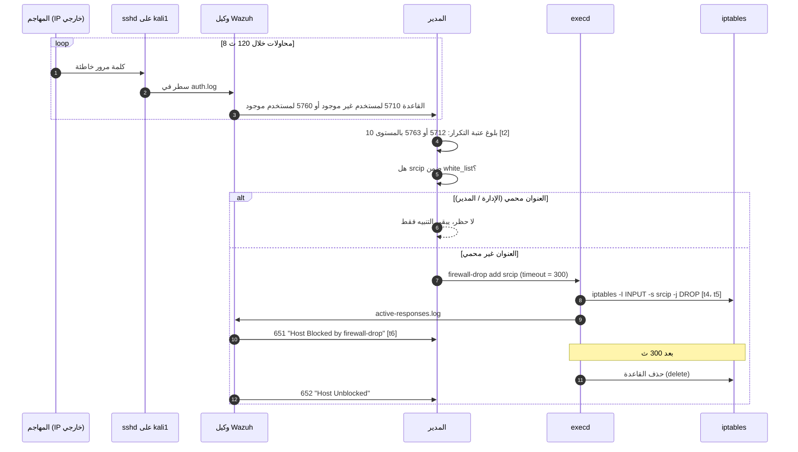
**شكل (3.8): تسلسل حظر هجوم القوة الغاشمة (UC-11)**

قرار التصميم الذي أثبته الاختبار على المحرك الفعلي أن ربط الاستجابة بالقاعدة 5763 وحدها (كما في الخطة الأولى) لا يحظر أداة القوة الغاشمة النموذجية التي تجرّب أسماء مستخدمين غير موجودة، لأنها تُطلق 5712 لا 5763؛ لذلك رُبطت الاستجابة بالقاعدتين معاً. ويضمن الحظر المؤقت (300 ث) وقائمة الاستثناء عدم حبس المسؤول خارج النظام.

### 3.7.5 تسلسل المحلل الذكي بموافقة بشرية (UC-14)

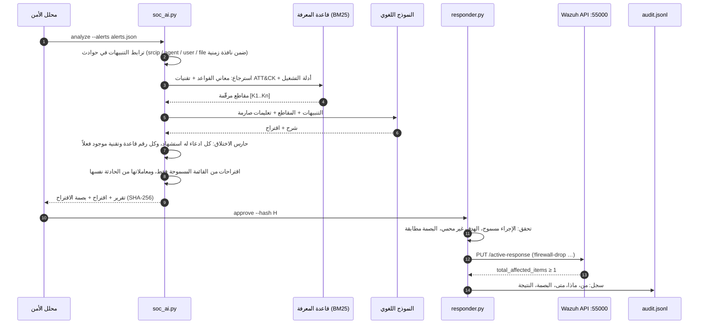
**شكل (3.9): تسلسل المحلل بالذكاء الاصطناعي بموافقة بشرية (UC-14)**

يُطبّق التصميم ثلاث طبقات دفاع أمام أخطاء النموذج اللغوي: (1) **الاسترجاع** يحصر معرفة النموذج في مصادر موثّقة محلياً، (2) **الحارس** يرفض أي مخرج يذكر قاعدة أو تقنية غير موجودة أو ادعاءً بلا استشهاد، ويعود إلى تحليل حتمي بلا نموذج، (3) **المنفّذ** لا يقبل إلا إجراءً من قائمة مسموحة من خمسة إجراءات (`block_ip`، `quarantine_file`، `disable_account`، `notify`، `monitor`) بموافقة مرتبطة ببصمة الاقتراح، فلا يمكن تنفيذ اقتراح عُدّل بعد الموافقة. ويعمل المكوّن دون اتصال (`SOC_AI_OFFLINE=1`) بتحليل قائم على القواعد عند غياب النموذج.

### 3.7.6 سجل معرّفات القواعد المخصصة

اعتُمد نطاق المعرّفات `100000–109999` المخصّص لقواعد المستخدم في Wazuh [3]، وقُسّم إلى نطاقات فرعية لكل وظيفة لمنع التعارض. ويُفحص عدم التكرار وصحة الإحالات آلياً بسكربت `check_rule_ids.py` قبل كل دمج.

**جدول (3.10): سجل معرّفات القواعد المخصصة (25 قاعدة)**

| النطاق | الوظيفة | المعرّف | المستوى | القاعدة الأم | الوصف المختصر | ATT&CK |
|---|---|---|:---:|---|---|---|
| 100050–100059 | مراقبة العمليات | 100050 | 0 | 530 | تجميع مخرجات قائمة العمليات | — |
| | | 100051 | 7 | 100050 | Netcat يستمع لاتصالات واردة (`-l`، `-lvp`، `-lnvp`…) | T1571 |
| 100090–100099 | نتائج الاستجابة الآلية | 100092 | 12 | 657 | تم حذف التهديد بنجاح | — |
| | | 100093 | 12 | 657 | فشل حذف التهديد (رفض أحد الفحوص) | — |
| 100200–100209 | محفّزات FIM ← VirusTotal | 100200 | 7 | 550 | تعديل ملف في `SOCfile` | — |
| | | 100201 | 7 | 554 | إضافة ملف في `SOCfile` | — |
| 100210–100219 | تدقيق الأوامر | 100210 | 12 | 80792 | أمر عالي الخطورة من قائمة CDB `suspicious-programs` | T1059 |
| 100300–100309 | محفّزات FIM ← YARA | 100300 / 100301 | 7 | 550 / 554 | تعديل / إضافة في مجلد YARA على Linux | — |
| | | 100303 / 100304 | 7 | 550 / 554 | تعديل / إضافة في `Downloads` على Windows | — |
| 100400–100409 | راوتر MikroTik | 100400 | 0 | مفكّك `mikrotik` | تجميع رسائل RouterOS | — |
| | | 100401 | 5 | 100400 | فشل دخول إلى إدارة الراوتر | T1110 |
| | | 100402 | 10 | 100401 (5 مرات / 120 ث) | قوة غاشمة على الراوتر من المصدر نفسه | T1110.001 |
| | | 100403 | 3 | 100400 | دخول ناجح إلى الراوتر | — |
| | | 100404 | 12 | 100403 بعد 100402 | دخول ناجح بعد قوة غاشمة (اختراق محتمل) | T1078 |
| | | 100405 | 8 | 100400 | تغيير إعداد (إضافة / حذف / تعديل) | T1562.004 (T1686) |
| | | 100406 | 12 | 100405 | تغيير أمني: مستخدم، قاعدة جدار ناري، NAT، خدمة | T1562.004، T1136 |
| 100410–100419 | سجل الجدار الناري | 100410 | 4 | 100400 | اتصال مسجّل في جدار الراوتر | — |
| | | 100411 | 10 | 100410 (15 منفذاً / 60 ث) | فحص منافذ عند الراوتر | T1046 |
| 100420–100429 | رؤية الأجهزة (DHCP) | 100420 | 3 | 100400 | منح عنوان DHCP لجهاز | — |
| | | 100422 | 8 | 100420 + CDB | جهاز غير معروف انضم إلى الشبكة | T1200 |
| | | 100421 | 9 | 100422 | جهاز غير معروف بعنوان MAC عشوائي (هاتف غالباً) | T1200 |
| 100500–100599 | **محجوز** | — | — | — | الإشعارات والتقارير مستقبلاً | — |
| 108000–108009 | نتائج YARA | 108000 | 0 | مفكّك `yara_decoder` | تجميع نتائج YARA | — |
| | | 108001 | 12 | 108000 | تطابق إيجابي مع قاعدة YARA | T1204.002 |

> رقم القاعدة 100421 أكبر من 100422 مع أنها ابنتها؛ وهذا مقصود، إذ يقيّم Wazuh القواعد بحسب علاقة الأب والابن لا بترتيب الأرقام، واحتُفظ بالرقم لثبات الإحالات في الوثائق والاختبارات.

## 3.8 تصميم البيانات (Data Design)

لا تستخدم المنصة قاعدة بيانات علائقية مركزية واحدة؛ فبيانات Wazuh تُخزَّن في ملفات JSON متتابعة وفي فهارس OpenSearch، وقوائم CDB ملفات مفتاح/قيمة مترجمة، وسجلات التقييم والتدقيق ملفات JSON Lines قابلة للإضافة فقط. ومع ذلك صُمّم **نموذج بيانات منطقي موحّد** يربط هذه المخازن بعلاقات صريحة، لأن صحة التقييم (ربط كل محاولة بتنبيهها) وصحة الاستجابة (ربط كل إجراء بتنبيهه وموافقته) تعتمدان على هذه العلاقات. واعتُمد نموذج الكيانات والعلاقات [4] للتعبير عنه.

### 3.8.1 مخازن البيانات الفعلية

**جدول (3.11): مخازن البيانات الفعلية**

| المخزن | المسار / الموقع | الصيغة | الكتابة | الاحتفاظ |
|---|---|---|---|---|
| D1 أحداث الوكلاء | `/var/ossec/queue` | ثنائية داخلية | remoted | عابر |
| D2 التنبيهات | `/var/ossec/logs/alerts/alerts.json` + فهرس `wazuh-alerts-*` | JSON سطر لكل تنبيه | analysisd، Filebeat | تدوير يومي |
| D3 قوائم CDB | `/var/ossec/etc/lists/{suspicious-programs,known-devices,audit-keys}` | نص `مفتاح:قيمة` يُترجم إلى `.cdb` | المسؤول | دائم (Git) |
| D4 سجل الاستجابة | `/var/ossec/logs/active-responses.log` على كل وكيل | نص بسطر لكل إجراء | سكربتات AR | تدوير |
| D5 التقييم والتدقيق | `attempts.jsonl`، `manifest.json`، `ai_agent/audit.jsonl` | JSON Lines، إضافة فقط | أداة القياس، المنفّذ | دائم |

### 3.8.2 مخطط الكيانات والعلاقات

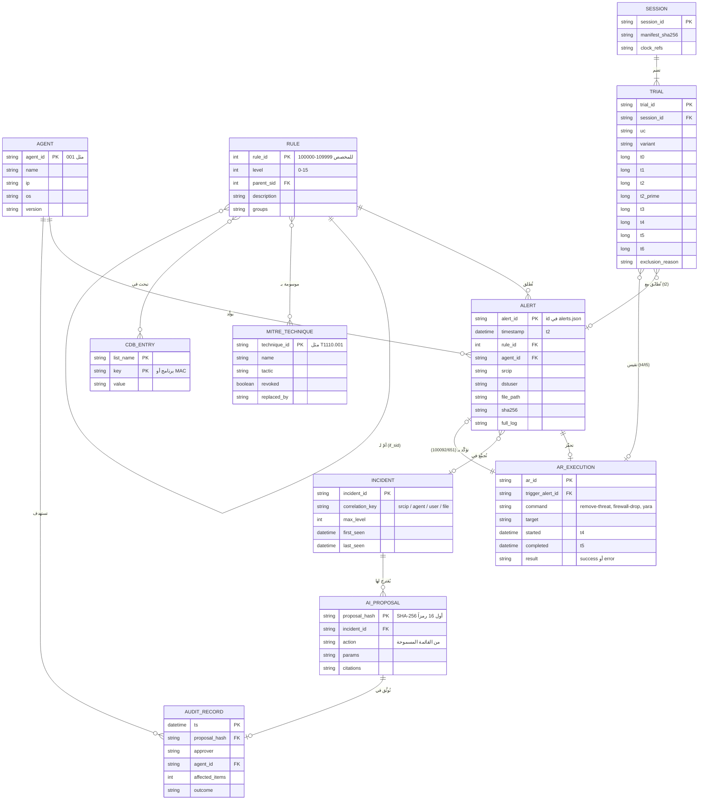
**شكل (3.10): مخطط الكيانات والعلاقات لمخازن البيانات**

أهم قرارات التصميم في هذا النموذج:

1. **العلاقة الذاتية للقواعد** (`parent_sid`) تمثّل شجرة `if_sid`، وهي التي تجعل قاعدة مخصصة واحدة (مثل 100201) تعيد استخدام كل منطق القاعدة المدمجة (554) دون نسخه.
2. **علاقة الحلقة المغلقة** بين `ALERT` و`AR_EXECUTION` في الاتجاهين: التنبيه يحفّز الإجراء، والإجراء يُنتج تنبيه تأكيد؛ فيمكن الاستعلام عن كل إجراء لم يُؤكَّد.
3. **فصل `TRIAL` عن `ALERT`**: المحاولة تُسجَّل قبل الهجمة ومستقلة عن النظام المُقاس، وتُطابَق مع التنبيه لاحقاً عبر مفتاح الهدف (`target_key`)؛ فالمحاولة التي لم يصدر لها تنبيه تبقى في المقام وتُحسب كإخفاق كشف.
4. **ربط الاقتراح بالبصمة**: مفتاح `AI_PROPOSAL` هو بصمته، فأي تعديل على الإجراء أو معاملاته يُنتج مفتاحاً آخر لا تنطبق عليه الموافقة.

### 3.8.3 قاموس بيانات سجل المحاولات

سجل المحاولات هو "الحقيقة المرجعية" (Ground Truth) للتقييم في الفصل الخامس؛ لذلك حُدّد عقده بدقة. تُسجَّل كل الأزمنة بالمللي ثانية منذ 1970 بتوقيت UTC بعد تصحيح انحراف الساعة.

**جدول (3.12): قاموس بيانات سجل المحاولات (`attempts.jsonl`)**

| الحقل | النوع | إلزامي | الوصف والقيود |
|---|---|:---:|---|
| `schema_version` | عدد صحيح | نعم | إصدار العقد، حالياً 2 |
| `session_id` | نص | نعم | جلسة قياس واحدة بساعات متزامنة؛ يربط بملف `manifest.json` |
| `run_id` | نص | نعم | مجموعة محاولات متجانسة (نفس الإعداد والإصدار) |
| `trial_id` | نص | نعم | معرّف فريد للمحاولة داخل التشغيل |
| `uc` | نص | نعم | حالة الاستخدام `UC-01`…`UC-14` |
| `variant` | نص | نعم | صيغة الهجمة (مثل `create`، `modify`، `invalid_user`) |
| `phase` | تعداد | نعم | `PILOT` (تجريبية)، `MEASURED` (قياس)، `BASELINE` (نشاط طبيعي لحساب الإنذارات الكاذبة)، `SUPPRESSION_CONTROL` (ضبط) |
| `t0` | عدد صحيح أو null | نعم | لحظة إطلاق الهجمة، يكتبها المشغّل قبل التنفيذ |
| `t1` | عدد صحيح أو null | نعم | طابع الحدث في سجل المصدر (auditd، eve.json، access.log، syscheck) |
| `t2` | عدد صحيح أو null | نعم | طابع التنبيه المتوقع في `alerts.json` |
| `t2_prime` | عدد صحيح أو null | UC-03 | طابع تنبيه VirusTotal (87105) |
| `t3` | عدد صحيح أو null | نعم | أول ظهور في الفهرس (استطلاع كل 1000 ms) |
| `t4` | عدد صحيح أو null | عند AR | بدء الإجراء على الوكيل |
| `t5` | عدد صحيح أو null | عند AR | اكتمال الإجراء بمراقب مستقل (اختفاء الملف، قاعدة DROP) |
| `t6` | عدد صحيح أو null | عند AR | طابع تنبيه التأكيد (100092، 651) |
| `missing_reasons` | كائن | عند null | سبب غياب كل زمن مفقود؛ لا يُستبدل المفقود بصفر |
| `stage_selectors` | كائن | نعم | لكل مرحلة: معرّفات القواعد والمستويات ومفتاح الهدف المقبولة |
| `target_key` | كائن | نعم | ما يربط المحاولة بتنبيهها تحديداً (مسار الملف، srcip، flow_id…) |
| `ntp_offset_ms` | كائن | نعم | انحراف كل جهاز (مهاجم، وكيل، مدير، مراقب) عن UTC |
| `uncertainty_ms` | عدد صحيح | نعم | حد عدم اليقين؛ أكثر من 100 ms يجعل الأزمنة غير مُتحقَّقة |
| `precision_ms` | عدد صحيح | نعم | دقة المصدر الأصلية (بعض السجلات بدقة ثانية) |
| `completion_kind` | نص | عند t5 | يجب أن يكون `independent_observation` لا نجاح السكربت |
| `exclusion_reason` | تعداد أو null | نعم | `BLOCKED` أو `INVALID` أو `INTERFERED` أو `AMBIGUOUS`؛ المستبعد يُعدّ ويُعلَن |
| `evidence_ref` | نص | نعم | مرجع الدليل الخام (سطر السجل أو لقطة) |

وتُحفظ بصمات SHA-256 لكل ملفات الإدخال والسكربتات في `manifest.json`، فيمكن لأي مراجع إعادة حساب المقاييس من البيانات الخام بالأداة `mttd.py` والتحقق من عدم تعديلها.

## 3.9 التصميم الأمني للمنصة نفسها

منصة الأمن هدف مغرٍ للمهاجم؛ لذلك صُمّمت ضوابط تحمي المنصة ذاتها، وتمنع أن تتحول الاستجابة الآلية أو الذكاء الاصطناعي إلى أداة ضرر.

**جدول (3.13): التهديدات الموجهة إلى المنصة وضوابطها**

| التهديد | الضابط التصميمي | موضعه |
|---|---|---|
| تنبيه مزوَّر يدفع الاستجابة لحذف ملف نظام | القائمة المسموحة للمسارات + تطابق بصمة MD5 التي فحصها VirusTotal + رفض الروابط الرمزية والملفات متعددة الارتباط + ثبات inode | `soc_ar.py` (C1) |
| استبدال الملف بين الفحص والحذف (TOCTOU) | فتح المجلدات والملف بـ `O_NOFOLLOW`، ومقارنة هوية الملف (`st_dev`، `st_ino`، الحجم، أزمنة التعديل) قبل الحساب وبعده، والحذف نسبةً إلى واصف المجلد الأب | `soc_ar.py` |
| حظر عنوان الإدارة أو المدير بهجمة منتحلة | `white_list` في المدير + شبكات محمية في المنفّذ الذكي | `ossec.conf`، `responder.py` |
| إغراق المدير بسجلات Syslog مزيفة | `allowed-ips` يقبل عنوان الراوتر فقط | `70-remote-syslog-network-devices.xml` |
| تنفيذ أمر عشوائي عبر النموذج اللغوي (Prompt Injection في حقل سجل) | قائمة إجراءات مسموحة، معاملات بصيغ صارمة، لا صدفة (shell)، التنفيذ عبر API فقط | `analyst.py`، `responder.py` |
| اختلاق النموذج لقواعد أو تقنيات | حارس الاستشهاد والتحقق من المعرّفات، والعودة للتحليل الحتمي | `analyst.py` |
| تسرّب مفاتيح API وكلمات المرور | متغيرات بيئة وملفات خارج Git، وفحص أسرار آلي | `validate_all.sh` |
| التلاعب بسكربتات الاستجابة | ملكية `root:wazuh` وصلاحية 750 | سكربت النشر |
| التنصت على قناة الوكيل | تسجيل بـ TLS (1515) وأحداث مشفرة AES (1514) | Wazuh |
| الإنكار (من وافق على ماذا؟) | سجل تدقيق JSONL بإضافة فقط، يتضمن الموافق والبصمة ونتيجة API | `audit.jsonl` |

ويُطبّق كل ما سبق مبدأ **الفشل الآمن**: عند أي شك تُرفض العملية ويُولَّد تنبيه، ولا يُنفَّذ الإجراء.

## 3.10 تصميم بيئة المعمل

### 3.10.1 الطوبولوجيا

صُمّم المعمل ليحاكي شبكة مؤسسة صغيرة: راوتر MikroTik بوابةً وخادمَ DHCP، وخلفه خادم SOC ونقطتا نهاية وهواتف المستخدمين. وتقع الشبكة المُقاسة `192.168.100.0/24` داخل بيئة افتراضية معزولة، وتستخدم شبكة الراوتر `192.168.88.0/24` لحالتَي UC-12 وUC-13.

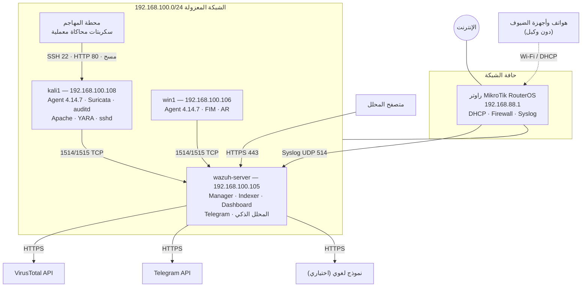
**شكل (3.11): طوبولوجيا المعمل الافتراضي**

### 3.10.2 جدول الأصول

**جدول (3.14): جدول الأصول**

| الأصل | الاسم | العنوان | نظام التشغيل | البرمجيات | الدور |
|---|---|---|---|---|---|
| خادم SOC | `wazuh-server` | 192.168.100.105 | Wazuh OVA 4.14 (Amazon Linux 2023) | wazuh-manager، indexer، dashboard، filebeat، Python 3 | نواة المنصة، التكاملات، المحلل الذكي |
| نقطة نهاية Linux | `kali1` | 192.168.100.108 | Kali GNU/Linux 2025.4 | wazuh-agent 4.14.7، Suricata 8، auditd، Apache 2.4، YARA 4.5، sshd | مراقَب، حسّاس شبكي، ضحية ويب وSSH |
| نقطة نهاية Windows | `win1` | 192.168.100.106 | Windows 10 Education | wazuh-agent 4.14.7، Python 3 (سكربتات AR مجمّعة) | مراقَب |
| الراوتر | `router` | 192.168.88.1 | MikroTik RouterOS v6/v7 (أو محاكٍ بصيغته) | DHCP، Firewall، Syslog | بوابة ومصدر سجلات شبكية |
| المهاجم | `attacker` | عنوان خاص في المعمل | Linux | Bash، Python، nmap، curl، ssh | تنفيذ سيناريوهات الهجوم المحاكاة |
| الهواتف | — | DHCP من 192.168.88.0/24 | Android / iOS | — | أجهزة غير مُدارة تُرصد من الشبكة |

**مبررات التصميم:**

- **خادم متكامل واحد (All-in-one):** يناسب حجم المؤسسة الصغيرة ويبسّط النشر، ويمكن فصل المكونات لاحقاً دون تغيير الوكلاء.
- **Suricata على نقطة النهاية:** خيار عملي للمعمل؛ وفي النشر الحقيقي يُوضع على منفذ مرآة (SPAN) أو على البوابة.
- **الهواتف دون وكيل:** لا يوجد وكيل Wazuh رسمي للهواتف، ولا يمكن فرضه على أجهزة الضيوف؛ لذا تُرصد من سجلات DHCP في الراوتر (UC-13)، وهذا حد معلن للنطاق.
- **بيئة التحقق:** نُفّذ التحقق الآلي على مدير ووكيل Wazuh 4.14.7 حقيقيين في بيئة اختبار، وحُقنت سجلات الراوتر والهواتف بمحاكٍ يلتزم صيغة RouterOS الموثّقة.

### 3.10.3 المنافذ والبروتوكولات

**جدول (3.15): المنافذ والبروتوكولات**

| المنفذ | البروتوكول | الاتجاه | الغرض | الحماية |
|---|---|---|---|---|
| 1514 | TCP | الوكيل ← المدير | نقل الأحداث | تشفير AES بمفتاح لكل وكيل |
| 1515 | TCP | الوكيل ← المدير | تسجيل الوكيل | TLS |
| 514 | UDP | الراوتر ← المدير | Syslog أجهزة الشبكة | `allowed-ips` للراوتر فقط |
| 55000 | TCP | Dashboard والمنفّذ الذكي ← المدير | Wazuh API | HTTPS + JWT |
| 9200 | TCP | Filebeat ← Indexer | فهرسة التنبيهات (داخلي) | TLS |
| 443 | TCP | المحلل ← Dashboard | واجهة الويب | HTTPS + تسجيل دخول |
| 443 | TCP | المدير ← الإنترنت | VirusTotal، Telegram، النموذج اللغوي | HTTPS، مفاتيح خارج Git |
| 22 | TCP | المهاجم ← kali1 | هدف UC-11 | مراقَب بـ Wazuh |
| 80 | TCP | المهاجم ← kali1 | Apache هدف UC-06 وUC-09 | مراقَب بـ Wazuh |

## 3.11 منهجية التقييم

### 3.11.1 وحدة التجربة ونموذج الزمن

وحدة التجربة هي **المحاولة الواحدة**: تنفيذ سيناريو هجوم واحد لحالة استخدام محددة على نظام تشغيل محدد، يُسجَّل مسبقاً في سجل المحاولات المستقل (§3.8.3) قبل إطلاقه. ولكل محاولة تُلتقط حتى سبعة طوابع زمنية بدقة المللي ثانية من ساعات متزامنة (chrony على Linux وw32tm على Windows)، ويُسجَّل انحراف كل ساعة، وتُرفض الجلسة إذا تجاوز عدم اليقين 100 ms.

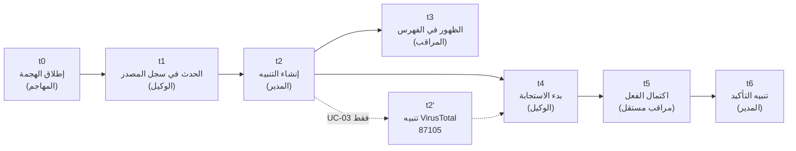
**شكل (3.12): خط الزمن لقياس المحاولة الواحدة (t0–t6)**

### 3.11.2 المقاييس المشتقة

**جدول (3.16): المقاييس المشتقة**

| المقياس | الصيغة | ما يقيسه | ملاحظة |
|---|---|---|---|
| D_source | t1 − t0 | تأخر المصدر (auditd، Suricata…) في تسجيل الحدث | خارج سيطرة المنصة |
| MTTD | t2 − t1 | زمن خط الوكيل ← المدير ← محرك التحليل | المقياس الأساسي للفرضية H2 |
| MTTD_e2e | t2 − t0 | من الهجمة إلى التنبيه كما يراه المحلل | يشمل تأخر المصدر ودورات الاستطلاع |
| L_vis | t3 − t2 | زمن الظهور في اللوحة | دقته ±1 ث بسبب الاستطلاع |
| L_AR_trigger | t4 − t2 | من التنبيه إلى بدء الاستجابة على الوكيل | — |
| L_AR_complete | t5 − t4 | زمن تنفيذ الاستجابة نفسها | يقيس كلفة التحصين (H4) |
| L_AR_e2e | t5 − t0 | من الهجمة إلى اكتمال الدفاع | الرقم الأهم تشغيلياً |
| L_confirm | t6 − t5 | تأخر تنبيه التأكيد | ليس زمن الاستجابة |
| D_VT | t2′ − t2 | زمن استعلام VirusTotal الخارجي (UC-03) | يُبلَّغ منفصلاً لأنه يعتمد على الإنترنت |
| DR | k / n | معدل الكشف: المحاولات التي صدر لها التنبيه المتوقع تحديداً ÷ كل المحاولات الصالحة | بفاصل ثقة Wilson 95% |
| FP/h | k / T | الإنذارات الكاذبة للقواعد المخصصة في الساعة أثناء النشاط الطبيعي | بحد Poisson الأعلى 95% |

### 3.11.3 الأساليب الإحصائية

- **الأزمنة:** يُبلَّغ الوسيط والمدى الربيعي (IQR) والمئين 95 والحدّان الأدنى والأعلى، إضافة إلى المتوسط والانحراف المعياري للمقارنة مع الأدبيات؛ لأن توزيع الأزمنة غالباً غير طبيعي بذيل أيمن ناتج عن دورات الاستطلاع.
- **معدل الكشف:** فاصل ثقة **Wilson** 95% [5]، لأن فاصل Wald ينهار عند نسب قريبة من 100%. فعند n = 30 ونجاح 29 محاولة يكون الفاصل [0.833، 0.994].
- **الإنذارات الكاذبة:** حد **Poisson** الأعلى الدقيق 95% [6]؛ فعند صفر إنذار خلال T ساعة يكون الحد −ln(0.05)/T ≈ 3/T، وعند 12 ساعة وإنذار واحد يكون الحد نحو 0.39 إنذار/ساعة.
- **كلفة التحصين:** اختبار **Mann-Whitney U** أحادي الجانب عند α = 0.05 [7] لمقارنة زمن الاستجابة للسكربت المُحصَّن بالمرجعي، لأنه لا يفترض توزيعاً طبيعياً.
- **حجم العينة:** تجربة تجريبية (PILOT) بخمس محاولات لتقدير الانحراف المعياري، ثم n = ⌈(1.96·σ̂ / E)²⌉ بخطأ مسموح E = 1 ث، **وبحد أدنى 30 محاولة** لكل حالة استخدام ونظام تشغيل، و12 ساعة نشاط طبيعي لكل نظام لقياس الإنذارات الكاذبة.
- **الاستبعاد:** لا تُستبعد محاولة إلا لسبب مُعرَّف مسبقاً (`BLOCKED`، `INVALID`، `INTERFERED`، `AMBIGUOUS`)، وتُعلَن المستبعدات وتُعرض النسبتان: على كل المحاولات، وعلى الصالحة فقط.

### 3.11.4 الفرضيات ومعايير القبول

**جدول (3.17): الفرضيات ومعايير القبول**

| الفرضية | النص | المقياس | معيار القبول | العينة | الاختبار |
|---|---|---|---|---|---|
| H1 | كل حالة استخدام تُكشف بمعدل لا يقل عن 90% | DR | الحد الأدنى لفاصل Wilson ≥ 0.80 | 30 لكل حالة ونظام | Wilson 95% |
| H2 | زمن الكشف قصير بما يكفي للاستجابة الفورية | MTTD | الوسيط ≤ 10 ث والمئين 95 ≤ 30 ث | 30 أو أكثر وفق PILOT | الوسيط، IQR، P95 |
| H3 | القواعد المخصصة عالية الخطورة نادرة الإنذار الكاذب | FP/h | حد Poisson الأعلى 95% < 0.5 | 12 ساعة لكل نظام | Poisson الدقيق |
| H4 | تحصين الاستجابة (C1) لا يضيف تأخيراً مؤثراً | Δ الوسيط لـ L_AR_complete | ≤ 1 ث | 30 + 30 | Mann-Whitney U أحادي |
| H5 | السكربت المرجعي يفشل في سيناريوهات الإساءة V1–V6 والمُحصَّن ينجح | نجاح / فشل | المُحصَّن يرفض 6/6 والمرجعي ينفّذ الإساءة | 6 × 2 | جدول حتمي |
| H6 | إضافة مصدر شبكي لا تتطلب تعديل نواة Wazuh | عدد ملفات النواة المعدّلة | = 0 | إضافة واحدة (MikroTik) | `git diff --stat` |

وتقابل سيناريوهات الإساءة V1–V6 عيوب السكربت المرجعي الستة الموثّقة في §2.11: (V1) رسالة بأمر غير `add`، (V2) مسار يحتوي فراغات، (V3) ملف استُبدل بعد فحصه فاختلفت بصمته، (V4) مسار خارج المجلدات المراقبة، (V5) رابط رمزي أو مسار بـ `../`، (V6) فشل لا يترك نتيجة موثوقة في السجل.

### 3.11.5 ضوابط التجربة وتهديدات الصلاحية

**جدول (3.18): ضوابط التجربة وتهديدات الصلاحية**

| النوع | التهديد | الضابط |
|---|---|---|
| داخلية | ساعات غير متزامنة تشوّه الأزمنة | chrony/w32tm، وتسجيل الانحراف، ورفض الجلسة عند عدم يقين > 100 ms |
| داخلية | دقة الاستطلاع في t3 | يُبلَّغ L_vis بدقة ±1 ث صراحةً |
| البناء | عدّ أي تنبيه كشفاً | الكشف = التنبيه بالقاعدة المتوقعة ومفتاح الهدف نفسه فقط |
| البناء | عدّ نجاح السكربت اكتمالاً للاستجابة | t5 من مراقب مستقل (اختفاء الملف، ظهور قاعدة DROP) |
| الخارجية | معمل صغير (وكيلان، أقل من 50 حدثاً/ث) | لا تعميم على مؤسسات كبيرة؛ يُستشهد بدراسات السعة في الفصل الثاني |
| الخارجية | سجلات الراوتر والهواتف من محاكٍ | المحاكي يلتزم الصيغة الموثّقة؛ ويُوصى بالتحقق على جهاز فعلي |
| الموثوقية | انتقاء النتائج | سجل خام لكل محاولة، وبصمات الملفات، وإعادة الحساب بأداة مفتوحة |

## 3.12 قابلية التوسع

صُمّمت المنصة لتستقبل مصادر وقدرات جديدة **دون تغيير المعمارية**، باتباع "عقد إدخال المصدر": (1) قناة نقل (وكيل أو Syslog مقيّد)، (2) مفكّك، (3) قواعد في نطاق معرّفات محجوز، (4) اختبار على المحرك الفعلي. وقد طُبّق العقد فعلاً عند إضافة MikroTik والهواتف.

**جدول (3.19): التوسعات المنفَّذة والمستقبلية**

| التوسعة | الطبقة | ما يلزم | النطاق المحجوز | الحالة |
|---|---|---|---|---|
| راوتر MikroTik | 1، 2، 3 | Syslog + مفككات + قواعد | 100400–100419 | منفَّذة (UC-12) |
| رؤية الهواتف | 1، 3 | سجلات DHCP + CDB | 100420–100429 | منفَّذة (UC-13) |
| إشعارات Telegram | 6 | سكربت تكامل | — | منفَّذة (UC-10) |
| المحلل الذكي | 6 | خدمة تقرأ التنبيهات + API | — | منفَّذة (UC-14) |
| أجهزة شبكة أخرى (Cisco، FortiGate) | 2، 3 | مفككات جديدة | 100430+ | مستقبلية |
| Zeek لتحليل البروتوكولات | 2، 3 | مفككات JSON | — | مستقبلية |
| إدارة الحالات (TheHive) | 6 | تكامل API | 100500+ | مستقبلية |
| إدارة الأجهزة المحمولة (MDM) | 1 | تكامل سجلات MDM | 100500+ | مستقبلية |

## 3.13 مصفوفة تتبع المتطلبات

تربط المصفوفة التالية كل متطلب بحالة الاستخدام التي تحققه، والملف الذي ينفّذه في المستودع، والاختبار الذي يثبته؛ فلا يبقى متطلب بلا تنفيذ، ولا تنفيذ بلا متطلب.

**جدول (3.20): مصفوفة تتبع المتطلبات**

| المتطلب | حالة الاستخدام | ملف التنفيذ الرئيس | الدليل / الاختبار |
|---|---|---|---|
| FR-01 | UC-01 | `docs/lab/UC-01_agent_deployment.md` | الوكيل نشط في `agent_control` |
| FR-02 | UC-02 | `wazuh/agents/linux/ossec.conf.d/10-syscheck-dirs.xml` | `test_wazuh_engine.py` (100200/100201) |
| FR-03 | UC-03 | `20-virustotal-integration.xml`، `30-active-response-remove-threat.xml`، `soc_ar.py` | `test_security.py`، `test_wazuh_engine.py` (87105 ← 100092/100093) |
| FR-04 | UC-04 | `40-localfile-suricata.xml` | `test_wazuh_engine.py` (86601) |
| FR-05 | UC-05 | `20-localfile-audit.xml`، `lists/suspicious-programs` | `test_wazuh_engine.py` (100210) |
| FR-06 | UC-06، UC-09 | `30-localfile-apache.xml` | `test_wazuh_engine.py` (31168، 31103/31106) |
| FR-07 | UC-07 | `40-active-response-yara.xml`، `yara.py` | `test_wazuh_engine.py` (108001) |
| FR-08 | UC-08 | `50-command-process-list.xml`، القاعدة 100051 | `test_wazuh_engine.py` (صيغ netcat) |
| FR-09 | الكل | وسوم `<mitre>` في `local_rules*.xml` | `check_rule_ids.py`، `test_ai_agent.py` |
| FR-10 | Dashboard | Wazuh Dashboard | فحص يدوي موثّق بلقطات |
| FR-11 | UC-10 | `integrations/custom-telegram.py`، `60-integration-telegram.xml` | `test_telegram.py` |
| FR-12 | UC-11 | `50-active-response-firewall-drop.xml` | `test_wazuh_engine.py` (5712/5763 ← 651) |
| FR-13 | UC-12 | `decoders/mikrotik_decoders.xml`، `local_rules_network.xml`، `70-remote-syslog-network-devices.xml` | `test_wazuh_engine.py` (100401–100411) |
| FR-14 | UC-13 | `lists/known-devices`، القواعد 100420–100422 | `test_wazuh_engine.py` (100421/100422) |
| FR-15 | UC-14 | `ai_agent/{analyst,responder,knowledge,soc_ai}.py` | `test_ai_agent.py` |
| NFR-01 | — | المكونات مفتوحة المصدر | مراجعة التراخيص |
| NFR-02، NFR-03 | الكل | `scripts/measure/{trial_runner,mttd}.py` | `test_measure.py`؛ القياس الفعلي في الفصل الخامس |
| NFR-04 | الكل | القواعد المخصصة | قياس 12 ساعة (الفصل الخامس) |
| NFR-06 | — | `scripts/lab/deploy_manager_local.sh`، `validate_all.sh` | إعادة النشر في بيئة نظيفة |
| NFR-07 | UC-03، UC-11، UC-14 | `soc_ar.py`، `responder.py` | `test_security.py`، `test_ai_agent.py` |
| NFR-08 | UC-12، UC-13 | ملفات MikroTik فقط | H6: صفر ملفات نواة معدّلة |

## 3.14 خلاصة الفصل

عرض هذا الفصل منهجية علم التصميم التكرارية التي حكمت المشروع، وحلّل خمسة عشر متطلباً وظيفياً وثمانية غير وظيفية، ثم قدّم معمارية من ست مراحل تُقرأ عليها كل حالات الاستخدام، ونمذج تدفق البيانات على ثلاثة مستويات. وصمّم أربع عشرة حالة استخدام مع تسلسلات تفصيلية لأعقدها، وسجلاً موحّداً لخمس وعشرين قاعدة مخصصة، ونموذج بيانات منطقياً يربط التنبيهات والاستجابات والمحاولات والاقتراحات، وضوابط تحمي المنصة ذاتها. ثم حدّد بيئة المعمل وبروتوكول تقييم كمّياً بسبعة طوابع زمنية وست فرضيات قابلة للاختبار بمعايير قبول مسبقة. ويمثّل هذا التصميم الأساس الذي يُبنى عليه التنفيذ في الفصل الرابع، والتقييم في الفصل الخامس.

## مراجع الفصل الثالث

[1] A. R. Hevner, S. T. March, J. Park, and S. Ram, "Design Science in Information Systems Research," *MIS Quarterly*, vol. 28, no. 1, pp. 75–106, 2004, doi: 10.2307/25148625.

[2] K. Peffers, T. Tuunanen, M. A. Rothenberger, and S. Chatterjee, "A Design Science Research Methodology for Information Systems Research," *Journal of Management Information Systems*, vol. 24, no. 3, pp. 45–77, 2007, doi: 10.2753/MIS0742-1222240302.

[3] Wazuh Inc., "Wazuh documentation — version 4.14: Custom rules," 2025. [Online]. Available: https://documentation.wazuh.com/4.14/user-manual/ruleset/rules/custom.html (accessed Sep. 2026).

[4] P. P.-S. Chen, "The Entity-Relationship Model—Toward a Unified View of Data," *ACM Transactions on Database Systems*, vol. 1, no. 1, pp. 9–36, 1976, doi: 10.1145/320434.320440.

[5] E. B. Wilson, "Probable Inference, the Law of Succession, and Statistical Inference," *Journal of the American Statistical Association*, vol. 22, no. 158, pp. 209–212, 1927, doi: 10.1080/01621459.1927.10502953.

[6] F. Garwood, "Fiducial Limits for the Poisson Distribution," *Biometrika*, vol. 28, no. 3–4, pp. 437–442, 1936, doi: 10.1093/biomet/28.3-4.437.

[7] H. B. Mann and D. R. Whitney, "On a Test of Whether One of Two Random Variables Is Stochastically Larger than the Other," *The Annals of Mathematical Statistics*, vol. 18, no. 1, pp. 50–60, 1947, doi: 10.1214/aoms/1177730491.
